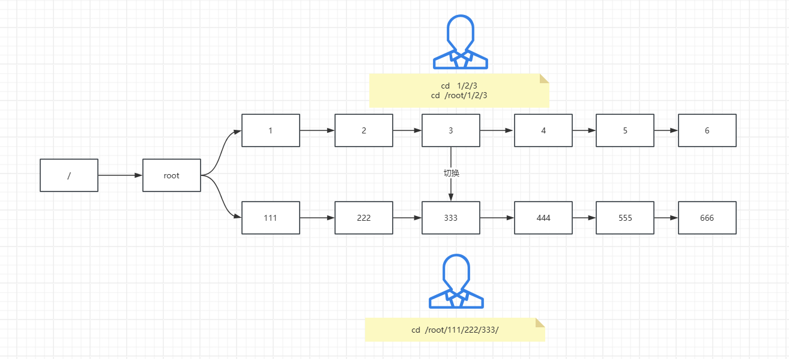
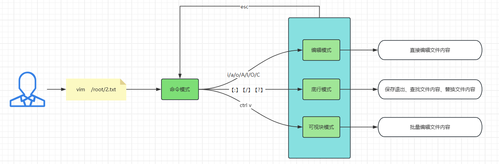
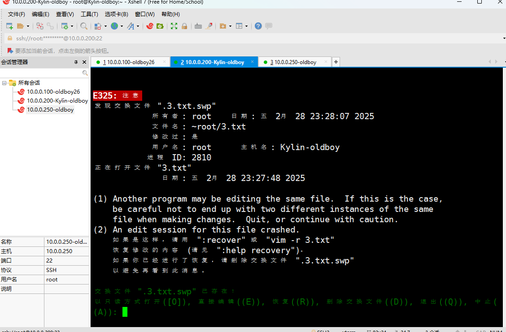
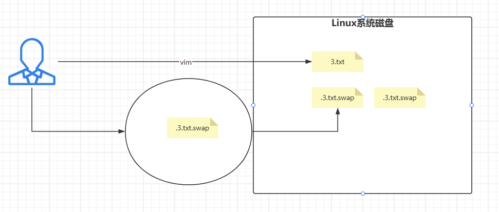

# 一、课程回顾

```bash
1，安装基础软件；
2，linux系统；
	- centos7.9
	- Ubuntu22.04（sshd服务的配置文件）
	- Kylin-v10-sp3
3，解释器的含义；
4，命令的格式：命令 [参数选项] 操作的目标；
5，shell解释器中的快捷键：
	crtl + l  #清屏
	crtl + a 
	crtl + e
	crtl + u
	crtl + k
	crtl + 左/右
	crtl + y
	crtl + c
	crtl + z
6，开关机命令；
	shutdown  -h now
	shutdown  -h 5
	shutdown  -r now
	shutdown  -r 10
	shutdown  -c
	halt
	poweroff
	init 0
	reboot
	init 6
7，ping ip/域名；
8，ip a【ip address】；
9，重点；
	- rm --help
	- man rm
	- 百度******
```

> 【8:30-9:00】吃饭

```bash
#规则：
	- 上课手机不能响，谁响谁发红包；
	- 迟到：红包；
```

# 二、linux系统的目录结构

> linux两大原则：
>
> - 一切从根【/】开始；
> - 一切皆文件；

```bash
[root@Kylin-oldboy ~]# ll /
总用量 16
lrwxrwxrwx    1 root root    7  3月  6  2021 bin -> usr/bin  #系统命令
dr-xr-xr-x.   6 root root 4096  2月 28 10:41 boot    #系统内核存储位置
drwxr-xr-x   19 root root 4000  2月 28 15:34 dev     #（硬盘）外接硬件的文件目录；
drwxr-xr-x  121 root root 8192  2月 28 15:40 etc     #系统软件服务的配置文件存放地；
drwxr-xr-x    3 root root   20  2月 28 11:40 home    #普通用户的家目录
....
drwxr-xr-x    2 root root    6  3月  6  2021 mnt     #默认的挂载目录
drwxr-xr-x    4 root root   53  2月 28 10:43 opt     #三方软件包的安装位置；
dr-xr-xr-x  204 root root    0  2月 28 15:34 proc    #系统服务进程信息（类似于汽车的仪表盘）
dr-xr-x---    3 root root  142  2月 28 15:52 root    #管理员的家目录
lrwxrwxrwx    1 root root    8  3月  6  2021 sbin -> usr/sbin #系统命令
drwxrwxrwt   10 root root  200  2月 28 15:46 tmp     #临时文件的存储位置（回收站）
drwxr-xr-x   12 root root  144  2月 28 10:37 usr   
drwxr-xr-x   22 root root  303  2月 28 10:56 var     #存放系统服务日志的目录；
```

# 三、linux系统核心命令（必会）

## 1，cd与pwd

```bash
cd   #切换目录，
pwd  #查看当前所在路径；
##################################
[root@Kylin-oldboy ~]# pwd
/root
[root@Kylin-oldboy ~]# cd /
[root@Kylin-oldboy /]# pwd
/
[root@Kylin-oldboy /]# cd /tmp/
[root@Kylin-oldboy tmp]# pwd
/tmp

###################################
#绝对路径与相对路径

#1，配置epel源
#kylin：
curl -o /etc/yum.repos.d/epel.repo https://mirrors.aliyun.com/repo/epel-7.repo

#centos：
curl -o /etc/yum.repos.d/CentOS-Base.repo https://mirrors.aliyun.com/repo/Centos-7.repo
curl -o /etc/yum.repos.d/epel.repo https://mirrors.aliyun.com/repo/epel-7.repo

#2，安装tree命令
[root@Kylin-oldboy ~]# yum -y install tree

#3，创建多级目录，使用tree命令显示目录结构
[root@Kylin-oldboy ~]# mkdir 111/222/333/444/555/666 -p
[root@Kylin-oldboy ~]# tree 
.
└── 111
    └── 222
        └── 333
            └── 444
                └── 555
                    └── 666
[root@Kylin-oldboy ~]# mkdir -p 1/2/3/4/5/6
[root@Kylin-oldboy ~]# tree
.
├── 1
│   └── 2
│       └── 3
│           └── 4
│               └── 5
│                   └── 6
└── 111
    └── 222
        └── 333
            └── 444
                └── 555
                    └── 666
[root@Kylin-oldboy ~]# cd /root/111/222/333/      #绝对路径
[root@Kylin-oldboy ~]# cd 111/222/333/            #相对路径（相对于我当前的路径）
[root@Kylin-oldboy ~]# cd ~
[root@Kylin-oldboy 333]# cd /root/1/2/3/
[root@Kylin-oldboy 3]# pwd
/root/1/2/3
```



```bash
#关于cd命令
	cd    #回到家目录
	cd -  #回到上一次所在的路径下
	cd ~  #回到家目录
	cd .. #前往上一级目录
	cd .  #一动不动
```

> 绝对路径与相对路径~

## 2，ls查看

> 语法： 
>
> - ls                  查看当前目录下有什么
> - ls   路径       查看路径下有什么

```bash
#1,查看根/下有什么
[root@Kylin-oldboy ~]# ls /
bin   dev  home  lib64  mnt  proc  run   srv  tmp  var
boot  etc  lib   media  opt  root  sbin  sys  usr

#2，查看当前目录（milv）下有什么
[root@Kylin-oldboy ~]# ls
1  111
```

> -l参数：显示文件或者目录的属性信息

```bash
[root@Kylin-oldboy ~]# ls -l /
或者
[root@Kylin-oldboy ~]# ll /
总用量 16
lrwxrwxrwx    1 root root    7  3月  6  2021 bin -> usr/bin
dr-xr-xr-x.   6 root root 4096  2月 28 10:41 boot
drwxr-xr-x   19 root root 4000  2月 28 15:34 dev
drwxr-xr-x  121 root root 8192  2月 28 15:40 etc
drwxr-xr-x    3 root root   20  2月 28 11:40 home
lrwxrwxrwx    1 root root    7  3月  6  2021 lib -> usr/lib
lrwxrwxrwx    1 root root    9  3月  6  2021 lib64 -> usr/lib64
drwxr-xr-x    2 root root    6  3月  6  2021 media
drwxr-xr-x    2 root root    6  3月  6  2021 mnt
drwxr-xr-x    4 root root   53  2月 28 10:43 opt
dr-xr-xr-x  201 root root    0  2月 28 15:34 proc
dr-xr-x---    5 root root  162  2月 28 17:08 root
drwxr-xr-x   38 root root 1080  2月 28 15:34 run
lrwxrwxrwx    1 root root    8  3月  6  2021 sbin -> usr/sbin
drwxr-xr-x    2 root root    6  3月  6  2021 srv
dr-xr-xr-x   14 root root    0  2月 28 15:39 sys
drwxrwxrwt   10 root root  200  2月 28 17:45 tmp
drwxr-xr-x   12 root root  144  2月 28 10:37 usr
drwxr-xr-x   22 root root  303  2月 28 10:56 var
```

> -h  人类可读的方式显示

```bash
[root@Kylin-oldboy ~]# ls -lh /
总用量 16K
lrwxrwxrwx    1 root root    7  3月  6  2021 bin -> usr/bin
dr-xr-xr-x.   6 root root 4.0K  2月 28 10:41 boot
drwxr-xr-x   19 root root 4.0K  2月 28 15:34 dev
drwxr-xr-x  121 root root 8.0K  2月 28 15:40 etc

[root@Kylin-oldboy ~]# ll -h /
总用量 16K
lrwxrwxrwx    1 root root    7  3月  6  2021 bin -> usr/bin
dr-xr-xr-x.   6 root root 4.0K  2月 28 10:41 boot
drwxr-xr-x   19 root root 4.0K  2月 28 15:34 dev
drwxr-xr-x  121 root root 8.0K  2月 28 15:40 etc

###########################
#扩展：2^10=1024
	1byte = 8bit
	1kb   = 1024byte
	1mb   = 1024kb
	1gb   = 1024mb
	1tb   = 1024gb
	1pb   = 1024tb
	1eb   = 1024pb
	1zb   = 1024eb
```

> -d查看目录本身

```bash
[root@Kylin-oldboy ~]# ll -d /etc
drwxr-xr-x 121 root root 8192  2月 28 15:40 /etc
```

> -a显示隐藏文件或隐藏目录

```bash
[root@Kylin-oldboy ~]# ll
总用量 0
drwxr-xr-x 3 root root 15  2月 28 17:08 1
drwxr-xr-x 3 root root 17  2月 28 16:57 111


[root@Kylin-oldboy ~]# ll -a
总用量 28
dr-xr-x---   5 root root 162  2月 28 17:08 .
dr-xr-xr-x. 18 root root 238  2月 28 11:01 ..
drwxr-xr-x   3 root root  15  2月 28 17:08 1
drwxr-xr-x   3 root root  17  2月 28 16:57 111
-rw-------   1 root root 326  2月 28 17:45 .bash_history
-rw-r--r--   1 root root  18  3月 13  2020 .bash_logout
-rw-r--r--   1 root root 176  3月 13  2020 .bash_profile
-rw-r--r--   1 root root 176  3月 13  2020 .bashrc
-rw-r--r--   1 root root 100  3月 13  2020 .cshrc
drwx------   3 root root 108  2月 28 15:34 .gnupg
-rw-------   1 root root  20  2月 28 15:14 .lesshst
-rw-r--r--   1 root root 129  3月 13  2020 .tcshrc
```

> 不常用的参数-t：按照时间排序
>
> 不常用的参数-r：逆序排序

```bash
[root@Kylin-oldboy ~]# ll -at
总用量 28
-rw-------   1 root root 326  2月 28 17:45 .bash_history
dr-xr-x---   5 root root 162  2月 28 17:08 .
drwxr-xr-x   3 root root  15  2月 28 17:08 1
drwxr-xr-x   3 root root  17  2月 28 16:57 111
drwx------   3 root root 108  2月 28 15:34 .gnupg
-rw-------   1 root root  20  2月 28 15:14 .lesshst
dr-xr-xr-x. 18 root root 238  2月 28 11:01 ..
-rw-r--r--   1 root root  18  3月 13  2020 .bash_logout
-rw-r--r--   1 root root 176  3月 13  2020 .bash_profile
-rw-r--r--   1 root root 176  3月 13  2020 .bashrc
-rw-r--r--   1 root root 100  3月 13  2020 .cshrc
-rw-r--r--   1 root root 129  3月 13  2020 .tcshrc

[root@Kylin-oldboy ~]# ll -atr
总用量 28
-rw-r--r--   1 root root 129  3月 13  2020 .tcshrc
-rw-r--r--   1 root root 100  3月 13  2020 .cshrc
-rw-r--r--   1 root root 176  3月 13  2020 .bashrc
-rw-r--r--   1 root root 176  3月 13  2020 .bash_profile
-rw-r--r--   1 root root  18  3月 13  2020 .bash_logout
dr-xr-xr-x. 18 root root 238  2月 28 11:01 ..
-rw-------   1 root root  20  2月 28 15:14 .lesshst
drwx------   3 root root 108  2月 28 15:34 .gnupg
drwxr-xr-x   3 root root  17  2月 28 16:57 111
drwxr-xr-x   3 root root  15  2月 28 17:08 1
dr-xr-x---   5 root root 162  2月 28 17:08 .
-rw-------   1 root root 326  2月 28 17:45 .bash_history
```

```bash
ls   
	-l    #显示属性信息
	-a    #显示隐藏信息
	-h    #人类可读的方式显示
	-d    #查看目录本身的信息
	-t    #按照时间排序
	-r    #逆序显示
	-i    #显示inode号；

[root@Kylin-oldboy ~]# ll -atri
总用量 28
136159995 -rw-r--r--   1 root root 129  3月 13  2020 .tcshrc
136159994 -rw-r--r--   1 root root 100  3月 13  2020 .cshrc
136159993 -rw-r--r--   1 root root 176  3月 13  2020 .bashrc
136159992 -rw-r--r--   1 root root 176  3月 13  2020 .bash_profile
136159991 -rw-r--r--   1 root root  18  3月 13  2020 .bash_logout
      128 dr-xr-xr-x. 18 root root 238  2月 28 11:01 ..
134337496 -rw-------   1 root root  20  2月 28 15:14 .lesshst
 68032713 drwx------   3 root root 108  2月 28 15:34 .gnupg
134337492 drwxr-xr-x   3 root root  17  2月 28 16:57 111
   899628 drwxr-xr-x   3 root root  15  2月 28 17:08 1
134317953 dr-xr-x---   5 root root 162  2月 28 17:08 .
134609353 -rw-------   1 root root 326  2月 28 17:45 .bash_history
```

## 3，mkdir创建目录（milv）

```bash
[root@Kylin-oldboy ~]# mkdir 111
[root@Kylin-oldboy ~]# ll
总用量 0
drwxr-xr-x 2 root root 6  2月 28 18:23 111

#-p递归创建目录
[root@Kylin-oldboy ~]# mkdir 11/22/33/44
mkdir: 无法创建目录 “11/22/33/44”: 没有那个文件或目录

[root@Kylin-oldboy ~]# mkdir -p 11/22/33/44
[root@Kylin-oldboy ~]# tree
.
├── 11
│   └── 22
│       └── 33
│           └── 44
└── 111

#-v显示创建的过程
[root@Kylin-oldboy ~]# mkdir -pv 1111/2222/3333/4444
mkdir: 已创建目录 '1111'
mkdir: 已创建目录 '1111/2222'
mkdir: 已创建目录 '1111/2222/3333'
mkdir: 已创建目录 '1111/2222/3333/4444'
```

## 4，touch创建文件

```bash
#1，当前目录下，创建一个1.txt的文件
[root@Kylin-oldboy ~]# touch /mnt/1.txt
[root@Kylin-oldboy ~]# ll /mnt/1.txt
-rw-r--r-- 1 root root 0  2月 28 18:31 /mnt/1.txt

#2，在/mnt下创建一个1.txt文件
[root@Kylin-oldboy ~]# touch /mnt/1.txt
[root@Kylin-oldboy ~]# ll /mnt/1.txt
-rw-r--r-- 1 root root 0  2月 28 18:31 /mnt/1.txt
```

## 5，mv移动改名

move  移动：就类似于windows中的剪切+粘贴；

语法： mv   被移动的文件或者目录    移动到的路径位置

【-t参数】mv  -t  移动到的路径位置    被移动的文件或者目录

```bash
#1，将当前目录下的1.txt文件移动到/tmp下
[root@Kylin-oldboy ~]# mv 1.txt /tmp/
[root@Kylin-oldboy ~]# ll
总用量 0
drwxr-xr-x 3 root root 16  2月 28 18:25 11
drwxr-xr-x 2 root root  6  2月 28 18:23 111
drwxr-xr-x 3 root root 18  2月 28 18:27 1111
[root@Kylin-oldboy ~]# ll /tmp/
总用量 0
-rw-r--r-- 1 root root  0  2月 28 18:31 1.txt

#2，将/tmp/1.txt移动到root的家目录，并改名为2.txt
[root@Kylin-oldboy ~]# mv /tmp/1.txt ./2.txt
[root@Kylin-oldboy ~]# ll
总用量 0
drwxr-xr-x 3 root root 16  2月 28 18:25 11
drwxr-xr-x 2 root root  6  2月 28 18:23 111
drwxr-xr-x 3 root root 18  2月 28 18:27 1111
-rw-r--r-- 1 root root  0  2月 28 18:31 2.txt

#3，【-t参数】：将当前目录下的2.txt，移动到/tmp下并改名3.txt
- 【-t参数使用后】不能改名
[root@Kylin-oldboy ~]# mv -t /tmp/3.txt ./2.txt 
mv: 访问 '/tmp/3.txt' 失败: 没有那个文件或目录
[root@Kylin-oldboy ~]# mv -t /tmp/ ./2.txt 
[root@Kylin-oldboy ~]# ll /tmp/
总用量 0
-rw-r--r-- 1 root root  0  2月 28 18:31 2.txt

[root@Kylin-oldboy ~]# ll
总用量 0
drwxr-xr-x 3 root root 16  2月 28 18:25 11
drwxr-xr-x 2 root root  6  2月 28 18:23 111
drwxr-xr-x 3 root root 18  2月 28 18:27 1111
```

## 6，cp复制改名

> 语法：
>
> - 复制文件：cp  把什么   复制到哪里
> - 复制目录：cp  -r  把什么   复制到哪里
> - -t参数：与mv中的-t一致；

```bash
#复制文件
[root@Kylin-oldboy ~]# touch 1.txt
[root@Kylin-oldboy ~]# cp 1.txt 11
11/   111/  1111/ 
[root@Kylin-oldboy ~]# cp 1.txt 11/22/33/
[root@Kylin-oldboy ~]# tree
.
├── 11
│   └── 22
│       └── 33
│           ├── 1.txt
│           └── 44
├── 111
├── 1111
│   └── 2222
│       └── 3333
│           └── 4444
└── 1.txt

#复制目录
[root@Kylin-oldboy ~]# cp -r 111 1111/2222/3333/4444/
[root@Kylin-oldboy ~]# tree
.
├── 11
│   └── 22
│       └── 33
│           ├── 1.txt
│           └── 44
├── 111
├── 1111
│   └── 2222
│       └── 3333
│           └── 4444
│               └── 111

#复制加改名
[root@Kylin-oldboy ~]# cp -r 1111/2222/3333/4444/111 ./11111
[root@Kylin-oldboy ~]# tree
.
├── 11
│   └── 22
│       └── 33
│           ├── 1.txt
│           └── 44
├── 111
├── 1111
│   └── 2222
│       └── 3333
│           └── 4444
│               └── 111
├── 11111
└── 1.txt

#-t参数
[root@Kylin-oldboy ~]# cp -t 111/ 1.txt 
[root@Kylin-oldboy ~]# tree
.
├── 11
│   └── 22
│       └── 33
│           ├── 1.txt
│           └── 44
├── 111
│   └── 1.txt

#【了解一下】-a参数：表示-r、-p、-d参数的合集
	- -r #递归复制目录
	- -p #表示复制后属性信息不变
	- -d #复制软连接的意思（后续会将）
```

## 7，rm删除命令

> -r   递归删除，删除目录；
>
> -f   强制删除，不提示操作者；

```bash
#1，-r参数删除目录
[root@Kylin-oldboy ~]# rm -r 11 
rm：是否进入目录'11'? y
rm：是否进入目录'11/22'? y
rm：是否进入目录'11/22/33'? y
rm：是否删除目录 '11/22/33/44'？y
rm：是否删除普通空文件 '11/22/33/1.txt'？y
rm：是否删除目录 '11/22/33'？y
rm：是否删除目录 '11/22'？y
rm：是否删除目录 '11'？y

#2，-f参数，删除目录，不提示
[root@Kylin-oldboy ~]# rm -rf 1111

#3，删除文件不提示
[root@Kylin-oldboy ~]# rm -f 1.txt 
[root@Kylin-oldboy ~]# tree
.
├── 111
│   └── 1.txt
└── 11111
```

> rm  -rf  /*

## 8，vi/vim编辑文件

### · vi与vim的区别

| 命令 | 区别                                                         |
| ---- | ------------------------------------------------------------ |
| vi   | 系统自带命令，不需要额外的安装，没有vim功能多；              |
| vim  | centos需要额外安装（ubuntu与kylin不需要安装），未来大部分编辑文件都是用vim |

```bash
#有这个文件，则进入编辑，没有这个文件，则创建后再编辑；
[root@Kylin-oldboy ~]# ll
总用量 0
drwxr-xr-x 2 root root 6  2月 28 18:57 111
drwxr-xr-x 2 root root 6  2月 28 18:47 11111
[root@Kylin-oldboy ~]# vim 1.txt
[root@Kylin-oldboy ~]# ll
总用量 0
drwxr-xr-x 2 root root 6  2月 28 18:57 111
drwxr-xr-x 2 root root 6  2月 28 18:47 11111
-rw-r--r-- 1 root root 0  2月 28 22:20 1.txt
```

### · 编辑文件的流程

```bash
#1，编辑文件
	- vi/vim   文件路径/文件名成
#2，进入编辑模式
	- i/a/o
	- 开始编辑内容
#3，退出编辑模式
	- esc
#4，保存并退出
	- :wq    #write写，quit退出；保存并退出；
	- :q     #quit退出，不保存；
	- :wq!   #强制保存退出；
	- :q!    #强制quit退出，不保存；
```

> 工作模式



### · vi与vim快捷键

```bash
#1，准备练习环境
[root@Kylin-oldboy ~]# cat /etc/passwd > 3.txt

#2，开始练习vim的命令
	- 光标移动的快捷键
		G       #光标移动到文件的最后一行；
		1G/gg   #光标移动到文件的第一行；
		5gg     #光标移动到第5行；
		^       #光标到行首
		$       #光标到行尾
	- 复制删除剪切黏贴
		yy      #复制当前行       3yy：复制当前行向下3行内容
		p       #当前行下一行黏贴；3p：剪切板上的内容，黏贴3次；
		dd      #删除当前行，3dd：连续删除3行；
		dG      #删除光标行到最后一行
		d1G/dgg     #删除光标行到文件第一行
	- 撤销
		u       #退回到上一步操作；
	- 底行模式
		:set nu    #显示行号
		:set nonu  #不显示行号
		:set paste  #无格式粘贴（之后会讲）
		/要搜索的内容    #搜索问价内容
			n   #从上往下查询
			N   #从下往上查询
		:noh        #取消高亮显示
	- 进入编辑模式
		i  #【光标位置不变】insert插入
		a  #【光标向后一位】进入编辑模式，append追加
		o  #【光标向下一行】进入编辑模式；
		A  #【光标移动到行尾】进入编辑模式；
		I  #【光标移动到行首】进入编辑模式；
		O  #【光标向上一行】进入编辑模式；
	- esc退出编辑模式；
```

### · vi/vim经典故障案例

> 案例场景：
>
> - 编辑一个文件，意外退出后，再次进入文件编辑，发现页面提示信息，如下图：



> 编辑文件的原理



> 解决方式

```bash
#1，根据提示R、D
#2，将隐藏文件改名为正式文件，或者直接删除隐藏文件。
```

## 9，cat查看文件内容

### · cat查看文件

> 企业当中：大文件，慎用~


```bash
#查看文件的相关参数
[root@Kylin-oldboy ~]# cat /etc/hostname 
Kylin-oldboy

#-n显示行号
[root@Kylin-oldboy ~]# cat -n 1.txt 
     1	fjkgdfjkhgjhgjdfghkdfjghdfh
     2	fghdfghfgh
     3	fdgdfhfgjhfg
     4	sdfgdfhfgjghjghjgh

#-E在每行结尾处，显示一个$符号
[root@Kylin-oldboy ~]# cat -E 1.txt 
fjkgdfjkhgjhgjdfghkdfjghdfh$
fghdfghfgh                          $
fdgdfhfgjhfg     $
sdfgdfhfgjghjghjgh$
```

### · cat创建编辑文件

```bash
[root@Kylin-oldboy ~]# cat > 2.txt<<EOF
> 111
> 22222
> 333
> 444
> 5555
> 6666756756867867867867868
> EOF
[root@Kylin-oldboy ~]# ll
总用量 12
drwxr-xr-x 2 root root    6  2月 28 18:57 111
drwxr-xr-x 2 root root    6  2月 28 18:47 11111
-rw-r--r-- 1 root root  102  3月  1 18:08 1.txt
-rw-r--r-- 1 root root   49  3月  1 18:13 2.txt
-rw-r--r-- 1 root root 1856  2月 28 23:27 3.txt
[root@Kylin-oldboy ~]# cat 2.txt 
111
22222
333
444
5555
6666756756867867867867868
```

## 10，tail查看文件

> 默认显示文件的后10行

```bash
[root@Kylin-oldboy ~]# tail /etc/services 
aigairserver    21221/tcp               # Services for Air Server
ka-kdp          31016/udp               # Kollective Agent Kollective Delivery
ka-sddp         31016/tcp               # Kollective Agent Secure Distributed Delivery
edi_service     34567/udp               # dhanalakshmi.org EDI Service
axio-disc       35100/tcp               # Axiomatic discovery protocol
axio-disc       35100/udp               # Axiomatic discovery protocol
pmwebapi        44323/tcp               # Performance Co-Pilot client HTTP API
cloudcheck-ping 45514/udp               # ASSIA CloudCheck WiFi Management keepalive
cloudcheck      45514/tcp               # ASSIA CloudCheck WiFi Management System
spremotetablet  46998/tcp               # Capture handwritten signatures

#显示文件的后5行
[root@Kylin-oldboy ~]# tail -n 5 /etc/services 
axio-disc       35100/udp               # Axiomatic discovery protocol
pmwebapi        44323/tcp               # Performance Co-Pilot client HTTP API
cloudcheck-ping 45514/udp               # ASSIA CloudCheck WiFi Management keepalive
cloudcheck      45514/tcp               # ASSIA CloudCheck WiFi Management System
spremotetablet  46998/tcp               # Capture handwritten signatures
[root@Kylin-oldboy ~]# tail -5 /etc/services 
axio-disc       35100/udp               # Axiomatic discovery protocol
pmwebapi        44323/tcp               # Performance Co-Pilot client HTTP API
cloudcheck-ping 45514/udp               # ASSIA CloudCheck WiFi Management keepalive
cloudcheck      45514/tcp               # ASSIA CloudCheck WiFi Management System
spremotetablet  46998/tcp               # Capture handwritten signatures

#tail监控文件变化（当文件发生变化，就将变化的内容打印在屏幕中）
[root@Kylin-oldboy ~]# tail -f /var/log/secure
```

## 11，head查看文件

> 默认显示文件的前10行

```bash
[root@Kylin-oldboy ~]# head /etc/services 
# /etc/services:
# $Id: services,v 1.49 2017/08/18 12:43:23 ovasik Exp $
#
# Network services, Internet style
# IANA services version: last updated 2016-07-08
#
# Note that it is presently the policy of IANA to assign a single well-known
# port number for both TCP and UDP; hence, most entries here have two entries
# even if the protocol doesn't support UDP operations.
# Updated from RFC 1700, ``Assigned Numbers'' (October 1994).  Not all ports

#显示文件的前2行
[root@Kylin-oldboy ~]# head -2 /etc/services 
# /etc/services:
# $Id: services,v 1.49 2017/08/18 12:43:23 ovasik Exp $
```

## 12，more/less分页查看文件

```bash
#准备大文件环境
[root@Kylin-oldboy ~]# seq 10000 > 1.txt

#1，less/more查看文件
[root@Kylin-oldboy ~]# more 1.txt
[root@Kylin-oldboy ~]# less 1.txt
	f   #向下翻页
	b   #向上翻页
	q   #退出
```


# 四、linux系统配置下载源

## 1，配置下载源

> centos配置下载源

```bash
curl -o /etc/yum.repos.d/CentOS-Base.repo https://mirrors.aliyun.com/repo/Centos-7.repo
curl -o /etc/yum.repos.d/epel.repo https://mirrors.aliyun.com/repo/epel-7.repo
```

> kylin配置下载源

```bash
curl -o /etc/yum.repos.d/epel.repo https://mirrors.aliyun.com/repo/epel-7.repo
```

> ubuntu配置下载源

```bash
root@oldboy:~# vim /etc/apt/sources.list
deb https://mirrors.aliyun.com/ubuntu/ jammy main restricted universe multiverse
deb-src https://mirrors.aliyun.com/ubuntu/ jammy main restricted universe multiverse

deb https://mirrors.aliyun.com/ubuntu/ jammy-security main restricted universe multiverse
deb-src https://mirrors.aliyun.com/ubuntu/ jammy-security main restricted universe multiverse

deb https://mirrors.aliyun.com/ubuntu/ jammy-updates main restricted universe multiverse
deb-src https://mirrors.aliyun.com/ubuntu/ jammy-updates main restricted universe multiverse

# deb https://mirrors.aliyun.com/ubuntu/ jammy-proposed main restricted universe multiverse
# deb-src https://mirrors.aliyun.com/ubuntu/ jammy-proposed main restricted universe multiverse

deb https://mirrors.aliyun.com/ubuntu/ jammy-backports main restricted universe multiverse
deb-src https://mirrors.aliyun.com/ubuntu/ jammy-backports main restricted universe multiverse

#配置完需要更新下载源
root@oldboy:~# apt update
```

## 2，下载常用的软件

```bash
#1,centos、kylin下载：
yum -y install tree vim wget bash-completion bash-completion-extras lrzsz net-tools sysstat iotop iftop htop unzip nc nmap telnet bc psmisc httpd-tools bind-utils methogs expect dos2unix cowsay sl

#2，ubuntu下载：apt只能一个一个安装~
apt -y install 软件名称
tree 
vim 
wget 
bash-completion 
bash-completion-extras 
lrzsz 
net-tools 
sysstat 
iotop 
iftop 
htop 
unzip 
nc 
nmap 
telnet 
bc 
psmisc 
httpd-tools 
bind-utils 
methogs 
expect 
dos2unix 
cowsay 
sl

#Ubuntu黑客帝国代码雨
root@oldboy:~# apt -y install cmatrix
root@oldboy:~# cmatrix
```

# 五、linux系统核心命令-续集（必会）

## 1，echo打印

```bash
[root@Kylin-oldboy ~]# echo hahahahahahaha
hahahahahahaha
[root@Kylin-oldboy ~]# echo "网安26期"
网安26期
```

### · echo与重定向配合

```bash
#重定向符号
>    #标准输出【覆盖】重定向，先清空，在覆盖；
>>   #标准输出【追加】重定向，追加到文件末尾；

[root@Kylin-oldboy ~]# cat 1.txt 
[root@Kylin-oldboy ~]# echo "111" 
111
[root@Kylin-oldboy ~]# echo "111" >1.txt 
[root@Kylin-oldboy ~]# cat 1.txt 
111
[root@Kylin-oldboy ~]# echo "222" >1.txt 
[root@Kylin-oldboy ~]# cat 1.txt 
222
[root@Kylin-oldboy ~]# echo "333" >>1.txt 
[root@Kylin-oldboy ~]# cat 1.txt 
222
333
[root@Kylin-oldboy ~]# echo "444" >>1.txt 
[root@Kylin-oldboy ~]# cat 1.txt 
222
333
444

#清空文件
[root@Kylin-oldboy ~]# >1.txt 
[root@Kylin-oldboy ~]# cat 1.txt 
```

### · echo与输出序列配合{}

```bash
[root@Kylin-oldboy ~]# echo {1..10}
1 2 3 4 5 6 7 8 9 10
[root@Kylin-oldboy ~]# echo {a..z}
a b c d e f g h i j k l m n o p q r s t u v w x y z
[root@Kylin-oldboy ~]# echo {a..Z}
a ` _ ^ ]  [ Z
[root@Kylin-oldboy ~]# echo {A..Z}
A B C D E F G H I J K L M N O P Q R S T U V W X Y Z
[root@Kylin-oldboy ~]# echo {A..F}
A B C D E F
[root@Kylin-oldboy ~]# echo {1..10000} > 1.txt
[root@Kylin-oldboy ~]# cat 1.txt 

```

> 附加：序列化符号的使用

```bash
[root@Kylin-oldboy ~]# rm -rf ./*
[root@Kylin-oldboy ~]# ll
总用量 0

#一起创建10个文件
[root@Kylin-oldboy ~]# touch {1..10}.txt
[root@Kylin-oldboy ~]# ll
总用量 0
-rw-r--r-- 1 root root 0  3月  1 20:23 10.txt
-rw-r--r-- 1 root root 0  3月  1 20:23 1.txt
-rw-r--r-- 1 root root 0  3月  1 20:23 2.txt
-rw-r--r-- 1 root root 0  3月  1 20:23 3.txt
-rw-r--r-- 1 root root 0  3月  1 20:23 4.txt
-rw-r--r-- 1 root root 0  3月  1 20:23 5.txt
-rw-r--r-- 1 root root 0  3月  1 20:23 6.txt
-rw-r--r-- 1 root root 0  3月  1 20:23 7.txt
-rw-r--r-- 1 root root 0  3月  1 20:23 8.txt
-rw-r--r-- 1 root root 0  3月  1 20:23 9.txt

#输出序列seq  n 
[root@Kylin-oldboy ~]# echo {1..10} >1.txt 

[root@Kylin-oldboy ~]# cat -n 1.txt 
     1	1 2 3 4 5 6 7 8 9 10

[root@Kylin-oldboy ~]# seq 10 > 1.txt
[root@Kylin-oldboy ~]# cat 1.txt 
1
2
3
4
5
6
7
8
9
10
```

## 2，tree命令树形显示目录结构

> 需要单独安装tree软件

```bash
[root@Kylin-oldboy ~]# mkdir -p 11/22/33/44/55/66/77/88/99/
[root@Kylin-oldboy ~]# tree ./
./
├── 1
│   └── 2
│       └── 3
│           └── 4
│               └── 5
│                   └── 6
│                       └── 7
│                           └── 8
│                               └── 9
└── 11
    └── 22
        └── 33
            └── 44
                └── 55
                    └── 66
                        └── 77
                            └── 88
                                └── 99

#-a显示隐藏文件
[root@Kylin-oldboy ~]# tree -a ./
./
├── 1
│   └── 2
│       └── 3
│           └── 4
│               └── 5
│                   └── 6
│                       └── 7
│                           └── 8
│                               └── 9
├── 11
│   └── 22
│       └── 33
│           └── 44
│               └── 55
│                   └── 66
│                       └── 77
│                           └── 88
│                               └── 99
├── .3.txt.swp
├── .bash_history
├── .bash_logout
├── .bash_profile
├── .bashrc
├── .cshrc
├── .gnupg
│   ├── private-keys-v1.d
│   ├── pubring.kbx
│   ├── pubring.kbx~
│   ├── random_seed
│   └── trustdb.gpg
├── .lesshst
├── .tcshrc
└── .viminfo

#-d只显示目录
[root@Kylin-oldboy ~]# tree -ad ./
./
├── 1
│   └── 2
│       └── 3
│           └── 4
│               └── 5
│                   └── 6
│                       └── 7
│                           └── 8
│                               └── 9
├── 11
│   └── 22
│       └── 33
│           └── 44
│               └── 55
│                   └── 66
│                       └── 77
│                           └── 88
│                               └── 99
└── .gnupg
    └── private-keys-v1.d
    
#-L控制像是的目录深度
[root@Kylin-oldboy ~]# tree -L 2 ./
./
├── 1
│   └── 2
└── 11
    └── 22

#-o将结果写入到一个文件中
[root@Kylin-oldboy ~]# tree -L 3 ./ > 1.txt
[root@Kylin-oldboy ~]# cat 1.txt 
./
├── 1
│   └── 2
│       └── 3
├── 11
│   └── 22
│       └── 33
└── 1.txt

6 directories, 1 file
[root@Kylin-oldboy ~]# tree -L 3 ./ -o 1.txt
[root@Kylin-oldboy ~]# cat 1.txt 
./
├── 1
│   └── 2
│       └── 3
├── 11
│   └── 22
│       └── 33
└── 1.txt

#-F在目录后面加一个/（为了与文件区分开）
[root@Kylin-oldboy ~]# tree -LF 3 ./ 
./
├── 1/
│   └── 2/
│       └── 3/
├── 11/
│   └── 22/
│       └── 33/
└── 1.txt

#-f显示完整的路径
[root@Kylin-oldboy ~]# tree -Lf 3 ./ 
.
├── ./1
│   └── ./1/2
│       └── ./1/2/3
├── ./11
│   └── ./11/22
│       └── ./11/22/33
└── ./1.txt

#-i不显示结构缩进线
[root@Kylin-oldboy ~]# tree -Lfi 3 ./ 
.
./1
./1/2
./1/2/3
./11
./11/22
./11/22/33
./1.txt
```

## 3，查询命令文件的位置

### · which

```bash
[root@Kylin-oldboy ~]# which vim
/usr/bin/vim
[root@Kylin-oldboy ~]# ll /usr/bin/vim
-rwxr-xr-x 1 root root 3035088 10月 10  2022 /usr/bin/vim
[root@Kylin-oldboy ~]# ll -h /usr/bin/vim
-rwxr-xr-x 1 root root 2.9M 10月 10  2022 /usr/bin/vim
```

### · whereis

> 顺带找到man帮助文件路径

```bash
[root@Kylin-oldboy ~]# whereis vim
vim: /usr/bin/vim /usr/share/vim /usr/share/man/man1/vim.1.gz
[root@Kylin-oldboy ~]# whereis cp
cp: /usr/bin/cp
[root@Kylin-oldboy ~]# whereis mkdir
mkdir: /usr/bin/mkdir /usr/share/man/man2/mkdir.2.gz
```

## 4，seq生成序列

```bash
[root@Kylin-oldboy ~]# seq 5
1
2
3
4
5

#从1一直输出到10，每隔2数字输出1个
[root@Kylin-oldboy ~]# seq 1 2 10
1
3
5
7
9
[root@Kylin-oldboy ~]# seq 1 3 10
1
4
7
10
[root@Kylin-oldboy ~]# seq 1 5 10
1
6
```


