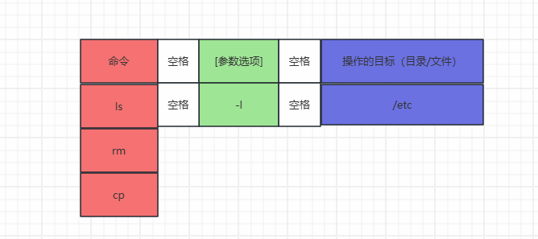
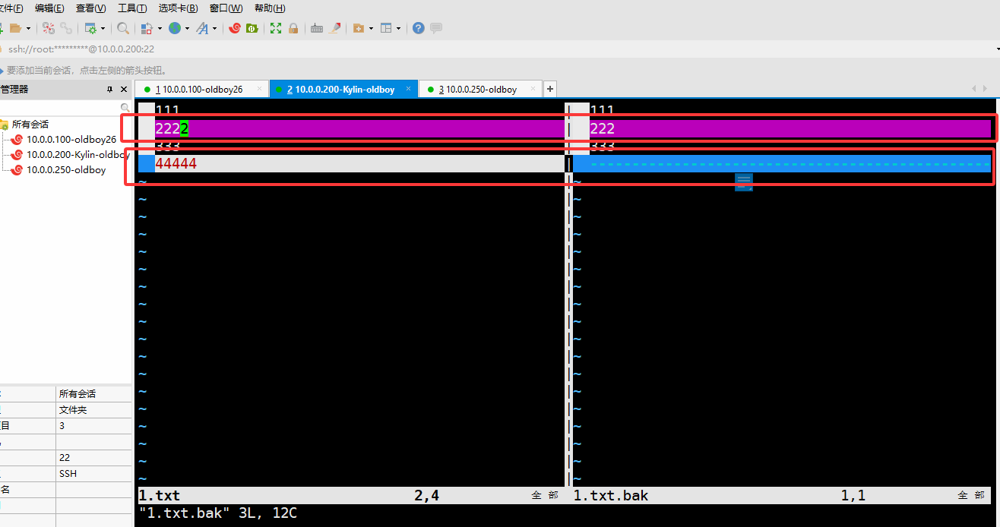

# 一、课程回顾

```bash
#1，命令解释器含义
[root@Kylin-oldboy ~]#
```

| 字段         | 含义                                                         |
| ------------ | ------------------------------------------------------------ |
| root         | 当前登录的用户                                               |
| Kylin-oldboy | 主机名称                                                     |
| ~            | 当前所在的目录<br>~表示家目录/root或者/home/***              |
| #、$         | 表示当前登录的用户类型<br>#    表示管理员<br>$    表示普通用户 |

```bash
#2,命令的格式写法
```



```bash
#3,核心命令（一切皆文件，命令针对的也就都是文件）
cd    #切换目录
	~    #表示家目录
	-    #回到上一次所在的目录
	..   #上一级目录
	.    #当前目录
pwd   #查看当前所在的绝对路径

mkdir   #创建目录
	-p  #递归创建多级目录
touch   #创建文件
rm      #删除
	-r  #表示递归删除（删除目录）
	-f  #强制删除不交互（不提示）
cp      #copy复制的意思【类似于：复制+黏贴】
	-r  #递归复制（复制目录）
	-t  #被复制的文件或目录与移动到得目标路径调换位置
mv      #move移动【类似于：剪切+黏贴】
	-t  #被移动的文件或目录与移动到得目标路径调换位置
ls      #查看目录下有什么
	-l  #【ll】查看详细/属性信息
	-a  #all，显示隐藏文件
	-t  #按照时间顺序显示；
	-r  #表示逆序
	-d  #查看目录本身；

cat   #查看文件内容
	-n  #显示行号
	-E  #在每一行结尾加一个$
cat > 1.txt<<EOF	
111
222
333
EOF

tail   #查看文件的后十行
	-n 20  #查看后20行
	-20    #查看后20行
	-f     #监控文件的变化
head   #查看文件的前十行
	-20    #查看那文件的前20行
more/less  #分页查看；
	f  #向下翻页
	b  #向上翻页
	q  #退出分页

echo    #打印到屏幕终端
echo 111 >1.txt    #写入111覆盖到1.txt
echo 111 >>1.txt   #写入111追加到1.txt
echo {1..100}      #打印1-100的数值到屏幕
seq  100           #打印1-100的数值到屏幕（每个数字独占一行）

tree    #查看目录的结构
	-L 2  #设置查看深度
	
which    命令   #查看命令的文件位置
whereis  命令   #查看命令的文件位置（附带man帮助的文件那位置）

vi/vim    #编辑文件
	dd    #删除当前行
	gg    #跳到第一行
	10gg  #跳到第十行
	yy    #复制当前行
	p     #粘贴
	G     #跳到最后一行
	^     #光标到行首
	$     #光标到行尾
	- 进入编辑
		a/A
		i/I
		o/O
		esc   #退出比那家模式
	- 底行命令模式：
		:set nu   #显示行号
		:set nonu #不显示行号
		/内容      #查询文件你内容
			n
			N
```

# 二、基础命令

## 1，wc统计文件信息

| 命令 | 参数          | 解释说明                         |
| ---- | ------------- | -------------------------------- |
| wc   |               | 统计文件的：行数、字数、字节数； |
|      | -l（小写的L） | line统计行数；                   |
|      | -w            | 统计字数；                       |
|      | -m            | 统计字符数；                     |
|      | -c            | 统计字节数；                     |

```bash
#过滤访问日志文件Failed出现的行数
[root@Kylin-oldboy ~]# grep "Failed" /var/log/messages

[root@Kylin-oldboy ~]# grep "Failed" /var/log/messages | wc -l 
2318
###############################################
grep   #过滤文件内容                            #
|      #【管道】将管道前面的执行结果交给管道后面   #
###############################################

#案例演示
[root@Kylin-oldboy ~]# cat 1.txt 
111
222
333
[root@Kylin-oldboy ~]# cat 1.txt | wc -l 
3
[root@Kylin-oldboy ~]# wc -l 1.txt 
3 1.txt
[root@Kylin-oldboy ~]# wc  1.txt 
 3  3 12 1.txt
 
#grep的用法
[root@Kylin-oldboy ~]# grep '111' 1.txt 
111
[root@Kylin-oldboy ~]# grep '1' 1.txt 
111
```

## 2，文件比较diff与vimdiff

```bash
#diff案例（少用）
[root@Kylin-oldboy ~]# diff 1.txt 1.txt.bak 
2c2     #第一个文件的第二行，与第二个文件的第二行不同
< 2222  #第一个文件的第二行内容
---
> 222   #第二个文件的第二行内容
4d3     #前面的文件4行，后面的文件3行
< 44444 #多这一行的内容
```

```bash
#vimdiff案例
[root@Kylin-oldboy ~]# vimdiff 1.txt 1.txt.bak
```



> 提示：由于是vim打开了两个文件进行对比，所以关闭时，要关闭两次；【:q】退出两个文件；

## 3，sort排序

| 命令 | 参数 | 解释说明                               |
| ---- | ---- | -------------------------------------- |
| sort |      | 不加参数，默认按照字母排序             |
|      | -n   | number，以数值的方式排序               |
|      | -k   | 指定某一列排序；                       |
|      | -r   | reverse，逆序排序；                    |
|      | -t   | 指定分隔符，不指定的时候默认以空格分隔 |

```bash
[root@Kylin-oldboy ~]# vim 1.txt

111
2222
333
44444
11
19999999
288
288887
279999999
222
333
444
5666
78867
9089089
00787686785678

#1,默认排序
[root@Kylin-oldboy ~]# sort 1.txt
00787686785678
11
111
19999999
222
2222
279999999
288
288887
333
333
444
44444
5666
78867
9089089

#2，-n数值排序
[root@Kylin-oldboy ~]# sort -n 1.txt
11
111
222
288
333
333
444
2222
5666
44444
78867
288887
9089089
19999999
279999999
00787686785678

#3，-r逆序排序
[root@Kylin-oldboy ~]# sort -nr 1.txt
00787686785678
279999999
19999999
9089089
288887
78867
44444
5666
2222
444
333
333
288
222
111
11

###########################
[root@Kylin-oldboy ~]# cat > 1.txt<<EOF
> 张三 89
> 李四 66
> 王五 100
> 孙尚香 70
> 刘备  12
> 关羽  101
> EOF
[root@Kylin-oldboy ~]# cat 1.txt
张三 89
李四 66
王五 100
孙尚香 70
刘备  12
关羽  101

[root@Kylin-oldboy ~]# sort 1.txt
关羽  101
李四 66
刘备  12
孙尚香 70
王五 100
张三 89

[root@Kylin-oldboy ~]# sort -nk2 1.txt
刘备  12
李四 66
孙尚香 70
张三 89
王五 100
关羽  101


[root@Kylin-oldboy ~]# sort -rnk2 1.txt
关羽  101
王五 100
张三 89
孙尚香 70
李四 66
刘备  12

#将/etc/passwd第三列，按照数值逆序排序
[root@Kylin-oldboy ~]# sort -t':' -rnk3 /etc/passwd

#将/etc/passwd第三列，按照数值逆序排序，取前三名；
[root@Kylin-oldboy ~]# sort -t':' -rnk3 /etc/passwd | head -3 
nobody:x:65534:65534:Kernel Overflow User:/:/sbin/nologin
oldboy:x:1000:1000::/home/oldboy:/bin/bash
systemd-coredump:x:999:997:systemd Core Dumper:/:/sbin/nologin
```

## 4，uniq去重

| 命令 | 参数 | 解释说明               |
| ---- | ---- | ---------------------- |
| uniq |      | 把重复的去掉，只留一个 |
|      | -c   | 去重，并显示重复了几次 |

```bash
[root@Kylin-oldboy ~]# cat 1.txt
oldboy
oldboy
oldboy
wa
wa
wa
wa
wa
26
26
26
26
26
26
26
26
26

#1，去重
[root@Kylin-oldboy ~]# uniq 1.txt
oldboy
wa
26
#2，去重并显示重复次数
[root@Kylin-oldboy ~]# uniq -c 1.txt
      3 oldboy
      5 wa
      9 26

#3，去重并显示重复次数，将重复次数多的，排在前面
[root@Kylin-oldboy ~]# uniq -c 1.txt | sort -nr
      9 26
      5 wa
      3 oldboy
```

> 题目：
>
> - ps  -axu  的查询结果，第四列，按照数字逆序排序，仅显示前三；
> - 提示：grep -v   取反

## 5，时间命令

| 命令 | 参数说明      | 选项说明                                                     |
| ---- | ------------- | ------------------------------------------------------------ |
| date |               |                                                              |
|      | +    显示时间 | %F   显示年月日：2025-03-02<br>%T   显示时分秒<br/>%w  小时周几<br/>%Y   显示年份<br/>%m  显示月<br/>%d   显示几号<br/>%H   显示小时<br/>%M   显示分钟<br/>%S    显示秒数 |
|      | -s   修改时间 |                                                              |

### · 查看时间

```bash
[root@Kylin-oldboy ~]# date
2025年 03月 02日 星期日 22:17:16 CST
[root@Kylin-oldboy ~]# date +%F
2025-03-02
[root@Kylin-oldboy ~]# date +%T
22:18:56
[root@Kylin-oldboy ~]# date +%w
0
[root@Kylin-oldboy ~]# date +%Y
2025
[root@Kylin-oldboy ~]# date +%Y-%m
2025-03
[root@Kylin-oldboy ~]# date +%Y/%m
2025/03
[root@Kylin-oldboy ~]# date +%Y-%m-%d
2025-03-02
[root@Kylin-oldboy ~]# date +%H
22
[root@Kylin-oldboy ~]# date +%H:%M
22:21
[root@Kylin-oldboy ~]# date +%H:%M:%S
22:21:45
[root@Kylin-oldboy ~]# date +%Y-%m-%d\ %H:%M:%S
2025-03-02 22:22:23
[root@Kylin-oldboy ~]# date +%Y-%m-%d/%H:%M:%S
2025-03-02/22:22:43
```

### · 修改时间

```bash
[root@Kylin-oldboy ~]# date -s '20111225 8:00:22'
2011年 12月 25日 星期日 08:00:22 CST
[root@Kylin-oldboy ~]# date
2011年 12月 25日 星期日 08:00:26 CST
```

> ubuntu默认开始了自动时间同步功能，想要修改时间，需要关闭systemd-timesyncd服务

```bash
root@oldboy:~# systemctl stop systemd-timesyncd.service 
root@oldboy:~# date -s '20111222 15:30:55'
Thu Dec 22 03:30:55 PM UTC 2011
root@oldboy:~# date
Thu Dec 22 03:30:57 PM UTC 2011
root@oldboy:~# systemctl start systemd-timesyncd.service 
root@oldboy:~# date
Wed Mar  5 03:34:45 AM UTC 2025
```

### · 时间同步

#### 1，设置时区

```bash
#1，查看系统时间
[root@Kylin-oldboy ~]# timedatectl 
               Local time: 日 2011-12-25 11:51:25 CST
           Universal time: 日 2011-12-25 03:51:25 UTC
                 RTC time: 三 2025-03-05 07:03:35
                #本机时区
                Time zone: Asia/Shanghai (CST, +0800)
                #是否自动同步时间；
System clock synchronized: no
              NTP service: active
          RTC in local TZ: no

#2，设置本机时区
root@oldboy:~# timedatectl list-timezones
root@oldboy:~# timedatectl set-timezone Asia/Shanghai
root@oldboy:~# timedatectl 
               Local time: Wed 2025-03-05 15:11:06 CST
           Universal time: Wed 2025-03-05 07:11:06 UTC
                 RTC time: Wed 2025-03-05 07:11:06
                Time zone: Asia/Shanghai (CST, +0800)
System clock synchronized: yes
              NTP service: active
          RTC in local TZ: no
```

#### 2，手动同步时间

```bash
[root@Kylin-oldboy ~]# yum -y install ntpdate
[root@Kylin-oldboy ~]# apt -y install ntpdate

#手动同步时间
[root@Kylin-oldboy ~]# ntpdate ntp1.aliyun.com
 5 Mar 15:14:46 ntpdate[13713]: step time server 118.31.3.89 offset +1052394249.468763 sec
[root@Kylin-oldboy ~]# date
2025年 03月 05日 星期三 15:14:49 CST
```

#### 3，自动同步时间

> centos/kylin系统
>
> - chronyd

```bash
[root@Kylin-oldboy ~]# vim /etc/chrony.conf 

# Use public servers from the pool.ntp.org project.
# Please consider joining the pool (http://www.pool.ntp.org/join.html).
#pool pool.ntp.org iburst
server ntp.ntsc.ac.cn iburst
server ntp1.aliyun.com iburst
server ntp2.aliyun.com iburst

[root@Kylin-oldboy ~]# systemctl restart chronyd.service 
[root@Kylin-oldboy ~]# timedatectl 
               Local time: 三 2025-03-05 15:46:54 CST
           Universal time: 三 2025-03-05 07:46:54 UTC
                 RTC time: 三 2025-03-05 07:46:54
                Time zone: Asia/Shanghai (CST, +0800)
System clock synchronized: yes
              NTP service: active
          RTC in local TZ: no
```

> ubuntu系统
>
> - systemd-timesyncd

```bash
root@oldboy:~# vim /etc/systemd/timesyncd.conf 

#  This file is part of systemd.
#
#  systemd is free software; you can redistribute it and/or modify it under the
#  terms of the GNU Lesser General Public License as published by the Free
#  Software Foundation; either version 2.1 of the License, or (at your option)
#  any later version.
#
# Entries in this file show the compile time defaults. Local configuration
# should be created by either modifying this file, or by creating "drop-ins" in
# the timesyncd.conf.d/ subdirectory. The latter is generally recommended.
# Defaults can be restored by simply deleting this file and all drop-ins.
#
# See timesyncd.conf(5) for details.

[Time]
NTP= ntp1.aliyun.com ntp2.aliyun.com
FallbackNTP=ntp.ubuntu.com
RootDistanceMaxSec=5
PollIntervalMinSec=32
PollIntervalMaxSec=2048

#重启服务
root@oldboy:~# systemctl restart systemd-timesyncd.service
```

#### 4，佳乐案例

```bash
#当kylin时间不准确的时候，无法yum安装软件
```


