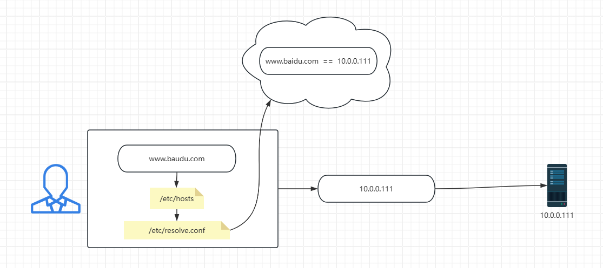
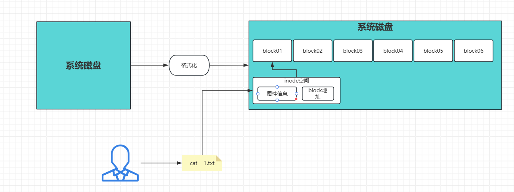

# 一、课程回顾

```bash
#主机名称配置文件
- /etc/hostname
	- 命令：hostnamectl set-hostname 主机名称

#网卡配置文件
-[kylin/centos] /etc/sysconfig/network-scripts/ifcfg-ens33
	- centos:【systemctl restart network】
	- kylin/centos：【ifdown ens33 && ifup ens33】
- [ubuntu]：/etc/netplan/00-*******
	- netplan apply

#开机打印文件中内容
	- /etc/motd
#开机执行文件中的命令（使用之前，需要给这个文件“执行权限x”）
	- /etc/rc.d/rc.local
#系统挂载文件
	- /etc/fstab
#系统版本信息
[root@K-oldboy26 ~]# cat /etc/os-release 
NAME="Kylin Linux Advanced Server"
VERSION="V10 (Lance)"
ID="kylin"
VERSION_ID="V10"
PRETTY_NAME="Kylin Linux Advanced Server V10 (Lance)"
ANSI_COLOR="0;31"

#查看系统的内核命令
[root@K-oldboy26 ~]# uname -a
Linux K-oldboy26 4.19.90-52.22.v2207.ky10.x86_64 #1 SMP Tue Mar 14 12:19:10 CST 2023 x86_64 x86_64 x86_64 GNU/Linux
[root@K-oldboy26 ~]# uname 
Linux

#DNS解析文件
	/etc/resolv.conf
```



```bash
#本地解析文件
	- /etc/hosts
		ip  域名

#硬件信息查看文件命令
	- /proc/cpuinfo
		lscpu
		nproc
	- /proc/meminfo
		free -h
#磁盘文件
	- /dev/sda
	df -h

#日志目录（/var/log）
[root@K-oldboy26 ~]# ll /var/log/secure 
-rw------- 1 root root 8769  3月  6 10:47 /var/log/secure
[root@K-oldboy26 ~]# ll /var/log/messages 
-rw------- 1 root root 3776439  3月  7 09:05 /var/log/messages

root@oldboy:~# ll /var/log/auth.log 
-rw-r----- 1 syslog adm 26874 Mar  7 08:51 /var/log/auth.log
root@oldboy:~# ll /var/log/syslog 
-rw-r----- 1 syslog adm 354827 Mar  7 08:51 /var/log/syslog
```

# 二、变量和变量文件

## 1，什么是变量

```bash
x = 1
y = x + 1
y = 2
#################
全局变量    #面对所有用户的变量
局部变量    #只针对当前用户自己
#################
[root@K-oldboy26 ~]# echo $oldboy

[root@K-oldboy26 ~]# oldboy=wangan26
[root@K-oldboy26 ~]# echo $oldboy
wangan26
```

## 2，全局变量配置文件

```bash
[root@K-oldboy26 ~]# ll /etc/profile
-rw-r--r-- 1 root root 1816  6月 23  2020 /etc/profile

#常见的全局环境变量
[oldboy@K-oldboy26 ~]$ env
HOME
HOSTNAME
USER
#重点了解；
PATH=/usr/local/sbin:/usr/local/bin:/usr/sbin:/usr/bin:/root/bin:/root/bin
	/usr/local/sbin:
	/usr/local/bin:
	/usr/sbin:
	/usr/bin:
	/root/bin:
	/root/bin:
#字符集
LANG=zh_CN.UTF-8
[root@K-oldboy26 ~]# echooooo 
-bash: echooooo: command not found
[root@K-oldboy26 ~]# LANG=zh_CN.UTF-8
[root@K-oldboy26 ~]# echooooo 
-bash: echooooo：未找到命令

#变量文件汇总
#全局
	/etc/profile      01   #优先级第四
	/etc/bashrc       02   #优先级第三
#局部
	~/.bashrc         03   #优先级第二
	~/.bash_profile   04   #优先级第一
	
```

> 修改系统语言（字符集）

```bash
#1,第一种方式：命令修改
- 查询系统中有哪些字符集
[root@K-oldboy26 ~]# localectl list-locales

[root@K-oldboy26 ~]# localectl set-locale zh_CN.UTF-8

#2，方式二：全局变量方式修改
[root@K-oldboy26 ~]# vim /etc/profile
export LANG=zh_CN.UTF-8
```

> PS1解释器颜色样式设置变量

```bash
#PS1设置内容
	\d   #日期【周 月 日】
	\t   #24小时制时间【时：分：秒】
	\T   #12小时制时间【时：分：秒】
	\u   #当前登录用户
	\w   #小写，表示显示当前完整的路径
	\W   #大写，变当前所在的路径的目录
		/etc/11/22/33/44
		44
	\h   #则表示主机名称
	$    #提示符号，如果是root显示#,如果是普通用户，显示$

#颜色设置
red="\[\e[31;1m\]"
green="\[\e[32;1m\]"
yellow="\[\e[33;1m\]"
blue="\[\e[34;1m\]"
end="\[\e[0m\]"
export PS1="[$green\u$end@$yellow\h$end \W $blue\t$end]\\$ "
```

# 三、文件属性信息

```bash
[root@oldboy ~ 11:30:38]# ll  -i

1572870 drwx------  3 root root  4096 Feb 28 11:26 snap/
```

| 1572870   | d                                        | rwx  r--  r--                                                | 3              | root | root | 4096 | Feb 28 11:26                   |
| --------- | ---------------------------------------- | ------------------------------------------------------------ | -------------- | ---- | ---- | ---- | ------------------------------ |
| inode号码 | 类型是：目录<br>d表示目录，-表示普通文件 | 权限位<br>r读权限，w写权限，x执行权限                        | 硬链接<br>数量 | 属主 | 属组 | 大小 | make  time<br>最近被修改的时间 |
|           |                                          | 前三位u：属主的权限，<br>中间三位g：属组的权限<br>后三位o：其他用户的权限 |                |      |      |      |                                |

用户：oldboy  root

用户：yonggril    yonggril

## 1，inode号

### · inode与block原理

```bash
#磁盘满了有几种情况？
	- 大文件过多
	- 小文件名过多
```



```bash
#如何判断磁盘block与inode
[root@K-oldboy26 ~ 11:58:13]# df -hi
文件系统       Inodes 已用(I) 可用(I) 已用(I)% 挂载点
......
/dev/sda3         49M    101K     49M       1% /


[root@K-oldboy26 ~ 11:59:06]# df
文件系统           1K-块    已用     可用 已用% 挂载点
devtmpfs          469984       0   469984    0% /dev
tmpfs             485452       0   485452    0% /dev/shm
tmpfs             485452   13016   472436    3% /run
tmpfs             485452       0   485452    0% /sys/fs/cgroup
/dev/sda3      102504552 4033900 98470652    4% /
tmpfs             485452       8   485444    1% /tmp
/dev/sda1         199328  124400    74928   63% /boot
tmpfs              97088       0    97088    0% /run/user/0

df  #查看磁盘信息命令
	-h  #人类可读
	-i  #查看inode号占用情况
	-T  #显示“文件系统”信息，及其占用block情况
	-a  #显示所有文件系统
```

# 四、作业

> ev录制视频，从
>
> 1，第一天安装系统；
>
> 2，shell快捷键、基础与核心命令；

```bash
#你、模拟你是老师，你在模拟你是学生，你讲给你自己；
	- 目标一个，将事情讲明白；

#发给我；
	百度网盘链接发给我；
	xinjizhiwa_var@163.com
```


