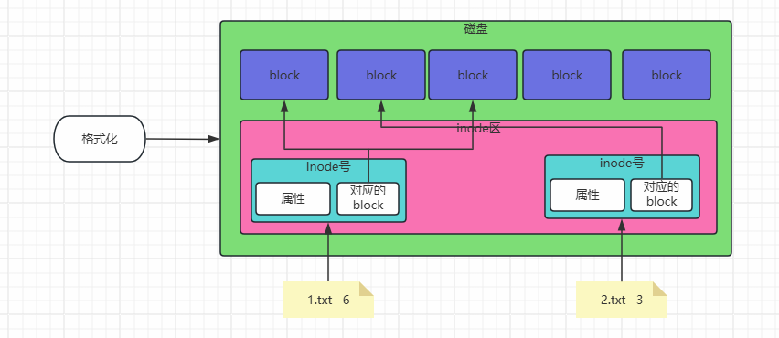
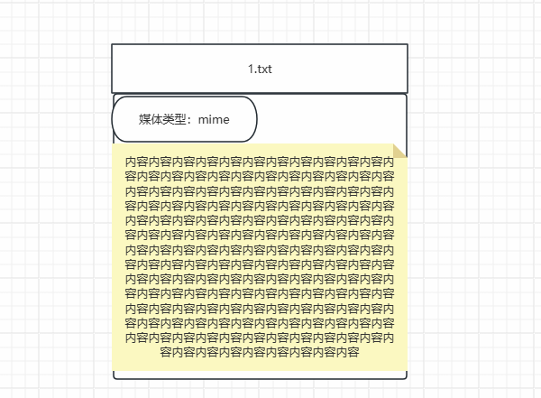
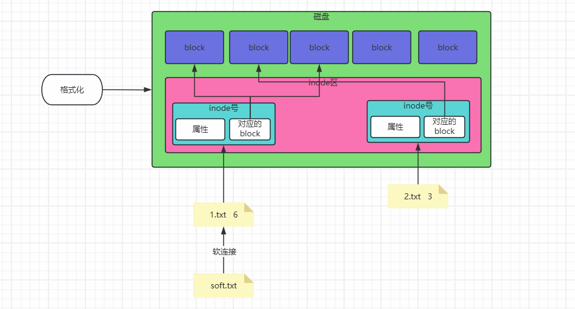
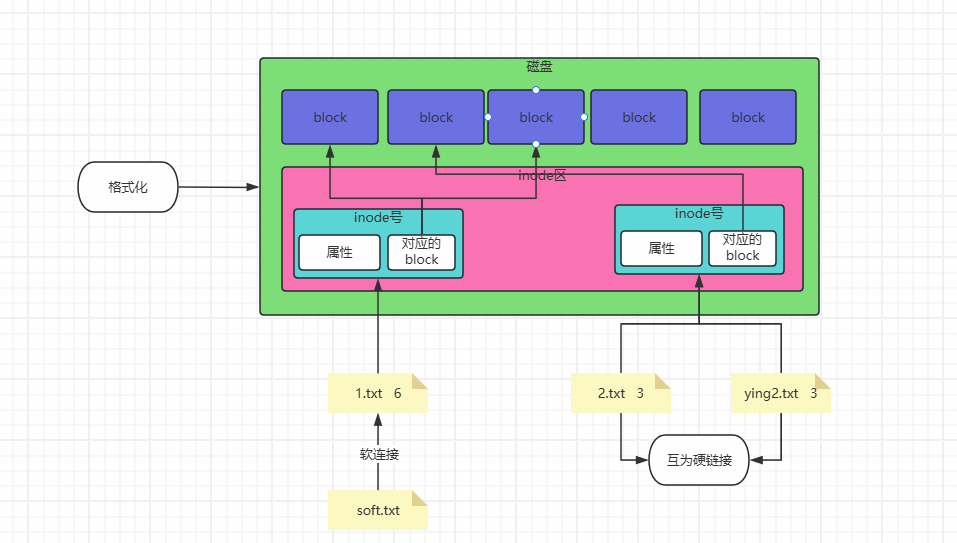

# 一、课程回顾

```bash
#1，命令格式是什么
	- 命令+空格+[参数选项]+空格+操作的目标对象（目录或文件）
	- rm -rf ./*
#2，基础命令
	- 开关机
		· shutdown -h now/数字   #定时关机
		· shutdown -r now/数字   #定时重启
		· shutdown -c   #取消所有定时
		· reboot
		· poweroff
		· init 0
		· init 6
	- shell快捷键
		· ctrl + l #清屏
		· ctrl + a/e 
		· ctrl + u/k
		· ctrl + y
		· ctrl + z/c
#3，重要的配置文件
	- /etc/
		- hostname
		- ifcfg-ens33
		- resolv.conf
		- hosts
	- /var/
		- secure/auth.log
		- message/syslog
	- /proc
		cpu: lscpu\nproc
		内存：free -h
		磁盘：df -hi
#4，核心命令
	cd、pwd
	touch、mkdir -p
	rm -rf
	cp -rt 、 mv -t
	ls -latrd
	cat -nE
	cat > 1.txt <<EOF
	...
	EOF
	tail -f head   less、more
	vi、vim
		dG、dd、gg/1G、G、^$\yy\p;
		:set nu
		:wq!
		/
	> >>
	echo  neirong > 文件
	
	【|】
	wc -lwcm 配合管道
	sort -rnk3 -t':'
	uniq -c

	diff、vimdif
	tree -L
	seq 10
	seq 1 5 10 
	which/whereis
	grep 

	date -s
	date +%F
```

# 二、inode与block



| 命令 | 参数 | 解释说明                                                     |
| ---- | ---- | ------------------------------------------------------------ |
| df   |      |                                                              |
|      | -h   | 人类可读的方式显示（换算单位显示）                           |
|      | -i   | 查看inode号的占用情况                                        |
|      | -T   | 显示文件系统信息，及block占用的情况                          |
|      | -a   | all（了解即可）显示所有文件系统，包括0块文件系统，和未分区初始化的磁盘信息； |

```bash
[root@K-oldboy26 ~ 08-用户管理:10-软件管理:17]# df -h
文件系统        容量  已用  可用 已用% 挂载点
devtmpfs        459M     0  459M    0% /dev
tmpfs           475M     0  475M    0% /dev/shm
tmpfs           475M   19M  456M    4% /run
tmpfs           475M     0  475M    0% /sys/fs/cgroup
/dev/sda3        98G  3.9G   94G    4% /
tmpfs           475M  8.0K  475M    1% /tmp
/dev/sda1       195M  122M   74M   63% /boot
tmpfs            95M     0   95M    0% /run/user/0

[root@K-oldboy26 ~ 08-用户管理:44:06]# df -i
文件系统         Inodes 已用(I)  可用(I) 已用(I)% 挂载点
devtmpfs         117496     457   117039       1% /dev
tmpfs            121363       1   121362       1% /dev/shm
tmpfs            121363     683   120680       1% /run
tmpfs            121363      17   121346       1% /sys/fs/cgroup
/dev/sda3      51277312  103234 51174078       1% /
tmpfs            121363      14   121349       1% /tmp
/dev/sda1        102400     339   102061       1% /boot
tmpfs            121363       6   121357       1% /run/user/0

[root@K-oldboy26 ~ 08-用户管理:44:53]# df -T
文件系统       类型         1K-块    已用     可用 已用% 挂载点
devtmpfs       devtmpfs    469984       0   469984    0% /dev
tmpfs          tmpfs       485452       0   485452    0% /dev/shm
tmpfs          tmpfs       485452   19092   466360    4% /run
tmpfs          tmpfs       485452       0   485452    0% /sys/fs/cgroup
/dev/sda3      xfs      102504552 4039604 98464948    4% /
tmpfs          tmpfs       485452       8   485444    1% /tmp
/dev/sda1      xfs         199328  124400    74928   63% /boot
tmpfs          tmpfs        97088       0    97088    0% /run/user/0
```

# 三、文件类型

```bash
-   #普通文件
d   #目录、文件夹
l   #软连接
================================
c   #字符设备，char特殊文件；不断输出、不断吸入的文件
b   #块设备block应盘
s   #socket套接字文件
```

> 拓展：查看文件媒体类型

```bash
[root@K-oldboy26 ~ 09-权限管理:03-linux目录结构与核心命令（2）:13-系统服务管理与三剑客（2）]# file hahahaha
hahahaha: PNG image data, 458 x 458, 8-bit/color RGBA, non-interlaced

[root@K-oldboy26 ~ 09-权限管理:06:55]# file 1.txt
1.txt: ASCII text
```



# 四、软硬链接

## 1，软连接



> softlink：软连接。就类似于windows的桌面快捷方式；

```bash
[root@K-oldboy26 ~ 09-权限管理:12-系统服务管理与三剑客（1）:06]# ln -s 1.txt soft1.txt
[root@K-oldboy26 ~ 09-权限管理:12-系统服务管理与三剑客（1）:36]# ll
-rw-r--r-- 1 root root 0  3月 10 09-权限管理:12-系统服务管理与三剑客（1） 1.txt
lrwxrwxrwx 1 root root 5  3月 10 09-权限管理:12-系统服务管理与三剑客（1） soft1.txt -> 1.txt

[root@K-oldboy26 ~ 09-权限管理:12-系统服务管理与三剑客（1）:37]# cat soft1.txt 
[root@K-oldboy26 ~ 09-权限管理:12-系统服务管理与三剑客（1）:49]# cat 1.txt 

[root@K-oldboy26 ~ 09-权限管理:12-系统服务管理与三剑客（1）:54]# echo 111 > soft1.txt 
[root@K-oldboy26 ~ 09-权限管理:13-系统服务管理与三剑客（2）:05-系统重要的配置文件-etc]# cat 1.txt 
111
[root@K-oldboy26 ~ 09-权限管理:13-系统服务管理与三剑客（2）:07-文件属性信息（2）]# cat soft1.txt 
111
```

> 练习：给网卡配置文件，创建软连接到当前目录下

```bash
[root@K-oldboy26 ~ 09-权限管理:16:30]# ln -s /etc/sysconfig/network-scripts/ifcfg-ens33  wangka
[root@K-oldboy26 ~ 09-权限管理:16:46]# ll
总用量 0
lrwxrwxrwx 1 root root 42  3月 10 09-权限管理:16 wangka -> /etc/sysconfig/network-scripts/ifcfg-ens33
[root@K-oldboy26 ~ 09-权限管理:16:48]# vim wangka 
```

## 2，硬链接

> 硬链接
>
> - 就是inode的另一个入口



```bash
[root@K-oldboy26 ~ 09-权限管理:38:22]# touch 1.txt
[root@K-oldboy26 ~ 09-权限管理:38:28]# ll
总用量 0
-rw-r--r-- 1 root root 0  3月 10 09-权限管理:38 1.txt
[root@K-oldboy26 ~ 09-权限管理:38:30]# ln -s 1.txt soft1.txt
[root@K-oldboy26 ~ 09-权限管理:38:44]# ll -i
总用量 0
134318863 -rw-r--r-- 1 root root 0  3月 10 09-权限管理:38 1.txt
134318882 lrwxrwxrwx 1 root root 5  3月 10 09-权限管理:38 soft1.txt -> 1.txt

#创建硬链接
[root@K-oldboy26 ~ 09-权限管理:38:47]# ln 1.txt ying1.txt
[root@K-oldboy26 ~ 09-权限管理:39:12-系统服务管理与三剑客（1）]# ll -i
总用量 0
134318863 -rw-r--r-- 2 root root 0  3月 10 09-权限管理:38 1.txt
134318882 lrwxrwxrwx 1 root root 5  3月 10 09-权限管理:38 soft1.txt -> 1.txt
134318863 -rw-r--r-- 2 root root 0  3月 10 09-权限管理:38 ying1.txt
```

> 查看硬链接数量

```bash
[root@K-oldboy26 ~ 09-权限管理:41:19]# ll -i
134318863 -rw-r--r-- 2 root root 0  3月 10 09-权限管理:38 1.txt
134318863 -rw-r--r-- 2 root root 0  3月 10 09-权限管理:38 ying1.TXT
```

> 目录的硬链接:
>
> - 目录不允许创建硬链接

```bash
[root@K-oldboy26 ~ 09-权限管理:41:57]# mkdir 111
[root@K-oldboy26 ~ 09-权限管理:41:57]# cd 111

[root@K-oldboy26 111 09-权限管理:43:01-vmware安装linux镜像+命令基础入门]# ll -ai
总用量 0
 67137636 drwxr-xr-x 2 root root   6  3月 10 09-权限管理:42 .
......
[root@K-oldboy26 111 09-权限管理:43:15]# ll -i ..
总用量 0
 67137636 drwxr-xr-x 2 root root 6  3月 10 09-权限管理:42 111
.....
```

# 五、文件的大小

| 命令 | 参数 | 解释说明                           |
| ---- | ---- | ---------------------------------- |
| du   |      |                                    |
|      | -s   | 不显示目录下信息（只查看目录本身） |
|      | -h   | 人类可读                           |

```bash
[root@K-oldboy26 ~ 09-权限管理:47:27]# ll -h /etc/services 
-rw-r--r-- 1 root root 677K  6月 23  2020 /etc/services

#目录的属性大小，现实的是目录下文件的属性信息的大小，而不包含其数据大小
[root@K-oldboy26 ~ 09-权限管理:51:54]# ll -hd /etc/
drwxr-xr-x 122 root root 8.0K  3月  7 10-软件管理:06 /etc/

#如何查看目录下包含的所有数据大小呐？？？？
[root@K-oldboy26 ~ 09-权限管理:54:38]# du -sh /etc
25M	/etc

[root@K-oldboy26 ~ 09-权限管理:57:10-软件管理]# du -s /etc /root /var -h
25M	/etc
80K	/root
232M	/var
```

# 六、文件的时间属性

```bash
[root@K-oldboy26 ~ 09-权限管理:59:55]# stat 1.txt 
  文件：“1.txt”
  大小：4         	块：8          IO 块：4096   普通文件
设备：803h/2051d	Inode：134318863   硬链接：2
权限：(0644/-rw-r--r--)  Uid：(    0/    root)   Gid：(    0/    root)
最近访问：2025-03-linux目录结构与核心命令（2）-09-权限管理 09-权限管理:38:28.853841182 +0800   #accesstime，atime，最近被访问时间
最近更改：2025-03-linux目录结构与核心命令（2）-09-权限管理 09-权限管理:59:53.456797200 +0800   #modifytime，mtime，最近内容被修改的时间
最近改动：2025-03-linux目录结构与核心命令（2）-09-权限管理 09-权限管理:59:53.456797200 +0800   #changetime，ctime，最近属性被修改的时间
创建时间：-
```

# 七、打包压缩三剑客

## 1，tar命令

| 命令 | 参数 | 解释说明                                                     |
| ---- | ---- | ------------------------------------------------------------ |
| tar  | zcvf | 【压缩】<br>【语法】：tar  zcvf  xxxx.tar.gz   被压缩的文件或目录 |
|      | z    | z：使用gzip的方式进行压缩，压缩包以.tar.gz结尾<br>j：使用bzip2的方式进行压缩，压缩包以.tar.bz2结尾<br>J：使用xz的方式进行压缩，压缩包以tar.xz结尾 |
|      | c    | 创建包（打包），如果只用cf，那么只会打包，不会压缩；         |
|      | v    | 显示过程（不加也行）                                         |
|      | f    | 指定压缩的文件，这个参数需要放在最后                         |
| tar  | xf   | 【解压】<br>【语法】：tar  xf   xxx.tar.gz                   |
|      | x    | 解压<br>-C(大写)指定解压目录                                 |
|      | f    | 指定压缩包的文件，这个参数需要放在最后                       |
| tar  | tf   | 解压前查看压缩包的内容                                       |
|      | t    | 解压前查看                                                   |

```bash
#打包压缩家目录下的所有
[root@K-oldboy26 ~ 10-软件管理:36:27]# touch {1..09-权限管理}.txt
[root@K-oldboy26 ~ 10-软件管理:36:42]# ll
总用量 8
-rw-r--r-- 1 root root 0  3月 10 10-软件管理:36 09-权限管理.txt
drwxr-xr-x 2 root root 6  3月 10 09-权限管理:42 111
-rw-r--r-- 2 root root 4  3月 10 10-软件管理:36 1.txt
-rw-r--r-- 1 root root 0  3月 10 10-软件管理:36 2.txt
-rw-r--r-- 1 root root 0  3月 10 10-软件管理:36 3.txt
-rw-r--r-- 1 root root 0  3月 10 10-软件管理:36 4.txt
-rw-r--r-- 1 root root 0  3月 10 10-软件管理:36 5.txt
-rw-r--r-- 1 root root 0  3月 10 10-软件管理:36 6.txt
-rw-r--r-- 1 root root 0  3月 10 10-软件管理:36 7.txt
-rw-r--r-- 1 root root 0  3月 10 10-软件管理:36 8.txt
-rw-r--r-- 1 root root 0  3月 10 10-软件管理:36 9.txt
lrwxrwxrwx 1 root root 5  3月 10 09-权限管理:38 soft1.txt -> 1.txt
-rw-r--r-- 2 root root 4  3月 10 10-软件管理:36 ying1.TXT

[root@K-oldboy26 ~ 10-软件管理:36:44]# tar zcvf root.tar.gz ./*

#-C指定解压目录
[root@K-oldboy26 ~ 10-软件管理:40:57]# tar xf /mnt/root.tar.gz -C /mnt

#解压前查看压缩包内容
[root@K-oldboy26 ~ 10-软件管理:43:24]# tar tf /mnt/root.tar.gz 
./09-权限管理.txt
./111/
./1.txt
./2.txt
./3.txt
./4.txt
./5.txt
./6.txt
./7.txt
./8.txt
./9.txt
./soft1.txt
./ying1.TXT
```

## 2，zip/unzip命令

```bash
#将当前目录下的所有，压缩到zip_test.zip压缩包中
[root@K-oldboy26 ~ 15:00:45]# zip -r zip_test.zip ./*

#将当前目录下的zip_test.zip解压到/mnt/下【-d，指定解压目录】
[root@K-oldboy26 ~ 15:04-Linux核心命令:03-linux目录结构与核心命令（2）]# unzip zip_test.zip -d /mnt
Archive:  zip_test.zip
 extracting: /mnt/09-权限管理.txt             
   creating: /mnt/111/
 extracting: /mnt/1.txt              
 extracting: /mnt/2.txt              
 extracting: /mnt/3.txt              
 extracting: /mnt/4.txt              
 extracting: /mnt/5.txt              
 extracting: /mnt/6.txt              
 extracting: /mnt/7.txt              
 extracting: /mnt/8.txt              
 extracting: /mnt/9.txt              
 extracting: /mnt/soft1.txt          
 extracting: /mnt/ying1.TXT
```

## 3，gzip命令（了解）

> 语法：gzip  被压缩的文件（-r表示跳过目录进行压缩）
>
> - 压缩后，删除源文件；

> 语法：gzip   -d   要解压的文件
>
> - 解压后删除压缩包；

```bash
[root@K-oldboy26 ~ 15:11-进程与服务管理:39]# ll
总用量 0
[root@K-oldboy26 ~ 15:11-进程与服务管理:42]# touch 1.txt
[root@K-oldboy26 ~ 15:11-进程与服务管理:48]# ll
总用量 0
-rw-r--r-- 1 root root 0  3月 10 15:11-进程与服务管理 1.txt
[root@K-oldboy26 ~ 15:11-进程与服务管理:49]# gzip 1.txt 
[root@K-oldboy26 ~ 15:12-系统服务管理与三剑客（1）:01-vmware安装linux镜像+命令基础入门]# ll
总用量 4
-rw-r--r-- 1 root root 26  3月 10 15:11-进程与服务管理 1.txt.gz
[root@K-oldboy26 ~ 15:12-系统服务管理与三剑客（1）:03-linux目录结构与核心命令（2）]# gzip -d 1.txt.gz 
[root@K-oldboy26 ~ 15:12-系统服务管理与三剑客（1）:16]# ll
总用量 0
-rw-r--r-- 1 root root 0  3月 10 15:11-进程与服务管理 1.txt
################################################
#压缩案例【查看目录结构】
[root@K-oldboy26 ~ 15:17:36]# tree
.
├── 111
│   └── 1.txt
└── 2.txt

#压缩当前目录下的所有
[root@K-oldboy26 ~ 15:17:39]# gzip -r ./*

#查看结果发现【只能压缩单独的一个文件】
[root@K-oldboy26 ~ 15:17:56]# tree
.
├── 111
│   └── 1.txt.gz   #1.txt被压缩结果
└── 2.txt.gz       #2.txt被压缩的结果
```

# 八、find命令查找文件位置（必会）

> 参数介绍

| 命令 | 参数选项 | 解释说明                                                     |
| ---- | -------- | ------------------------------------------------------------ |
| find |          |                                                              |
|      | -name    | 通过文件名称超找文件路径<br>[root@K-oldboy26 ~ 15:25:19]# find /etc -name "*ens33"<br/>/etc/sysconfig/network-scripts/ifcfg-ens33 |
|      | -type    | 通过文件类型查找文件【d：目录，f：文件，l：软连接】          |
|      | -size    | 通过文件大小来查找<br>+10      表示大于10字节<br>+100k  小写的k。表示kb<br>-100M  大写的M。表示兆字节<br>+3G      表示gb字节 |
|      | -mtime   | 根据最近修改时间查找文件路径<br>+7   表示七天之前<br>-7    表示七天之内<br>7      表示正好第七天，修改时间正好是第七天； |

```bash
#准备环境
[root@K-oldboy26 ~ 15:33:16]# tree
.
├── 111
│   └── 1.txt
├── 1.txt
├── 222
│   └── 1.txt -> /root/111/1.txt
└── 333
    └── 1.txt

#查找root目录下名称是txt结尾的
[root@K-oldboy26 ~ 15:34:36]# find /root/ -name "*.txt"
/root/1.txt
/root/111/1.txt
/root/222/1.txt
/root/333/1.txt
[root@K-oldboy26 ~ 15:34:51]# find /root/ -type f  -name "*.txt"
/root/1.txt
/root/111/1.txt
[root@K-oldboy26 ~ 15:35:32]# find /root/ -type l  -name "*.txt"
/root/222/1.txt
[root@K-oldboy26 ~ 15:35:45]# find /root/ -type d  -name "*.txt"
/root/333/1.txt
```


```bash
#1，在etc目录下，找到网卡配置文件：
[root@K-oldboy26 ~ 15:42:46]# find /etc -name "*-ens33"
/etc/sysconfig/network-scripts/ifcfg-ens33

#2，在etc目录下，查出所有以.conf结尾的文件
[root@K-oldboy26 ~ 16:27:55]# find /etc -name "*.conf"

#3，在etc目录下，查出文件名中包含ifcfg的文件
[root@K-oldboy26 ~ 16:27:55]# find /etc -name "*ifcfg*"
/etc/sysconfig/network-scripts/ifcfg-ens33
/etc/dbus-1/system.d/nm-ifcfg-rh.conf
/etc/NetworkManager/dispatcher.d/no-wait.d/09-权限管理-ifcfg-rh-routes.sh
/etc/NetworkManager/dispatcher.d/pre-up.d/09-权限管理-ifcfg-rh-routes.sh
/etc/NetworkManager/dispatcher.d/09-权限管理-ifcfg-rh-routes.sh

#4，查找整个系统中>100k的文件
[root@K-oldboy26 ~ 16:29:31]# find / -size +100k

#5，找出/var/log下所有6天之前的.log结尾的文件，并且删除；（一行搞定）
[root@K-oldboy26 ~ 16:32:58]# find /var/log -mtime +6  -name "*.log" | xargs rm -rf 

xargs   #分组（理解为：将文件中的每一行，拆出来，一条一条执行；）
```

> 总结：

````bash
明天预告：用户和权限
	今天开始视频开始加密；
	找你的咨询师，要解码；
````


