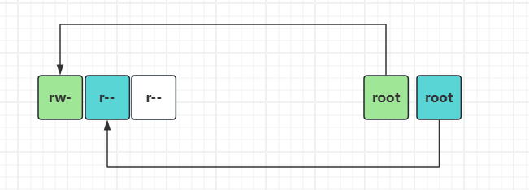

# 一、课程回顾

```bash
#用户管理-用户分类
	- root    #管理员    0
	- 普通用户 #各司其职   >1000
	- 虚拟用户 #不能登陆系统的用户 <1000
#id介绍
	uid、gid
#相关的配置文件
	/etc/passwd  #用户列表
	/etc/shadow  #用户密码文件
	/etc/group
	/etc/gshadow

#用户创建
	useradd
	adduser
		-u   #指定uid
		-g   #指定gid（提前存在）
		-s   #指定解释器
			/bin/bash
			/sbin/nologin
		-M   #不创建家目录
		-G   #指定附属组
#修改
	usermod
#删除
	userdel 
		-r   #删除用户，并且删除用户家目录
#查看
	id
		-un
		-gn
		-u
		-g
	w / who
	whoami
	last
	lastlog
#设置密码
	passwd 用户名
	
	kylin和centos：【echo "密码" | passwd --stdin 用户名】
	ubuntu：       【echo “用户名:密码” | chpasswd】
					cat 1.txt | chpasswd
#切换用户
	su - 用户名
#创建用户组
	groupadd -g 100  名称
#sudo提权
	#给oldboy用户提权rm命令的过程
		- root用户编辑/etc/sudoers（visudo）
		- 写入文件内容：
			oldboy    ALL=（ALL）   NOPASSWD:/usr/bin/rm
		- oldboy用户使用rm
			sudo rm .....
			sudo -l
			sudo -k
			
#别名(临时生效)
	alias
	alias  名称=“要执行的命令”
	unalias 名称
#永久生效
	/etc/rc.local
	/etc/profile
```

# 二、12位权限管理体系

## 1，基础概念

```bash
[root@K-oldboy26 ~ 09:16:12]# ll -i
总用量 0
134318879 -rw-r--r-- 1 root root 0  3月 12 09:16 1.txt

r  #read读
w  #write写
x  #execute执行
-  #没有权限
```



## 2，权限值的计算

| 权限 | 含义 | 权限对应的数字 |
| ---- | ---- | -------------- |
| r    | 读   | 4              |
| w    | 写   | 2              |
| x    | 执行 | 1              |

```bash
[root@K-oldboy26 ~ 09:26:00]# ll -d /etc/
drwxr-xr-x 122 root root 8192  3月 12 08:25 /etc/

7 5 5
```

## 3，修改权限

### · 修改所有者

| 命令  | 参数 | 解释说明                                               |
| ----- | ---- | ------------------------------------------------------ |
| chown |      | 修改文件本身的属主和属组                               |
|       | -R   | 递归修改文件本身的属主和属组（修改目录下级的所有文件） |
|       |      |                                                        |

```bash
[root@K-oldboy26 ~ 09:33:59]# chown wa05.wa05 111
[root@K-oldboy26 ~ 09:34:06]# ll
总用量 0
drwxr-xr-x 2 wa05 wa05 19  3月 12 09:33 111
-rw-r--r-- 1 wa05 wa05  0  3月 12 09:16 1.txt
[root@K-oldboy26 ~ 09:34:07]# ll 111/
总用量 0
-rw-r--r-- 1 root root 0  3月 12 09:33 1.txt
[root@K-oldboy26 ~ 09:34:12]# chown -R wa05.wa05 111
[root@K-oldboy26 ~ 09:34:32]# ll 
总用量 0
drwxr-xr-x 2 wa05 wa05 19  3月 12 09:33 111
-rw-r--r-- 1 wa05 wa05  0  3月 12 09:16 1.txt
[root@K-oldboy26 ~ 09:34:37]# ll 111
总用量 0
-rw-r--r-- 1 wa05 wa05 0  3月 12 09:33 1.txt
```

### · 修改权限位

| 命令  | 参数 |                          |
| ----- | ---- | ------------------------ |
| chmod |      | 修改文件本身的权限位     |
|       | -R   | 递归修改文件本身的权限位 |

```bash
[root@K-oldboy26 ~ 09:37:08]# chmod +x 1.txt 
[root@K-oldboy26 ~ 09:37:44]# ll
总用量 0
drwxr-xr-x 2 wa05 wa05 19  3月 12 09:33 111
-rwxr-xr-x 1 wa05 wa05  0  3月 12 09:16 1.txt
[root@K-oldboy26 ~ 09:37:45]# chmod -x 1.txt 
[root@K-oldboy26 ~ 09:38:03]# ll
总用量 0
drwxr-xr-x 2 wa05 wa05 19  3月 12 09:33 111
-rw-r--r-- 1 wa05 wa05  0  3月 12 09:16 1.txt
[root@K-oldboy26 ~ 09:38:05]# chmod u+x 1.txt 
[root@K-oldboy26 ~ 09:38:37]# ll
总用量 0
drwxr-xr-x 2 wa05 wa05 19  3月 12 09:33 111
-rwxr--r-- 1 wa05 wa05  0  3月 12 09:16 1.txt
[root@K-oldboy26 ~ 09:38:38]# chmod o+w 1.txt 
[root@K-oldboy26 ~ 09:38:57]# ll
总用量 0
drwxr-xr-x 2 wa05 wa05 19  3月 12 09:33 111
-rwxr--rw- 1 wa05 wa05  0  3月 12 09:16 1.txt


[root@K-oldboy26 ~ 09:39:58]# chmod u=,g=,o=rwx 1.txt 
[root@K-oldboy26 ~ 09:41:15]# ll
总用量 0
drwxr-xr-x 2 wa05 wa05 19  3月 12 09:33 111
-------rwx 1 wa05 wa05  0  3月 12 09:16 1.txt
[root@K-oldboy26 ~ 09:41:16]# chmod -x 111
[root@K-oldboy26 ~ 09:41:46]# ll
总用量 0
drw-r--r-- 2 wa05 wa05 19  3月 12 09:33 111
-------rwx 1 wa05 wa05  0  3月 12 09:16 1.txt
[root@K-oldboy26 ~ 09:41:47]# cd 111
[root@K-oldboy26 111 09:41:51]# cd
[root@K-oldboy26 ~ 09:41:57]# ll 111
总用量 0
-rw-r--r-- 1 wa05 wa05 0  3月 12 09:33 1.txt
[root@K-oldboy26 ~ 09:42:01]# chmod -R +x 111
[root@K-oldboy26 ~ 09:42:17]# ll
总用量 0
drwxr-xr-x 2 wa05 wa05 19  3月 12 09:33 111
-------rwx 1 wa05 wa05  0  3月 12 09:16 1.txt
[root@K-oldboy26 ~ 09:42:18]# ll 111
总用量 0
-rwxr-xr-x 1 wa05 wa05 0  3月 12 09:33 1.txt

#数值写法（推荐）
[root@K-oldboy26 ~ 09:43:02]# chmod 644 1.txt 
[root@K-oldboy26 ~ 09:43:21]# ll
总用量 0
drwxr-xr-x 2 wa05 wa05 19  3月 12 09:33 111
-rw-r--r-- 1 wa05 wa05  0  3月 12 09:16 1.txt
```

## 4，权限与文件和目录的关系

| 权限 | 文件                           | 目录                                              |
| ---- | ------------------------------ | ------------------------------------------------- |
| r    | 读文件内容                     | 是否可以查看目录内容，（需要x权限配合）           |
| w    | 编辑文件内容，一般要与r配合    | 是否可以在目录下，创建删除、重命名文件，需要x配合 |
| x    | 是否可以执行文件（命令、脚本） | 是否可以进入这个目录                              |

### · 文件权限测试

#### 1，准备环境

```bash
[root@K-oldboy26 ~ 09:43:22]# mkdir /mode
[root@K-oldboy26 ~ 10:11:54]# cd /mode/
[root@K-oldboy26 mode 10:11:57]# echo "hostname" > /mode/wa.sh
[root@K-oldboy26 mode 10:13:54]# chown wa05.wa05 wa.sh
```

#### 2，测试wa05的权限

```bash
[wa05@K-oldboy26 mode]$ /mode/wa.sh
-bash: /mode/wa.sh: 权限不够

[root@K-oldboy26 mode 10:14:25]# chmod u+x wa.sh

[wa05@K-oldboy26 mode]$ /mode/wa.sh
K-oldboy26
/mode
```

#### 3，属主的r权限测试

```bash
#将wa05用户wx权限去掉
[root@K-oldboy26 mode 10:19:49]# chmod u-wx wa.sh 
[root@K-oldboy26 mode 10:20:29]# ll
总用量 0
-r--r--r-- 1 wa05 wa05 0  3月 12 10:20 wa.sh

#测试写入内容
[wa05@K-oldboy26 mode]$ echo "ip a" >> wa.sh 
-bash: wa.sh: 权限不够
```

#### 4，属主w权限测试

```bash
[root@K-oldboy26 mode 10:26:29]# chmod u=w wa.sh 
[root@K-oldboy26 mode 10:26:51]# ll
总用量 4
--w-r--r-- 1 wa05 wa05 13  3月 12 10:25 wa.sh
```

> 总结：w权限编辑文件，必须配合r权限进行，否则编辑文件会覆盖原来内容

#### 5，属主的x权限测试

```bash
[root@K-oldboy26 mode 10:34:03]# chmod u=x wa.sh

[wa05@K-oldboy26 mode]$ ./wa.sh 
bash: ./wa.sh: 权限不够
```

> 总结：因为系统，无法读取内容，所以也就无法执行；也就是说，x权限必须配合r存在；

#### 6，文件权限测试总结

```bash
w 写权限，需要配合r读权限一起使用；
x 执行权限，必须配合r读权限一起使用；

#如何一个用户是这个文件的所有者，那么其即便没有w权限，但是也能强制对其进行编辑；
```

### · 目录权限测试

#### 1，准备环境

```bash
[root@K-oldboy26 mode 10:36:21]# mkdir wadir
[root@K-oldboy26 mode 11:09:44]# touch wadir/{1..10}.txt
[root@K-oldboy26 mode 11:10:18]# chown -R wa05.wa05 wadir

[root@K-oldboy26 mode 11:10:53]# ll wadir/
总用量 0
-rw-r--r-- 1 wa05 wa05 0  3月 12 11:10 10.txt
-rw-r--r-- 1 wa05 wa05 0  3月 12 11:10 1.txt
-rw-r--r-- 1 wa05 wa05 0  3月 12 11:10 2.txt
-rw-r--r-- 1 wa05 wa05 0  3月 12 11:10 3.txt
-rw-r--r-- 1 wa05 wa05 0  3月 12 11:10 4.txt
-rw-r--r-- 1 wa05 wa05 0  3月 12 11:10 5.txt
-rw-r--r-- 1 wa05 wa05 0  3月 12 11:10 6.txt
-rw-r--r-- 1 wa05 wa05 0  3月 12 11:10 7.txt
-rw-r--r-- 1 wa05 wa05 0  3月 12 11:10 8.txt
-rw-r--r-- 1 wa05 wa05 0  3月 12 11:10 9.txt
```

#### 2，测试r权限

```bash
[root@K-oldboy26 mode 11:12:01]# chmod u=r wadir/
[root@K-oldboy26 mode 11:12:18]# ll wadir/ -d
dr--r-xr-x 2 wa05 wa05 137  3月 12 11:10 wadir/

#测试r权限
[wa05@K-oldboy26 mode]$ ll wadir/
ls: 无法访问 'wadir/1.txt': 权限不够
ls: 无法访问 'wadir/2.txt': 权限不够
ls: 无法访问 'wadir/3.txt': 权限不够
ls: 无法访问 'wadir/4.txt': 权限不够
ls: 无法访问 'wadir/5.txt': 权限不够
ls: 无法访问 'wadir/6.txt': 权限不够
ls: 无法访问 'wadir/7.txt': 权限不够
ls: 无法访问 'wadir/8.txt': 权限不够
ls: 无法访问 'wadir/9.txt': 权限不够
ls: 无法访问 'wadir/10.txt': 权限不够

#测试w权限
[wa05@K-oldboy26 mode]$ touch wadir/11.txt
touch: 无法创建 'wadir/11.txt': 权限不够
[wa05@K-oldboy26 mode]$ rm -rf wadir/*
rm: 无法删除 'wadir/10.txt': 权限不够
rm: 无法删除 'wadir/1.txt': 权限不够
rm: 无法删除 'wadir/2.txt': 权限不够
rm: 无法删除 'wadir/3.txt': 权限不够
rm: 无法删除 'wadir/4.txt': 权限不够
rm: 无法删除 'wadir/5.txt': 权限不够
rm: 无法删除 'wadir/6.txt': 权限不够
rm: 无法删除 'wadir/7.txt': 权限不够
rm: 无法删除 'wadir/8.txt': 权限不够
rm: 无法删除 'wadir/9.txt': 权限不够

#测试x权限
[wa05@K-oldboy26 mode]$ cd wadir/
-bash: cd: wadir/: 权限不够
```

> 总结：
>
> - 目录只有r权限，只能查看文件名称，无法查看属性信息；
> - 目录x权限表示2个含义
>   - 能否cd到这个目录下
>   - 能否查看目录下的属性信息

#### 3，测试w权限

```bash
[root@K-oldboy26 mode 11:12:20]# chmod u=w wadir/

#测试rwx
[wa05@K-oldboy26 mode]$ ll wadir/
ls: 无法打开目录 'wadir/': 权限不够

[wa05@K-oldboy26 mode]$ touch wadir/11.txt
touch: 无法创建 'wadir/11.txt': 权限不够

[wa05@K-oldboy26 mode]$ cd wadir/
-bash: cd: wadir/: 权限不够
```

> 总结：
>
> - 目录没有x权限，就代表用户无法进入，所以基表有w权限，也无法创建删除目录下内容
> - 因此，w权限，必须配合x权限；
> - 但是有了wx权限，即便创建成功了，也看不到，所以有w权限，就要有rx权限；

> 所以：一般来讲
>
> - 文件创建：644   rw-r-r-
>
> - 目录创建：755   rwxr-xr-x

### · 系统默认权限umask（了解一下）

```bash
[root@K-oldboy26 mode 11:24:02]# umask 
0022

777-022==755

#系统创建目录：
	777-umask=755
#系统创建文件
	666-umask=644
```

> 测试

```bash
#将umask值设置为011
[root@K-oldboy26 mode 11:29:03]# umask 011
[root@K-oldboy26 mode 11:29:17]# umask 
0011

#创建目录文件
[root@K-oldboy26 mode 11:29:21]# mkdir 333
[root@K-oldboy26 mode 11:29:28]# touch 444
[root@K-oldboy26 mode 11:29:32]# ll

drwxrw-rw- 2 root root 6  3月 12 11:29 333
-rw-rw-rw- 1 root root 0  3月 12 11:29 444  

#文件为什么是666？？？
	当umask值为奇数时，对应的位，计算出的结果要+1
	655+011=666
```

## 5，系统特殊权限位

| 特殊权限           |                                                              | 含义                                                         |
| ------------------ | ------------------------------------------------------------ | ------------------------------------------------------------ |
| set  uid  ==  suid | 【命令文件】的属主u权限位上有一个s或者S<br>对应的权限数字：4；【4755】 | 运行这个命令文件的时候，都相当于属主来使用；                 |
| set  gid  ==  sgid | 【命令文件】的属组g权限位上有一个s或者S<br/>对应的权限数字：2；【2755】 | 运行这个命令文件的时候，都相当于属组来使用；                 |
| sticky             | 【目录】其他用户位（o权限位），有一个t<br>对应的权限数字：1；【1755】 | 【粘滞位】如果目录o权限位置上有个t:<br>表示：每个用户，都可以对这个目录创建内容<br>但是：每个用户只能删除、修改自己的文件 |

### · suid与sgid

> 提醒：这两个特殊权限位，只能给“命令文件”使用；

```bash
[root@K-oldboy26 mode 15:16:00]# touch 1.txt

[wa05@K-oldboy26 mode]$ rm -rf 1.txt 
rm: 无法删除 '1.txt': 权限不够

[root@K-oldboy26 mode 15:16:31]# chmod u+s /usr/bin/rm
[root@K-oldboy26 mode 15:17:33]# ll /usr/bin/rm
-rwsr-xr-x 1 root root 67840  4月 21  2022 /usr/bin/rm

[wa05@K-oldboy26 mode]$ rm -rf 1.txt


[root@K-oldboy26 mode 15:17:41]# chmod u-s /usr/bin/rm
[root@K-oldboy26 mode 15:18:19]# ll /usr/bin/rm
-rwxr-xr-x 1 root root 67840  4月 21  2022 /usr/bin/rm
[root@K-oldboy26 mode 15:18:23]# chmod 4755 /usr/bin/rm
[root@K-oldboy26 mode 15:18:44]# ll /usr/bin/rm
-rwsr-xr-x 1 root root 67840  4月 21  2022 /usr/bin/rm

[root@K-oldboy26 mode 15:18:45]# chmod 2755 /usr/bin/rm
[root@K-oldboy26 mode 15:20:00]# ll /usr/bin/rm
-rwxr-sr-x 1 root root 67840  4月 21  2022 /usr/bin/rm
```

### · sticky粘滞位

> 只能给目录使用
>
> 总结：同一个目录下，自己玩自己的；

```bash
[root@K-oldboy26 mode 15:24:28]# chmod 1777 /mode

[wa05@K-oldboy26 mode]$ touch 05.txt

[wa04@K-oldboy26 mode]$ rm -rf 05.txt 
rm: 无法删除 '05.txt': 不允许的操作
[wa04@K-oldboy26 mode]$ echo "111" >> 05.txt 
-bash: 05.txt: 权限不够

[wa04@K-oldboy26 mode]$ cat 05.txt 
fdfsdfsdfsd
```

## 6，文件上锁（隐藏权限）

> 如果hack很牛，拿到我们root权限，对核心配置文件进行破坏，怎么防御？
>
> - 文件上锁

| 命令   | 参数 | 解释说明                                                     |
| ------ | ---- | ------------------------------------------------------------ |
| chattr | +/-a | append文件只能追修改，不能删除和修改内容；root也不行         |
|        | +/-i | immutable不朽的、无法毁灭的，无法被删除的意思，只能看，不能修改和删除；root |
| lsattr |      | 查看文件是否有隐藏权限                                       |

```bash
#i
[root@K-oldboy26 mode 15:45:36]# touch 1.txt
[root@K-oldboy26 mode 15:45:41]# chattr +i 1.txt 
[root@K-oldboy26 mode 15:45:54]# ll
总用量 0
-rw-rw-rw- 1 root root 0  3月 12 15:45 1.txt
[root@K-oldboy26 mode 15:45:56]# lsattr 1.txt 
----i--------------- 1.txt
[root@K-oldboy26 mode 15:46:07]# rm -rf 1.txt 
rm: 无法删除 '1.txt': 不允许的操作
[root@K-oldboy26 mode 15:46:34]# echo "111" >> 1.txt 
-bash: 1.txt: 不允许的操作

#a
[root@K-oldboy26 mode 15:48:13]# chattr +a 1.txt 
[root@K-oldboy26 mode 15:48:22]# lsattr 1.txt 
-----a-------------- 1.txt
[root@K-oldboy26 mode 15:48:24]# echo "111" > 1.txt 
-bash: 1.txt: 不允许的操作
[root@K-oldboy26 mode 15:48:34]# echo "111" >> 1.txt 
[root@K-oldboy26 mode 15:48:38]# echo "111" >> 1.txt 
[root@K-oldboy26 mode 15:48:39]# echo "111" >> 1.txt 
[root@K-oldboy26 mode 15:48:40]# cat 1.txt 
111
111
111
111
111
111
[root@K-oldboy26 mode 15:48:49]# rm -rf 1.txt 
rm: 无法删除 '1.txt': 不允许的操作
```


