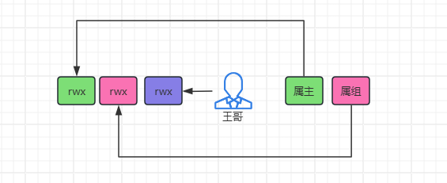
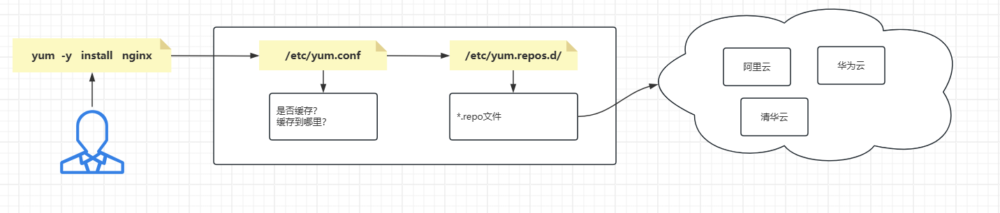
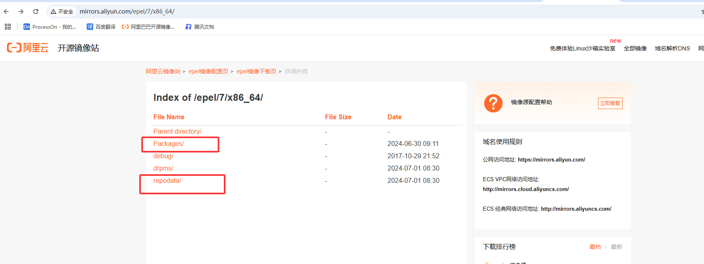

# 一、课程回顾

```bash
#用户的种类：
	- root       0
	- 普通用户    >1000
	- 虚拟用户    <1000
#两个关键词
	uid
	gid
#相关的配置文件
	用户列表：/etc/passwd
	密码文件：/etc/shadow
	用户组列表：/etc/grgoup
#用户管理命令
	useradd/adduser
		- u   
		- g
		- s
			/bin/bash
			/sbin/nologin
		- M
		- G
	userdel  -r
	usermod 
		- u   
		- g
		- s
			/bin/bash
			/sbin/nologin
		- M
		- G
	id
		-un
		-gn
		-u
		-g
	w
	who
	whoami
	last
	lastlog
	
	su - 用户名
	
#设置密码
	passwd 用户名
	
	echo “111” | passwd --stdin 用户名
	echo “用户名:密码” | chpasswd
	cat 1.txt | chpasswd
#提权
	sudo -l
	sudo -k
	sudo mv .......

#别名
	alias

#12位权限位
```



```bash
#
	chown -R  属主.数组  目录/文件
	chmod -R  u=r,g=rwx,o=,  目录/文件    #0470
	chmod -R  +x  目录/文件    
	chmod -R  755  目录/文件
#文件rwx
	r 读文件
	w 写文件；配合r才能写
	x 执行文件；配合r才能执行
#目录rwx
	r 查看目录下有什么，配合x才能看；
	w 怎删改查目录下的信息，配合x才能看；
	x 进入目录

#umask默认权限
	umask 022
		755
		644
	umask 033
		744
		644

#三位特殊权限位
	suid==4、sgid==2、sticky==1
	rwsr-xr-x  root root  cp    #
	
	rwxr-xr-t   
	
	chmod o+t  目录
		  1755

#文件上锁（隐藏权限）：
	chattr +/-i/a  文件
	lsattr 文件
```

# 二、linux软件安装概述

| 安装软件方式                          | 解释说明                                                     | 应用场景                                             |
| ------------------------------------- | ------------------------------------------------------------ | ---------------------------------------------------- |
| yum（centos、kylin）<br>apt（ubuntu） | 远程下载，从软件仓库下载；<br>需要的依赖，yum会自动寻找并自动下载； | 大部分场景；<br>也可以、自建仓库；                   |
| rpm(centos、kylin)<br>dpkg（ubuntu）  | 本地已经有了.rpm结尾的软件安装包，手动安装；<br>需要的依赖，我们自己去找； | 没有网络，误删除软件包的时候，所需要依赖较少的时候； |
| 编译安装                              | 可以自定义安装，安装时间（编译源码的时间），稍微有些长；缺少依赖也需要自己解决； | 功能自定义需求比较大的时候；                         |
| 二进制安装                            | 绿色软件，解压即用的；并非每个软件都有二进制安装包；<br>一般来讲都是比较“重”服务：mysql、k8s..... | 如果有，可以选用                                     |

> 软件包的格式

```bash
#centos与kylin：.rpm结尾的安装包
#ubuntu ：.deb结尾的包
```

# 三、rpm安装

| 命令 | 参数         | 解释说明                                         |
| ---- | ------------ | ------------------------------------------------ |
| rpm  | ivh          | i：install，v：行驶过程，h：人类可读<br>本地安装 |
|      | -qa          | 查看软件包是否安装                               |
|      | -ql          | 查看软件的安装路径                               |
|      | -qf          | 通过命令，索引软件包名称                         |
|      | -U（大写）vh | 升级软件包（如果软件包不存在，则相当于ivh）      |
|      | -e           | 删除软件包                                       |

## 1，rpm安装zabbix案例（了解）

> 视频中母校地址

```bash
wget -P /tools/ https://mirrors.tuna.tsinghua.edu.cn/zabbix/zabbix/6.0/rhel/7/x86_64/zabbix-agent2-6.0.0-1.el7.x86_64.rpm

#安装失败，因为提示缺少依赖
[root@oldboy26 tools 09-权限管理:39:54]# rpm -ivh zabbix-agent2-6.0.0-1.el7.x86_64.rpm 
警告：zabbix-agent2-6.0.0-1.el7.x86_64.rpm: 头V4 RSA/SHA512 Signature, 密钥 ID a14fe591: NOKEY
错误：依赖检测失败：
	libpcre2-8.so.0()(64bit) 被 zabbix-agent2-6.0.0-1.el7.x86_64 需要

#安装这个依赖
[root@oldboy26 tools 09-权限管理:40:26]# yum -y install pcre2


#再次安装
[root@oldboy26 tools 09-权限管理:39:54]# rpm -ivh zabbix-agent2-6.0.0-1.el7.x86_64.rpm 

#查看安装结果
[root@oldboy26 tools 09-权限管理:41:52]# rpm -qa | grep zabbix
zabbix-agent2-6.0.0-1.el7.x86_64

#查看安装位置路径
[root@oldboy26 tools 09-权限管理:42:09-权限管理]# rpm -ql zabbix-agent2
```

> 查看命令属于哪一个软件包(记得，命令要写绝对路径)

```bash
[root@oldboy26 tools 09-权限管理:45:53]# rpm -qf  /usr/bin/netstat
net-tools-2.0-0.25.20131004git.el7.x86_64
```

> 卸载软件

```bash
[root@oldboy26 tools 09-权限管理:46:07-文件属性信息（2）]# rpm -e zabbix-agent2
```

# 四、yum安装（必会）

| 命令 | 参数                  | 解释说明                                            |
| ---- | --------------------- | --------------------------------------------------- |
| yum  | -y   install          | 下载并安装（-y，免交互，有提示的时候，直接选择yes） |
|      | -y    reinstall       | 重新安装                                            |
|      | -y    localinstall    | 本地安装类似于rpm  -ivh                             |
|      | provides    命令/依赖 | 查看哪个软件包当中包含这个命令                      |
|      | search                | 从yum仓库中搜索软件包                               |
|      | list                  | 从远程仓库中，查看软件列表【yum list】              |
|      | remove                | 卸载                                                |
|      | update                | 更新软件（企业当中慎用）                            |
|      | clean  all            | 清理本地缓存包                                      |
|      | makecache             | 生成缓存（将rpm包保留本地）                         |

```bash
[root@oldboy26 tools 10-软件管理:20:49]# yum -y install nginx
[root@oldboy26 tools 10-软件管理:20:49]# yum -y reinstall nginx
[root@oldboy26 tools 10-软件管理:20:49]# yum -y remove nginx
[root@oldboy26 tools 10-软件管理:20:49]# yum -y localinstall ./*.rpm
[root@oldboy26 tools 10-软件管理:25:49]#  yum list | grep nginx
nginx.x86_64                             1:1.20.1-09-权限管理.el7               @epel    
nginx-filesystem.noarch                  1:1.20.1-09-权限管理.el7               @epel    
collectd-nginx.x86_64                    5.8.1-2.el7                   epel 

[root@oldboy26 tools 10-软件管理:26:02-linux目录结构与核心命令（）]# yum update nginx
[root@oldboy26 tools 10-软件管理:26:02-linux目录结构与核心命令（）]# yum provides mkpasswd
已加载插件：fastestmirror
Loading mirror speeds from cached hostfile
 * base: mirrors.aliyun.com
 * extras: mirrors.aliyun.com
 * updates: mirrors.aliyun.com
expect-5.45-13-系统服务管理与三剑客（2）.el7_1.x86_64 : A program-script interaction and testing utility
源    ：base
匹配来源：
文件名    ：/usr/bin/mkpasswd


[root@oldboy26 tools 10-软件管理:27:47]# yum provides libpcre2-8.so.0\(\)\(64bit\)
已加载插件：fastestmirror
Loading mirror speeds from cached hostfile
 * base: mirrors.aliyun.com
 * extras: mirrors.aliyun.com
 * updates: mirrors.aliyun.com
pcre2-09-权限管理.23-2.el7.x86_64 : Perl-compatible regular expression library
源    ：base
匹配来源：
提供    ：libpcre2-8.so.0()(64bit)
```

> yum工具的使用原理



```bash
[root@oldboy26 tools 10-软件管理:34:34]# vim /etc/yum.conf 
[main]
cachedir=/var/cache/yum/$basearch/$releasever     #缓存目录
keepcache=0                                       #1表示缓存，0表示不缓存
debuglevel=2
logfile=/var/log/yum.log
exactarch=1
obsoletes=1
gpgcheck=1
plugins=1
installonly_limit=5
bugtracker_url=http://bugs.centos.org/set_project.php?project_id=23&ref=http://bugs.centos.org/bug_report_page.php?category=yum
distroverpkg=centos-release


#清理缓存
yum  clean all
```

> yum源目录

```bash
#查看当前yum源
[root@oldboy26 tools 10-软件管理:40:50]# yum repolist 
已加载插件：fastestmirror
Loading mirror speeds from cached hostfile
 * base: mirrors.aliyun.com
 * extras: mirrors.aliyun.com
 * updates: mirrors.aliyun.com

#查看源目录
[root@oldboy26 tools 10-软件管理:40:55]# ll /etc/yum.repos.d/
总用量 44
-rw-r--r--. 1 root root 2523 3月   3 09-权限管理:08-用户管理 CentOS-Base.repo
-rw-r--r--. 1 root root 1309 5月  21 2024 CentOS-CR.repo
-rw-r--r--. 1 root root  649 5月  21 2024 CentOS-Debuginfo.repo
-rw-r--r--. 1 root root  314 5月  21 2024 CentOS-fasttrack.repo
-rw-r--r--. 1 root root  630 5月  21 2024 CentOS-Media.repo
-rw-r--r--. 1 root root 1331 5月  21 2024 CentOS-Sources.repo
-rw-r--r--. 1 root root 9454 5月  21 2024 CentOS-Vault.repo
-rw-r--r--. 1 root root  616 5月  21 2024 CentOS-x86_64-kernel.repo
-rw-r--r--. 1 root root  664 3月   3 09-权限管理:08-用户管理 epel.repo
```

> 配置yum源

```bash
#centos
curl -o /etc/yum.repos.d/CentOS-Base.repo https://mirrors.aliyun.com/repo/Centos-7.repo
curl -o /etc/yum.repos.d/epel.repo https://mirrors.aliyun.com/repo/epel-7.repo

#kylin
curl -o /etc/yum.repos.d/epel.repo https://mirrors.aliyun.com/repo/epel-7.repo
```

```bash
#源的文件内容详解[$basearch就是x86_64]的意思
[root@K-oldboy26 tools 10-软件管理:43:48]# cat /etc/yum.repos.d/epel.repo 
[epel]   #源的名称
name=Extra Packages for Enterprise Linux 7 - $basearch    #yum源名字的详细信息；
baseurl=http://mirrors.aliyun.com/epel/7/$basearch        #源链接地址（可以写多个）
failovermethod=priority  #如果地址解析失败，则使用baseurl下面的源地址  
enabled=1   #是否开启使用这个源
gpgcheck=0  #安全效验是否开启
gpgkey=file:///etc/pki/rpm-gpg/RPM-GPG-KEY-EPEL-7   #校验的秘钥本地地址；
```



> 案例：配置nginx官方源
>
> $releasever 版本变量在centos中：7    kylin当中：10
>
> $basearch  架构变量：x86_64

```bash
#kylin
[root@K-oldboy26 tools 10-软件管理:54:10-软件管理]# vim /etc/yum.repos.d/nginx.repo
[nginx-stable]
[nginx-stable]
name=nginx stable repo
baseurl=http://nginx.org/packages/centos/7/$basearch/
gpgcheck=1
enabled=1
gpgkey=https://nginx.org/keys/nginx_signing.key
module_hotfixes=true

#centos
[root@K-oldboy26 tools 10-软件管理:54:10-软件管理]# vim /etc/yum.repos.d/nginx.repo
[nginx-stable]
name=nginx stable repo
baseurl=http://nginx.org/packages/centos/$releasever/$basearch/
gpgcheck=1
enabled=1
gpgkey=https://nginx.org/keys/nginx_signing.key
module_hotfixes=true
```

# 五、apt安装方式

> yum ==  apt/apt-get
>
> rpm  ==  dpkg

| 命令 | 参数                     | 解释说明                                             |
| ---- | ------------------------ | ---------------------------------------------------- |
| apt  | -y   install    软件名称 | 安装软件从远程仓库安装                               |
|      | -y   remove   软件名称   | 卸载软件                                             |
|      | search  命令             | 通过命令搜索已经安装的软件包                         |
|      | show   软件名称          | 显示软件包具体的信息                                 |
|      | upgrade   软件包名称     | 升级这个软件包                                       |
|      | update                   | 更新下载源；（每次修改完仓库，都必须执行，才能生效） |
|      | list                     | 查看本地安装的软件包                                 |
|      | clean                    | 清理本地缓存的软件包                                 |
|      | download                 | 只下载不安装                                         |

> ubuntu配置apt源

```bash
[root@oldboy ~ 15:22:59]# cat /etc/apt/sources.list
deb https://mirrors.aliyun.com/ubuntu/ jammy main restricted universe multiverse
deb-src https://mirrors.aliyun.com/ubuntu/ jammy main restricted universe multiverse

deb https://mirrors.aliyun.com/ubuntu/ jammy-security main restricted universe multiverse
deb-src https://mirrors.aliyun.com/ubuntu/ jammy-security main restricted universe multiverse

deb https://mirrors.aliyun.com/ubuntu/ jammy-updates main restricted universe multiverse
deb-src https://mirrors.aliyun.com/ubuntu/ jammy-updates main restricted universe multiverse

# deb https://mirrors.aliyun.com/ubuntu/ jammy-proposed main restricted universe multiverse
# deb-src https://mirrors.aliyun.com/ubuntu/ jammy-proposed main restricted universe multiverse

deb https://mirrors.aliyun.com/ubuntu/ jammy-backports main restricted universe multiverse
deb-src https://mirrors.aliyun.com/ubuntu/ jammy-backports main restricted universe multiverse


#更新源
[root@oldboy ~ 15:26:04-Linux核心命令]# apt update
```

# 六、dpkg安装方式

| 命令 | 参数                | 解释说明           |
| ---- | ------------------- | ------------------ |
| dpkg | -i                  | 本地安装           |
|      | -l（小写的L）  包名 | ===    rpm     -qa |
|      | -r     包名         | 删除软件包         |
|      | -L(大写L)    包名   | ===     rpm   -ql  |

# 七、安装常用的软件

```bash
yum/apt -y install 
tree                     
vim                       
wget                     #下载
bash-completion          #命令补全工具
bash-completion-extras   #命令补全工具
lrzsz       #上传下载服务器文件
net-tools   #netstat -tnulp
sysstat 
iotop 
iftop 
htop 
unzip    #文件解压缩
nc       #
nmap     #扫描端口
telnet   #类似于sshd服务
bc 
psmisc 
httpd-tools 
bind-utils 
methogs 
expect    
dos2unix    
cowsay 
sl
```


