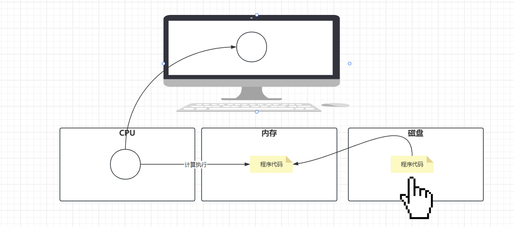
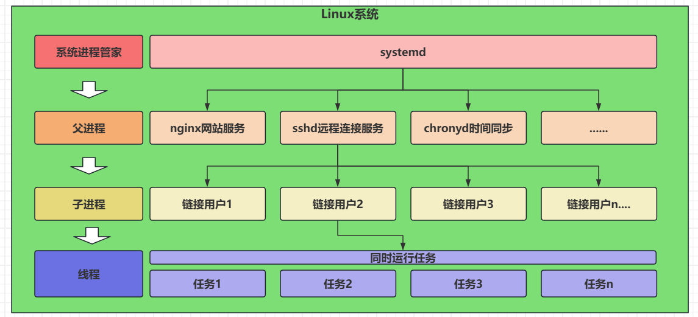
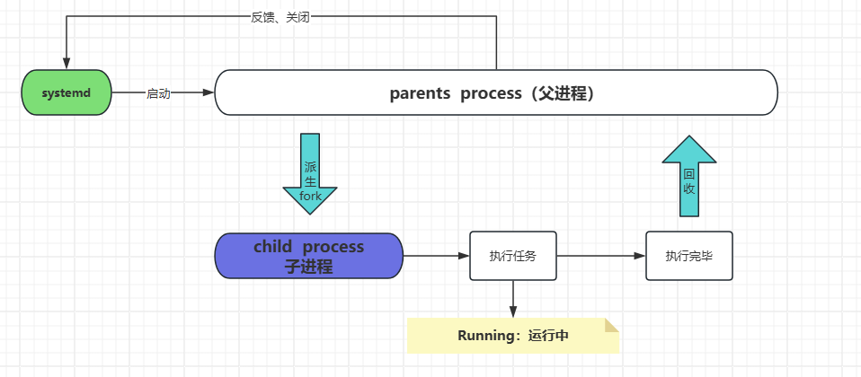
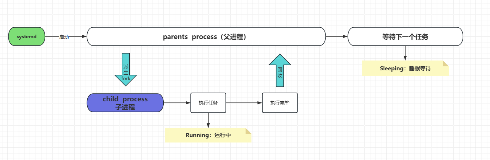
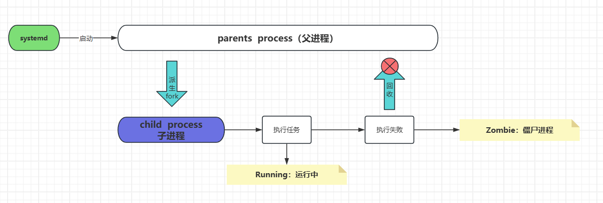
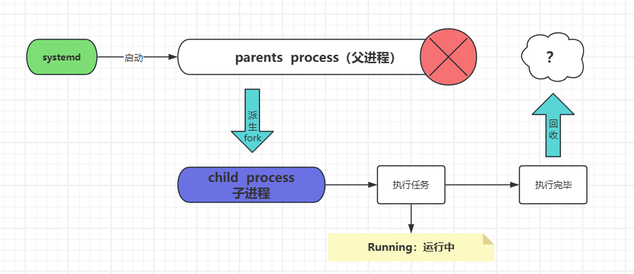
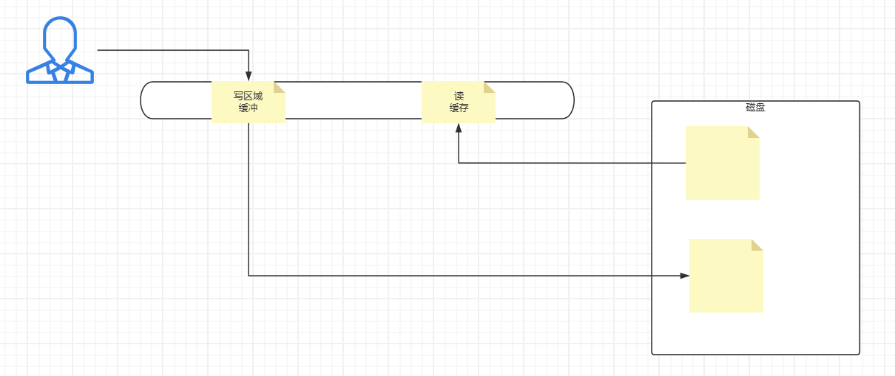
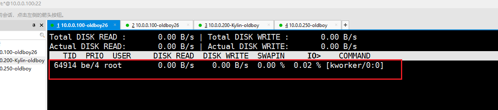
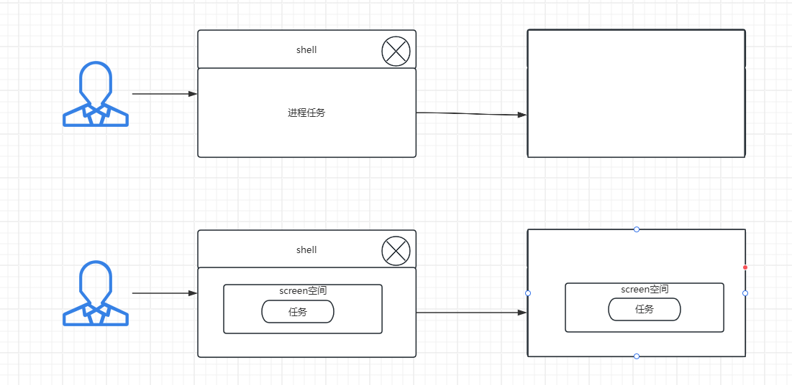

# 一、课程回顾

```bash
#centos和Kylin
1,yum远程仓库安装
		-y install  软件名称
		-y reinstall
		-y localinstall
		   provides 命令/依赖
		   search   软件名称
		   list     #查看软件列表
		   remove   #卸载
		   update/upgrade   #更新升级软件
		   clean all  #清理本地缓存的rpm包
		   makecache  #生成缓存
2，rpm本地安装方式
		-ivh   *.rpm
		-qa    #查看软件包名称
		-ql    #查看软件的安装路径
		-qf 命令的绝对路径   #根据命令查找软件包名称
		-Uvh   #更新软件包
		-e     #卸载软件

#ubuntu系统
1，apt/apt-get
		-y install 
		-y remove
		search 
		show  软件包名称   #显示软件的详细信息
		upgrade           #升级软件
		update     #更新下载源
		list       #查看本地所安装的软件包列表
			--installed  #列出已经安装的所有软件包
			--upgradeable #列出可更新的软件包
		clean      #清理本地缓存包.deb
		download   #只下载软件包不安装；
2，dpkg  -i
		 -l  软件包   #==rpm -qa
		 -r          #卸载
		 -L          #==rpm  -ql
```

# 二、进程概念

| 名词     | 解释说明                                                     |
| -------- | ------------------------------------------------------------ |
| 程序     | 存在磁盘，代码文件；（安装包、app）                          |
| 进程     | 运行起来的程序代码、命令、服务都可以称为：进程；运行在：内存中 |
| 守护进程 | 一直都运行的进程，也叫做服务；                               |



# 三、进程的层级和分类

## 1，查看进程的关系

```bash
[root@oldboy26 ~ 08-用户管理:26:39]# rpm -qa psmisc
psmisc-22.20-17.el7.x86_64
[root@oldboy26 ~ 08-用户管理:26:13-系统服务管理与三剑客（2）]# yum -y install psmisc

[root@oldboy26 ~ 08-用户管理:26:13-系统服务管理与三剑客（2）]# pstree
systemd─┬─NetworkManager───2*[{NetworkManager}]
        ├─VGAuthService
        ├─abrt-watch-log
        ├─abrtd
        ├─agetty
        ├─auditd───{auditd}
        ├─chronyd
        ├─crond
        ├─dbus-daemon───{dbus-daemon}
        ├─firewalld───{firewalld}
        ├─master─┬─pickup
        │        └─qmgr
        ├─polkitd───6*[{polkitd}]
        ├─rsyslogd───2*[{rsyslogd}]
        ├─sshd───bash
        ├─sshd───sshd───bash───pstree
        ├─systemd-journal
        ├─systemd-logind
        ├─systemd-udevd
        ├─tuned───4*[{tuned}]
        └─vmtoolsd───{vmtoolsd}

#-p显示进程号（pid）
[root@oldboy26 ~ 08-用户管理:28:41]# pstree -p
systemd(1)─┬─NetworkManager(1068)─┬─{NetworkManager}(1087)
           │                      └─{NetworkManager}(1093)
           ├─VGAuthService(24103)
           ├─abrt-watch-log(940)
           ├─abrtd(936)
           ├─agetty(970)
           ├─auditd(816)───{auditd}(820)
           ├─chronyd(978)
           ├─crond(24202)
           ├─dbus-daemon(943)───{dbus-daemon}(953)
           ├─firewalld(23948)───{firewalld}(24082)
           ├─master(1575)─┬─pickup(64158)
           │              └─qmgr(1587)
           ├─polkitd(24245)─┬─{polkitd}(24246)
           │                ├─{polkitd}(24247)
           │                ├─{polkitd}(24248)
           │                ├─{polkitd}(24249)
           │                ├─{polkitd}(24250)
           │                └─{polkitd}(24251)
           ├─rsyslogd(24161)─┬─{rsyslogd}(24163)
           │                 └─{rsyslogd}(24164)
           ├─sshd(1697)───bash(1701)
           ├─sshd(24125)───sshd(64206)───bash(64210)───pstree(64247)
           ├─systemd-journal(366)
           ├─systemd-logind(939)
           ├─systemd-udevd(4373)
           ├─tuned(24272)─┬─{tuned}(24441)
           │              ├─{tuned}(24442)
           │              ├─{tuned}(24446)
           │              └─{tuned}(24448)
           └─vmtoolsd(24104)───{vmtoolsd}(24106)
```

## 2，进程的关系讲解

```bash
#进程关系描述
	1，程序启动，系统【systemd】监管启动服务的【父进程（sshd）】
	2，父进程根据执行任务，派生出【子进程】，进行任务执行；
	3，子进程以【线程的方式执行任务】，如果并发多个，需要派生多个线程；
```



## 3，进程的分类

```bash
#普通进程
```



```bash
#守护进程
```



```bash
#僵尸进程
```



```bash
#孤儿进程
```



# 四、进程的监控命令

| 命令 | 含义                                              | 使用场景                                   |
| ---- | ------------------------------------------------- | ------------------------------------------ |
| ps   | process静态查看进程，此时此刻一瞬间的进程状态；   | 查看进程号，查看进程是否存在，查看进程状态 |
| top  | process动态查看进程，实时监控进程及硬件使用信息； | 系统的cpu负载、内存、僵尸进程查看，等等... |

## 1，【ps】命令

```bash
ps -ef    #简单查看
ps -axu   #详细查看

	-a   #all，显示所有终端下的执行程序进程；不管在哪里登录，只要执行了进程，就显示；
	-u   #【user】显示进程的守护（管理）用户；
	-x   #显示所有程序，不以终端来区分，包括系统运行的进程（不加x只能查看远程连接的进程）
	-e/A #显示系统中所有的（启动）进程信息，没有执行的也算；
	-f   #当前用户的操作，所产生的进程信息；显示更加详细的进程信息，包括pid和ppid；
	-o   #指定列查看
```

```bash
[root@oldboy26 ~ 09-权限管理:38:03-linux目录结构与核心命令（2）]# ps -axu
USER        PID %CPU %MEM    VSZ   RSS TTY      STAT START   TIME COMMAND
root          1  0.0  0.6  46392  6336 ?        Ss   3月12   0:08-用户管理 /usr/lib/systemd/systemd --system --deser
root          2  0.0  0.0      0     0 ?        S    3月12   0:00 [kthreadd]
root          4  0.0  0.0      0     0 ?        S<   3月12   0:00 [kworker/0:0H]
root          6  0.0  0.0      0     0 ?        S    3月12   0:03-linux目录结构与核心命令（2） [ksoftirqd/0]
root          7  0.0  0.0      0     0 ?        S    3月12   0:00 [migration/0]
root          8  0.0  0.0      0     0 ?        S    3月12   0:00 [rcu_bh]
root          9  0.0  0.0      0     0 ?        R    3月12   0:03-linux目录结构与核心命令（2） [rcu_sched]


USER   #进程的守护用户
PID    #子进程号
%CPU   #cpu占用%比（1核心跑满：100%，4核心：400%）
%MEM   #内存占用的%比
VSZ    #虚拟内存的使用情况（kb），占用多大的内存；
RSS    #实际内存的使用情况（kb），使用多大；
TTY    #链接主机的类型（tty本机链接，pts远程连接）
STAT   #进程的运行状态（**************重点************）
START  #进程启动的时间，什么时间启动的；
TIME   #进程启动过程当中，占用cpu多长时间的资源；
COMMAND   #进程执行的命令（[]表示系统内核启动的过程）

##########################
[root@oldboy26 ~ 09-权限管理:50:43]# tty
/dev/pts/1
```

## 2，进程的状态

| 状态 | 解释说明                                 |
| ---- | ---------------------------------------- |
| R    | Running：正在运行中                      |
| S    | Sleeping：睡眠等待状态（等待下一个任务） |
| T    | stop：停止、暂停的任务进程（ctrl + z）   |
| D    | 不可中断的进程（io读写磁盘的）           |
| Z    | Zombie:僵尸进程，异常的进程；            |

## 3，进程的状态符号

| 符号         | 解释说明                                       |
| ------------ | ---------------------------------------------- |
| s            | 父进程的意思【Ss】                             |
| <            | 优先级比较高的进程【S<】（优先使用cpu）        |
| N            | 优先级较低的进程【SN】                         |
| +            | 前台运行的进程【S+】,占用你的终端              |
| l（小写的L） | 这个进程是多线程的；表示进程以现成的方式运行； |

```bash
#前台运行一个程序
[root@oldboy26 ~ 10-软件管理:17:59]# sleep 10000 

#查看前台运行的进程
[root@oldboy26 ~ 09-权限管理:50:31]# ps -axu | grep -v grep | grep sleep
root      64465  0.0  0.0 108052   356 pts/1    S+    09-权限管理:55   0:00 sleep 10000

#ctrl + z  暂停这个进程
[root@oldboy26 ~ 09-权限管理:50:31]# ps -axu | grep -v grep | grep sleep
root      64466  0.0  0.0 108052   360 pts/1    T    09-权限管理:55   0:00 sleep 10000

#唤醒暂停的进程
[root@oldboy26 ~ 10-软件管理:17:59]# jobs
[1]-  运行中               sleep 10000 &
[2]+  已停止               sleep 10000

#将后台运行的改为前台运行
[root@oldboy26 ~ 10-软件管理:22:20]# fg 1
sleep 10000
```

## 4，【top】命令

```bash
[root@oldboy26 ~ 10-软件管理:22:27]# top
######################################################################
top - 10-软件管理:23:51    up 2 days,  3:03-linux目录结构与核心命令（2）,  6 users,  load average: 0.00, 0.01-vmware安装linux镜像+命令基础入门,     0.05-系统重要的配置文件-etc
      系统当前时间  运行时长            当前链接   cpu平均负载：  1分钟，平均5分钟，平均15分钟
      										   1核心1分钟之内占用cpu30秒，那么1分钟负载：50%==0.5
      										   2核心1分钟之内占用cpu30秒，那么1分钟负载：100%==1
######################################################################
Tasks: 108 total,   1 running, 107 sleeping,   0 stopped,   0 zombie
	   108个进程     1个运行中   107个睡眠等待     0个暂停      0个僵尸
######################################################################
%Cpu(s):  0.0 us,  0.0 sy,  0.0 ni,100.0 id,  0.0 wa,  0.0 hi,  0.0 si,  0.0 st
    0.0 us   #【user用户态】用户操作占用的cpu
    0.0 sy   #【system内核态】系统内核运行占用cpu
    0.0 ni   #【nice高优先级进程】高优先级占用cpu
    100.0 id #【idle空闲】空闲率
    0.0 wa   #【wait磁盘io等待】D状态占用cpu
    ============================================
    0.0 hi   #硬中断，硬件中断：插u盘
    0.0 si   #软中断，软件中断：开机运行新的程序
    0.0 st   #服务器虚拟机占用cpu的百分比
######################################################################
KiB Mem :   995672 total,   144720 free,   287464 used,   563488 buff/cache
	        内存最大值       空闲的内存       使用量          缓存和缓冲
KiB Swap:  2097148 total,  2090664 free,     6484 used.   529232 avail Mem 
#####################################################################
   PID USER      PR  NI    VIRT    RES    SHR S %CPU %MEM     TIME+ COMMAND                                
 64513 root      20   0  162068   2204   1560 R  0.3  0.2   0:00.22 top                                    
     1 root      20   0   46392   6336   3608 S  0.0  0.6   0:08-用户管理.46 systemd                                
     2 root      20   0       0      0      0 S  0.0  0.0   0:00.03-linux目录结构与核心命令（2） kthreadd                               
............................................
PID      #子进程号
USER     #守护用户
PR       #进程调度的优先级
NI       #【nice】进程调度的优先级
VIRT     #进程占用的虚拟内存（建筑面积、房本面积）
RES      #实际使用内存（套内真是面积）
SHR      #进程占用的共享内存（共享区域）
S        #状态
%CPU     #占用cpu
%MEM     #占用内存
TIME+    #进程运行到现在，占用的cpu时间
COMMAND  #进程执行的命令；
```



> top命令的参数

```bash
top  -d 10   #【10秒一更新】改变更新速度
	 -i      #不显示任何限制或者无用的进程（不显示僵尸进程）
	 -n 3    #【刷新3次后退出top命令】
	 -b      #归档，搭配-n使用，可以将top的结果写入文件
[root@oldboy26 ~ 10-软件管理:50:45]# top -n3 -b > 1.txt
```

> top的动态命令

```bash
M   #以内存进行排序
P   #以cpu进行排序
b   #高亮显示R状态的进程
1   #显示所有cpu核心数的负载情况
q   #quit退出动态
h   #help
```

## 5，杀死进程

### · kill杀死进程

```bash
[root@oldboy26 ~ 09-权限管理:49:35]# sleep 30000 && rm -rf /* &
[1] 64757

[root@oldboy26 ~ 15:02-linux目录结构与核心命令（）:37]# ps -axu | grep -v grep | grep sleep
root      64758  0.0  0.0 108052   360 pts/5    S    15:02-linux目录结构与核心命令（）   0:00 sleep 30000

[root@oldboy26 ~ 15:02-linux目录结构与核心命令（）:54]# kill 64758
[root@oldboy26 ~ 15:03-linux目录结构与核心命令（2）:44]# -bash: 行 12-系统服务管理与三剑客（1）: 64758 已终止               sleep 30000

[1]+  退出 143              sleep 30000 && rm -i -rf /*
[root@oldboy26 ~ 15:03-linux目录结构与核心命令（2）:46]# ps -axu | grep -v grep | grep sleep
```

> kill相关参数

```bash
[root@oldboy26 ~ 15:03-linux目录结构与核心命令（2）:58]# kill -l
 1) SIGHUP	 2) SIGINT	 3) SIGQUIT	 4) SIGILL	 5) SIGTRAP
 6) SIGABRT	 7) SIGBUS	 8) SIGFPE	 9) SIGKILL	10) SIGUSR1
11) SIGSEGV	12) SIGUSR2	13) SIGPIPE	14) SIGALRM	15) SIGTERM
16) SIGSTKFLT	17) SIGCHLD	18) SIGCONT	19) SIGSTOP	20) SIGTSTP
21) SIGTTIN	22) SIGTTOU	23) SIGURG	24) SIGXCPU	25) SIGXFSZ
26) SIGVTALRM	27) SIGPROF	28) SIGWINCH	29) SIGIO	30) SIGPWR
31) SIGSYS	34) SIGRTMIN	35) SIGRTMIN+1	36) SIGRTMIN+2	37) SIGRTMIN+3
38) SIGRTMIN+4	39) SIGRTMIN+5	40) SIGRTMIN+6	41) SIGRTMIN+7	42) SIGRTMIN+8
43) SIGRTMIN+9	44) SIGRTMIN+09-权限管理	45) SIGRTMIN+10-软件管理	46) SIGRTMIN+11-进程与服务管理	47) SIGRTMIN+12-系统服务管理与三剑客（1）
48) SIGRTMIN+13-系统服务管理与三剑客（2）	49) SIGRTMIN+15	50) SIGRTMAX-13-系统服务管理与三剑客（2）	51) SIGRTMAX-12-系统服务管理与三剑客（1）	52) SIGRTMAX-11-进程与服务管理
53) SIGRTMAX-10-软件管理	54) SIGRTMAX-09-权限管理	55) SIGRTMAX-9	56) SIGRTMAX-8	57) SIGRTMAX-7
58) SIGRTMAX-6	59) SIGRTMAX-5	60) SIGRTMAX-4	61) SIGRTMAX-3	62) SIGRTMAX-2
63) SIGRTMAX-1	64) SIGRTMAX	

###############################
    kill  1   进程号      #不杀死进程，重新加载配置文件；
    kill  9   进程号      #强制杀死（慎用）；
    kill  15  进程号      #==kill（默认值），温柔杀死（把手里的工作做完，再杀死）；
#或者
    kill  -s  SIGHUP    进程号
    kill  -s  SIGKILL   进程号
    kill  -s  SIGTERM   进程号
```

### · pikill和killall命令

```bash
#1，pkill通过名称杀死进程（模糊查询的杀死）
[root@oldboy26 ~ 15:03-linux目录结构与核心命令（2）:58]# pkill  ssh    #只要进程中带ssh者3个字符的进程，全部干掉；

#2，killall通过名称杀死进程（精准查询的杀死）
[root@oldboy26 ~ 15:21:25]# nohup ping 09-权限管理.0.0.1 &
[1] 64905

[root@oldboy26 ~ 15:21:52]# nohup: 忽略输入并把输出追加到"nohup.out"

[root@oldboy26 ~ 15:22:13-系统服务管理与三剑客（2）]# killall ping
[root@oldboy26 ~ 15:22:23]# ps -axu |grep -v grep |grep ping
```

## 6，进程的相关文件（了解）

> 记住：一切皆文件的原则；

```bash
[root@oldboy26 ~ 15:21:54]# ps -ef | grep sshd
root      64836      1  0 15:16 ?        00:00:00 /usr/sbin/sshd -D
root      64838  64836  0 15:16 ?        00:00:00 sshd: root@pts/0
root      64874  64836  0 15:20 ?        00:00:00 sshd: root@pts/1
root      64922  64842  0 15:25 pts/0    00:00:00 grep --color=auto sshd
[1]+  已终止               nohup ping 09-权限管理.0.0.1

[root@oldboy26 ~ 15:25:13-系统服务管理与三剑客（2）]# ll /proc/64836
总用量 0
dr-xr-xr-x. 2 root root 0 3月  14 15:16 attr
-rw-r--r--. 1 root root 0 3月  14 15:26 autogroup
-r--------. 1 root root 0 3月  14 15:26 auxv
-r--r--r--. 1 root root 0 3月  14 15:16 cgroup
--w-------. 1 root root 0 3月  14 15:26 clear_refs
-r--r--r--. 1 root root 0 3月  14 15:16 cmdline
-rw-r--r--. 1 root root 0 3月  14 15:16 comm

#进程执行命令的文件
[root@oldboy26 ~ 15:26:23]# ll /proc/64836/cmdline 
-r--r--r--. 1 root root 0 3月  14 15:16 /proc/64836/cmdline

#服务的资源限制
[root@oldboy26 ~ 15:27:53]# cat /proc/64836/cmdline 
/usr/sbin/sshd-D[root@oldboy26 ~ 15:27:57]# cat /proc/64836/limits 
Limit                     Soft Limit           Hard Limit           Units     
Max cpu time              unlimited            unlimited            seconds   
Max file size             unlimited            unlimited            bytes     
Max data size             unlimited            unlimited            bytes     
Max stack size            8388608              unlimited            bytes     
Max core file size        0                    unlimited            bytes     
Max resident set          unlimited            unlimited            bytes     
Max processes             3805                 3805                 processes 
Max open files            1024                 4096                 files     
Max locked memory         65536                65536                bytes     
Max address space         unlimited            unlimited            bytes     
Max file locks            unlimited            unlimited            locks     
Max pending signals       3805                 3805                 signals   
Max msgqueue size         819200               819200               bytes     
Max nice priority         0                    0                    
Max realtime priority     0                    0                    
Max realtime timeout      unlimited            unlimited            us        

#当前内存的使用信息
[root@oldboy26 ~ 15:28:20]# cat /proc/64836/statm
28251 1081 822 200 0 190 0
```

## 7，系统负载

### · 查询系统负载

> 系统负载：
>
> - 主要衡量：可运行状态的进程，和IO读写磁盘占用cpu的使用率；
> - 可运行的状态：R\S
> - io读写的进程：D

```bash
#top查看
[root@oldboy26 ~ 15:30:19]# top -n1
top - 15:34:54 up 2 days,  7:13-系统服务管理与三剑客（2）,  3 users,  load average: 0.00, 0.01-vmware安装linux镜像+命令基础入门, 0.05-系统重要的配置文件-etc

#w
[root@oldboy26 ~ 15:34:54]# w
 15:35:12-系统服务管理与三剑客（1） up 2 days,  7:15,  3 users,  load average: 0.00, 0.01-vmware安装linux镜像+命令基础入门, 0.05-系统重要的配置文件-etc
USER     TTY      FROM             LOGIN@   IDLE   JCPU   PCPU WHAT
root     tty1                      15:16   18:49   0.86s  0.86s -bash
root     pts/0    09-权限管理.0.0.1         15:16    1.00s  0.29s  0.00s w
root     pts/1    09-权限管理.0.0.1         15:20   11-进程与服务管理:49   0.16s  0.16s -bash

#uptime
[root@oldboy26 ~ 15:35:12-系统服务管理与三剑客（1）]# uptime
 15:35:48 up 2 days,  7:15,  3 users,  load average: 0.00, 0.01-vmware安装linux镜像+命令基础入门, 0.05-系统重要的配置文件-etc

#/proc/loadavg
[root@oldboy26 ~ 15:36:33]# cat /proc/loadavg 
0.00 0.01-vmware安装linux镜像+命令基础入门 0.05-系统重要的配置文件-etc 1/118 64963
```

### · 处理系统负载高的问题

```bash
#查看是什么态的使用比较高？
[root@oldboy26 ~ 15:36:36]# top -n1
....
%Cpu(s):  0.0 us,  0.0 sy,  0.0 ni,100.0 id,  0.0 wa,  0.0 hi,  0.0 si,  0.0 st
          用户态    内核态                      IO读写磁盘

#如果是IO读写磁盘占用cpu比较高，使用iotop查看是什么进程读写磁盘？
[root@oldboy26 ~ 15:38:13-系统服务管理与三剑客（2）]# iotop 
[root@oldboy26 ~ 15:38:13-系统服务管理与三剑客（2）]# iotop -o   #只显示使用io磁盘的进程

#lscpu查询cpu信息
[root@oldboy26 ~ 15:44:04-Linux核心命令]# lscpu
Architecture:          x86_64
CPU op-mode(s):        32-bit, 64-bit
Byte Order:            Little Endian
CPU(s):                1
```



```bash
[root@oldboy26 ~ 15:44:07-文件属性信息（2）]# dd if=/dev/zero of=/root/big.log bs=1M count=50000
已终止

```

## 8，前后台运行

```bash
#前台运行：占用你的终端；
#后台运行：不占用终端（偷偷的执行命令）；
[root@oldboy26 ~ 15:54:05-系统重要的配置文件-etc]# sleep 09-权限管理
[root@oldboy26 ~ 16:26:41]# sleep 09-权限管理 &
[1] 65124
```

### · 准备环境

```bash
[root@oldboy26 ~ 16:26:51]# vim sh.sh
#/bin/bash

for i in {1..30000}
do
        echo $i >>1.txt &
        sleep 1
done
```

```bash
[root@oldboy26 ~ 16:30:33]# sh sh.sh &
[1] 65161

[root@oldboy26 ~ 16:31:23]# ps -axu | grep -v grep| grep sh
......
root      65161  0.2  0.7 118824  7000 pts/1    S    16:30   0:00 sh sh.sh

#查看该终端，后台运行的进程
[root@oldboy26 ~ 16:32:34]# jobs
[1]+  运行中               sh sh.sh &

#前台运行
[root@oldboy26 ~ 16:32:41]# fg 1
sh sh.sh
^Z
[1]+  已停止               sh sh.sh

#后台运行（退出shell之后，进程也跟着退出）
[root@oldboy26 ~ 16:33:00]# bg 1
[1]+ sh sh.sh &


#后台运行，不打印输出结果
[root@oldboy26 ~ 16:36:50]# nohup sh sh.sh &
```


### · screen后台运行

> screen能够保证，运行在后台的程序，退出shell继续运行，知道程序运行结束；
>
> screen平行空间



> 安装：yum -y install screen

```bash
#创建并进入平行空间：oldboy26
[root@oldboy26 ~ 16:48:22]# screen -S oldboy26
	提示：你会发现屏幕一闪，其他啥变化都没有

#此时。你就已经在平行空间当中了，只需要要执行命令即可
sh  sh.sh

#退出平行空间
ctrl + a +d 

#退出shell重连，发现进程还在
[root@oldboy26 ~ 16:51:33]# ps -axu | grep sh
...
root      66527  0.1  0.7 118824  7008 pts/1    S+   16:49   0:00 sh sh.sh
...
```

> screen的参数使用

```bash
#查看目前的平行空间
[root@oldboy26 ~ 16:52:54]# screen -list
There is a screen on:
	66508.oldboy26	(Detached)
1 Socket in /var/run/screen/S-root.

#进入到一个平行空间当中
[root@oldboy26 ~ 16:53:01-vmware安装linux镜像+命令基础入门]# screen  -r 66508

#删除一个平行空间
exit
```

# 五、总结

```bash
1，ps
		-ef
		-axu
2，top  -n1
kill  1/9/15
pkill/killall

bg、fg   &    nohup   &
screen 平行空间；
```


