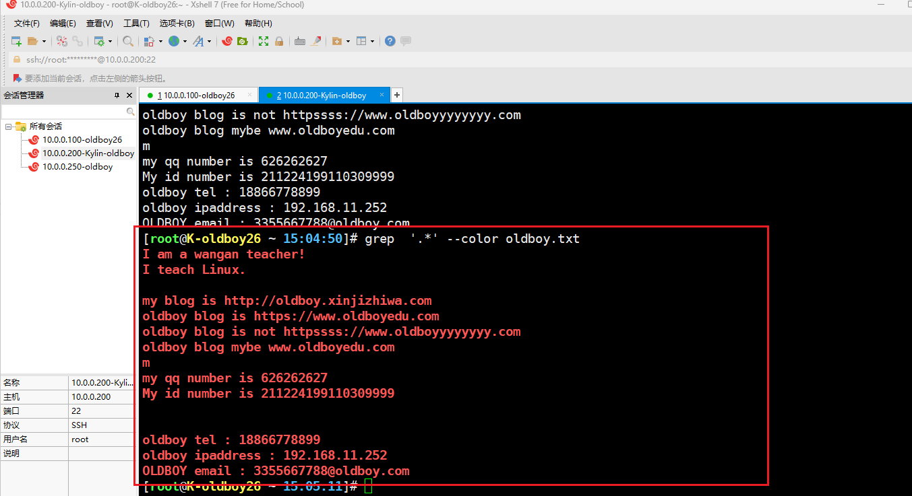
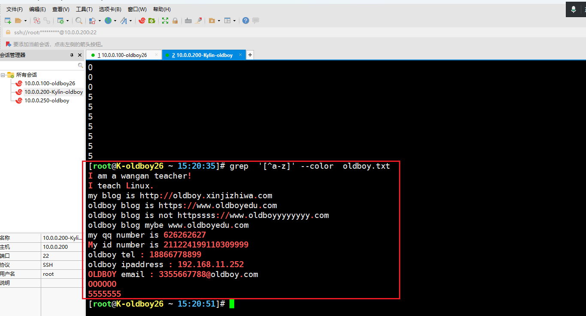

# 一、系统服务管理

```bash
#systemd

#1，查看服务的状态
[root@K-oldboy26 ~ 18:06-文件属性信息（1）:52]# systemctl status sshd
#2，启动服务
[root@K-oldboy26 ~ 18:06-文件属性信息（1）:52]# systemctl start sshd
#3，设置开机自启动
[root@K-oldboy26 ~ 18:06-文件属性信息（1）:52]# systemctl enable sshd
#4，关闭服务
[root@K-oldboy26 ~ 18:06-文件属性信息（1）:52]# systemctl stop sshd
#5，设置开机禁止启动
[root@K-oldboy26 ~ 18:06-文件属性信息（1）:52]# systemctl disable sshd
#6，重启服务
[root@K-oldboy26 ~ 18:06-文件属性信息（1）:52]# systemctl restart sshd
#7，重新加载配置文件（kill -1）
[root@K-oldboy26 ~ 18:06-文件属性信息（1）:52]# systemctl reload sshd
```

# 二、救援模式

## 1，kylin

```bash
#重启系统，快速按：e
```


```bash
root
Kylin123123
#k大写
```


```bash
#找到【linux】开头那一行：
	- 将ro改成rw
	- 在行尾添加：init=/bin/bash  console=tty0
#ctrl + x
```


```bash
#修改密码
	passwd root
#重启
	/usr/sbin/reboot -f
```

## 2，centos

```bash
#1,重启系统，快速按：e
#2,找到【linux16】开头那一行：
	- 在行尾添加：rd.break
#3,ctrl + x
#4，mount -o remount,rw /sysroot
#5,chroot /sysroot    
#5，系统语言改成英文
	LANG=en
#6，设置密码
	passwd root
#7，创建selinux标签
	touch /.autorelabel
	exit
#8,重启系统即可
	root
```

# 三、系统特殊符号和三剑客

## 1，系统特殊符号

### · 引号系列

| 引号         | 解释说明                                                     |
| ------------ | ------------------------------------------------------------ |
| 单引号【''】 | 所见即所得，单引号里面的内容，原封不动的输出；               |
| 双引号【""】 | 双引号里面的内容、变量、特殊符号，会被解析，【对于{}和通配符号，不解析】 |
| 反引号【``】 | 优先执行反引号中的命令，【支持{}和通配符】                   |
| 不加引号     | 【支持{}和通配符】                                           |

```bash
#单引号
[root@K-oldboy26 ~ 09-权限管理:04-Linux核心命令:50]# echo $PATH
/usr/local/sbin:/usr/local/bin:/usr/sbin:/usr/bin:/root/bin:/root/bin
[root@K-oldboy26 ~ 09-权限管理:05-系统重要的配置文件-etc:07-文件属性信息（2）]# echo '$PATH'
$PATH

#双引号
[root@K-oldboy26 ~ 09-权限管理:05-系统重要的配置文件-etc:24]# echo "$PATH"
/usr/local/sbin:/usr/local/bin:/usr/sbin:/usr/bin:/root/bin:/root/bin
[root@K-oldboy26 ~ 09-权限管理:06-文件属性信息（1）:07-文件属性信息（2）]# echo '$PATH'
$PATH
[root@K-oldboy26 ~ 09-权限管理:06-文件属性信息（1）:16]# echo {1..09-权限管理}
1 2 3 4 5 6 7 8 9 10
[root@K-oldboy26 ~ 09-权限管理:06-文件属性信息（1）:24]# echo "{1..09-权限管理}"
{1..09-权限管理}

#反引号
[root@K-oldboy26 ~ 09-权限管理:06-文件属性信息（1）:24]# echo "{1..09-权限管理}"
{1..09-权限管理}
[root@K-oldboy26 ~ 09-权限管理:06-文件属性信息（1）:29]# echo hostname
hostname
[root@K-oldboy26 ~ 09-权限管理:07-文件属性信息（2）:46]# echo "hostname"
hostname
[root@K-oldboy26 ~ 09-权限管理:07-文件属性信息（2）:52]# echo `hostname`
K-oldboy26
[root@K-oldboy26 ~ 09-权限管理:08-用户管理:02-linux目录结构与核心命令（）]# echo `{1..09-权限管理}`
-bash: 1：未找到命令

[root@K-oldboy26 ~ 09-权限管理:08-用户管理:24]# echo `echo {1..09-权限管理}`
1 2 3 4 5 6 7 8 9 10
```

### · 重定向系列


| 符号              | 含义                   | 解释说明                             |
| ----------------- | ---------------------- | ------------------------------------ |
| 【>】或者【1>】   | 标准正确输出覆盖重定向 | 先清空文件，再将正确的结果写入文件中 |
| 【2>】            | 标准错误输出覆盖重定向 | 先清空文件，再将错误的结果写入文件中 |
| 【>>】或者【1>>】 | 标准正确输出追加重定向 | 将正确的结果追加写入文件中           |
| 【2>>】           | 标准错误输出追加重定向 | 将错误的结果追加写入文件中           |
| 【<】或者【0<】   | 标准输入覆盖重定向     | 很少用，搭配xargs或者tr命令使用      |
| 【<<】或者【0<<】 | 标准输入追加重定向     | 与cat搭配使用，写入多行内容          |

```bash
#1，正确与错误都输出到文件中【操作日志】

- 方法一：
[root@K-oldboy26 ~ 09-权限管理:22:52]# echoo 123 1>> 3.txt 2>>3.txt
[root@K-oldboy26 ~ 09-权限管理:28:38]# cat 3.txt 
-bash: echoo：未找到命令
[root@K-oldboy26 ~ 09-权限管理:28:41]# echo 123 1>> 3.txt 2>>3.txt
[root@K-oldboy26 ~ 09-权限管理:28:47]# cat 3.txt 
-bash: echoo：未找到命令
123

- 方法二：【仅仅在centos和kylin当中可以用，Ubuntu不可以】
[root@K-oldboy26 ~ 09-权限管理:28:51]# echo 333 &>>3.txt
[root@K-oldboy26 ~ 09-权限管理:30:16]# cat 3.txt 
-bash: echoo：未找到命令
123
333
[root@K-oldboy26 ~ 09-权限管理:30:20]# echoooooo 333 &>>3.txt
[root@K-oldboy26 ~ 09-权限管理:30:28]# cat 3.txt 
-bash: echoo：未找到命令
123
333
-bash: echoooooo：未找到命令

- 方法三：
[root@K-oldboy26 ~ 09-权限管理:32:12-系统服务管理与三剑客（1）]# echoooooo 444444 1>>3.txt 2>&1
[root@K-oldboy26 ~ 09-权限管理:32:19]# echo 444444 1>>3.txt 2>&1
[root@K-oldboy26 ~ 09-权限管理:32:24]# cat 3.txt 
-bash: echoo：未找到命令
123
333
-bash: echoooooo：未找到命令
-bash: echoooooo：未找到命令
-bash: echoooooo：未找到命令
444444

#2，标准输入cat写法
[root@K-oldboy26 ~ 09-权限管理:32:27]# cat > 4.txt<<EOF
> 111
> 222
> 333
> EOF

[root@K-oldboy26 ~ 09-权限管理:34:06]# cat <<EOF >5.txt
> 111
> 222
> 333
> EOF

#3，标准输入案例
[root@K-oldboy26 ~ 09-权限管理:36:06]# seq 09-权限管理 > 6.txt
[root@K-oldboy26 ~ 09-权限管理:36:49]# cat 6.txt 
1
2
3
4
5
6
7
8
9
10


[root@K-oldboy26 ~ 09-权限管理:37:09-权限管理]# xargs -n 2 < 6.txt 
1 2
3 4
5 6
7 8
9 10
[root@K-oldboy26 ~ 09-权限管理:37:27]# cat 6.txt | xargs -n 2
1 2
3 4
5 6
7 8
9 09-权限管理.
```

### · 通配符

| 符号       | 解释说明                        |
| ---------- | ------------------------------- |
| *          | 表示【任意所有】：*.txt 、ens\* |
| [!]或者[^] | 取反                            |
| {}         | 输出序列                        |
| ？         | 匹配[一个]字符                  |

#### 1，{}花括号

```bash
[root@K-oldboy26 ~ 09-权限管理:37:46]# echo {1..09-权限管理}
1 2 3 4 5 6 7 8 9 10
[root@K-oldboy26 ~ 10-软件管理:11-进程与服务管理:01-vmware安装linux镜像+命令基础入门]# echo {a..z}
a b c d e f g h i j k l m n o p q r s t u v w x y z

[root@K-oldboy26 ~ 10-软件管理:11-进程与服务管理:23]# touch oldboy{1..09-权限管理}.txt
[root@K-oldboy26 ~ 10-软件管理:12-系统服务管理与三剑客（1）:06]# ll
总用量 0
-rw-r--r-- 1 root root 0  3月 17 10-软件管理:12-系统服务管理与三剑客（1） oldboy10.txt
-rw-r--r-- 1 root root 0  3月 17 10-软件管理:12-系统服务管理与三剑客（1） oldboy1.txt
-rw-r--r-- 1 root root 0  3月 17 10-软件管理:12-系统服务管理与三剑客（1） oldboy2.txt
-rw-r--r-- 1 root root 0  3月 17 10-软件管理:12-系统服务管理与三剑客（1） oldboy3.txt
-rw-r--r-- 1 root root 0  3月 17 10-软件管理:12-系统服务管理与三剑客（1） oldboy4.txt
-rw-r--r-- 1 root root 0  3月 17 10-软件管理:12-系统服务管理与三剑客（1） oldboy5.txt
-rw-r--r-- 1 root root 0  3月 17 10-软件管理:12-系统服务管理与三剑客（1） oldboy6.txt
-rw-r--r-- 1 root root 0  3月 17 10-软件管理:12-系统服务管理与三剑客（1） oldboy7.txt
-rw-r--r-- 1 root root 0  3月 17 10-软件管理:12-系统服务管理与三剑客（1） oldboy8.txt
-rw-r--r-- 1 root root 0  3月 17 10-软件管理:12-系统服务管理与三剑客（1） oldboy9.txt

[root@K-oldboy26 ~ 10-软件管理:12-系统服务管理与三剑客（1）:07-文件属性信息（2）]# echo a{b,c}
ab ac
[root@K-oldboy26 ~ 10-软件管理:12-系统服务管理与三剑客（1）:50]# echo a{b,c,d}
ab ac ad

#从1到100，每隔5个数打印一次；
[root@K-oldboy26 ~ 10-软件管理:13-系统服务管理与三剑客（2）:43]# echo {1..100..5}
1 6 11 16 21 26 31 36 41 46 51 56 61 66 71 76 81 86 91 96

#当前目录下，快速备份一个文件
[root@K-oldboy26 ~ 10-软件管理:17:40]# cp /etc/sysconfig/network-scripts/ifcfg-ens33{,.bak02}
==
[root@K-oldboy26 ~ 10-软件管理:17:40]# cp /etc/sysconfig/network-scripts/ifcfg-ens33   /etc/sysconfig/network-scripts/ifcfg-ens33.bak02

[root@K-oldboy26 ~ 10-软件管理:17:40]# cp /etc/sysconfig/network-scripts/ifcfg-ens33{,.bak02} 
[root@K-oldboy26 ~ 10-软件管理:20:42]# ll /etc/sysconfig/network-scripts/
总用量 12
-rw-r--r-- 1 root root 357  3月 11 15:49 ifcfg-ens33
-rw-r--r-- 1 root root 357  3月 17 10-软件管理:17 ifcfg-ens33.bak
-rw-r--r-- 1 root root 357  3月 17 10-软件管理:20 ifcfg-ens33.bak02
```

#### 2，？任意一个字符

```bash
[root@K-oldboy26 ~ 10-软件管理:22:35]# ll ./?.txt
-rw-r--r-- 1 root root 0  3月 17 10-软件管理:22 ./1.txt
-rw-r--r-- 1 root root 0  3月 17 10-软件管理:22 ./2.txt
-rw-r--r-- 1 root root 0  3月 17 10-软件管理:22 ./3.txt
-rw-r--r-- 1 root root 0  3月 17 10-软件管理:22 ./4.txt
-rw-r--r-- 1 root root 0  3月 17 10-软件管理:22 ./5.txt
-rw-r--r-- 1 root root 0  3月 17 10-软件管理:22 ./6.txt
-rw-r--r-- 1 root root 0  3月 17 10-软件管理:22 ./7.txt
-rw-r--r-- 1 root root 0  3月 17 10-软件管理:22 ./8.txt
-rw-r--r-- 1 root root 0  3月 17 10-软件管理:22 ./9.txt
```

## 2，grep与正则表达式

```bash
#正则符号：过滤、处理文件当中的内容的符号；
#通配符号：过滤查找文件名称的符号；
```

| 基础正则 | 解释说明                                       |
| -------- | ---------------------------------------------- |
| ^        | 以...开头                                      |
| $        | 以...结尾                                      |
| .        | 匹配任意一个字符                               |
| *        | 匹配前面一个字符出现0次或者0次以上；           |
| [   ]    | 或者的意思；[abc] 代表，或者a、或者b、或者c    |
| [^]      | 取反的意思；\[^abc]代表，除了a、b、c之外的内容 |

| 扩展正则 | 解释说明                     |
| -------- | ---------------------------- |
| \|       | 或者                         |
| +        | 连续出现1次或者1次以上       |
| ()       | 表示一个整体                 |
| {}       | 控制前面字符出现的次数       |
| ?        | 前面一个字符出现0次或者1次； |

### · 准备环境

```bash
[root@K-oldboy26 ~ 10-软件管理:33:22]# vim oldboy.txt

I am a wangan teacher!
I teach Linux.

my blog is http://oldboy.xinjizhiwa.com
oldboy blog is https://www.oldboyedu.com
oldboy blog is not httpssss://www.oldboyyyyyyyy.com
oldboy blog mybe www.oldboyedu.com
m
my qq number is 626262627
My id number is 211224199110309999


oldboy tel : 18866778899
oldboy ipaddress : 192.168.10-软件管理.252
OLDBOY email : 3355667788@oldboy.com
```

### · 基础正则

#### 1，匹配开头和结尾

```bash
#1,过滤以I开头的行
[root@K-oldboy26 ~ 10-软件管理:38:59]# grep '^I' oldboy.txt 
I am a wangan teacher!
I teach Linux.

#2，过滤以m结尾的行
[root@K-oldboy26 ~ 10-软件管理:40:07-文件属性信息（2）]# grep 'm$' oldboy.txt 
my blog is http://oldboy.xinjizhiwa.com
oldboy blog is https://www.oldboyedu.com
oldboy blog is not httpssss://www.oldboyyyyyyyy.com
oldboy blog mybe www.oldboyedu.com
m
OLDBOY email : 3355667788@oldboy.com


#3，过滤空行
[root@K-oldboy26 ~ 10-软件管理:41:38]# grep '^$' oldboy.txt 


#4，过滤除了空行之外的行；【-v取反】
[root@K-oldboy26 ~ 10-软件管理:42:42]# grep -v '^$' oldboy.txt 
I am a wangan teacher!
I teach Linux.
my blog is http://oldboy.xinjizhiwa.com   
oldboy blog is https://www.oldboyedu.com   
oldboy blog is not httpssss://www.oldboyyyyyyyy.com   
oldboy blog mybe www.oldboyedu.com
m
my qq number is 626262627
My id number is 211224199110309999
oldboy tel : 18866778899
oldboy ipaddress : 192.168.10-软件管理.252
OLDBOY email : 3355667788@oldboy.com 

#案例：过滤sshd的配置文件；（过滤掉#号开头的，和空行）
[root@K-oldboy26 ~ 10-软件管理:45:23]# grep -v '^#' /etc/ssh/sshd_config | grep -v '^$' 
HostKey /etc/ssh/ssh_host_rsa_key
HostKey /etc/ssh/ssh_host_ecdsa_key
HostKey /etc/ssh/ssh_host_ed25519_key
SyslogFacility AUTH
PermitRootLogin yes
...

#案例：过滤selinux的配置文件；（过滤掉#号开头的，和空行）
[root@K-oldboy26 ~ 10-软件管理:46:17]# grep -v '^#' /etc/selinux/config | grep -v '^$' 
SELINUX=enforcing
SELINUXTYPE=targeted
SETLOCALDEFS=0
```

#### 2，匹配任意一个字符【.】

```bash
[root@K-oldboy26 ~ 10-软件管理:48:06-文件属性信息（1）]# grep '.' oldboy.txt 
I am a wangan teacher!
I teach Linux.
my blog is http://oldboy.xinjizhiwa.com   
oldboy blog is https://www.oldboyedu.com   
oldboy blog is not httpssss://www.oldboyyyyyyyy.com   
oldboy blog mybe www.oldboyedu.com
m
my qq number is 626262627
My id number is 211224199110309999
oldboy tel : 18866778899
oldboy ipaddress : 192.168.10-软件管理.252
OLDBOY email : 3355667788@oldboy.com    

#-n显示行号；
[root@K-oldboy26 ~ 10-软件管理:48:39]# grep -n '.' oldboy.txt 
1:I am a wangan teacher!
2:I teach Linux.
4:my blog is http://oldboy.xinjizhiwa.com   
5:oldboy blog is https://www.oldboyedu.com   
6:oldboy blog is not httpssss://www.oldboyyyyyyyy.com   
7:oldboy blog mybe www.oldboyedu.com
8:m
9:my qq number is 626262627
09-权限管理:My id number is 211224199110309999
12-系统服务管理与三剑客（1）:oldboy tel : 18866778899
13-系统服务管理与三剑客（2）:oldboy ipaddress : 192.168.10-软件管理.252
15:OLDBOY email : 3355667788@oldboy.com 

#花式玩法。两个【.】查询的时候，如果该行少于2个字符，不被过滤出来；
[root@K-oldboy26 ~ 10-软件管理:51:10-软件管理]# grep  '..' oldboy.txt 
I am a wangan teacher!
I teach Linux.
my blog is http://oldboy.xinjizhiwa.com   
oldboy blog is https://www.oldboyedu.com   
oldboy blog is not httpssss://www.oldboyyyyyyyy.com   
oldboy blog mybe www.oldboyedu.com
my qq number is 626262627
My id number is 211224199110309999
oldboy tel : 18866778899
oldboy ipaddress : 192.168.10-软件管理.252
OLDBOY email : 3355667788@oldboy.com 


#-o  显示匹配过程
[root@K-oldboy26 ~ 10-软件管理:51:16]# grep -o '..' oldboy.txt 
I 
am
 a
 w
an
ga
......
```

> 【\】撬棍

```bash
#匹配以.结尾的行

[root@K-oldboy26 ~ 10-软件管理:54:04-Linux核心命令]# grep '.$'  oldboy.txt 
I am a wangan teacher!
I teach Linux.
my blog is http://oldboy.xinjizhiwa.com   
oldboy blog is https://www.oldboyedu.com   
oldboy blog is not httpssss://www.oldboyyyyyyyy.com   
oldboy blog mybe www.oldboyedu.com
m
my qq number is 626262627
My id number is 211224199110309999
oldboy tel : 18866778899
oldboy ipaddress : 192.168.10-软件管理.252
OLDBOY email : 3355667788@oldboy.com  

#撬棍，还原本意；
[root@K-oldboy26 ~ 10-软件管理:54:19]# grep '\.$'  oldboy.txt 
I teach Linux.
```

#### 3，连续出现0次或者0次以上【*】

```bash
[root@K-oldboy26 ~ 15:01-vmware安装linux镜像+命令基础入门:47]# grep 's*'  oldboy.txt 
I am a wangan teacher!
I teach Linux.

my blog is http://oldboy.xinjizhiwa.com   
oldboy blog is https://www.oldboyedu.com   
oldboy blog is not httpssss://www.oldboyyyyyyyy.com   
oldboy blog mybe www.oldboyedu.com
m
my qq number is 626262627
My id number is 211224199110309999


oldboy tel : 18866778899
oldboy ipaddress : 192.168.10-软件管理.252
OLDBOY email : 3355667788@oldboy.com    
[root@K-oldboy26 ~ 15:02-linux目录结构与核心命令（）:16]# grep -o 's*'  oldboy.txt 
s
s
s
s
ssss
s
s
ss
```

> .*匹配所有




#### 4，[abc]匹配中括号中任意一个字符

```bash
#1，过滤匹配文件中带0或者Y或者L的行
[root@K-oldboy26 ~ 15:08-用户管理:54]# grep '[0YL]' oldboy.txt 
I teach Linux.
My id number is 211224199110309999
OLDBOY email : 3355667788@oldboy.com 

#2，匹配文件中包含数字的行
[root@K-oldboy26 ~ 15:10-软件管理:03-linux目录结构与核心命令（2）]# grep '[0-9]' oldboy.txt 
my qq number is 626262627
My id number is 211224199110309999
oldboy tel : 18866778899
oldboy ipaddress : 192.168.10-软件管理.252
OLDBOY email : 3355667788@oldboy.com

#3，匹配文件中包含字母的行
[root@K-oldboy26 ~ 15:11-进程与服务管理:32]# grep '[a-z]' oldboy.txt 
I am a wangan teacher!
I teach Linux.
my blog is http://oldboy.xinjizhiwa.com   
oldboy blog is https://www.oldboyedu.com   
oldboy blog is not httpssss://www.oldboyyyyyyyy.com   
oldboy blog mybe www.oldboyedu.com
m
my qq number is 626262627
My id number is 211224199110309999
oldboy tel : 18866778899
oldboy ipaddress : 192.168.10-软件管理.252
OLDBOY email : 3355667788@oldboy.com   

#4，匹配文件中包含大写字母的行
[root@K-oldboy26 ~ 15:12-系统服务管理与三剑客（1）:06]# grep '[A-Z]' oldboy.txt 
I am a wangan teacher!
I teach Linux.
My id number is 211224199110309999
OLDBOY email : 3355667788@oldboy.com 

#5，匹配文件中包含大写或者小写字母的行
[root@K-oldboy26 ~ 15:15:25]# grep  '[a-zA-Z]' oldboy.txt 
[root@K-oldboy26 ~ 15:15:44]# grep '[a-Z]' oldboy.txt 
I am a wangan teacher!
I teach Linux.
my blog is http://oldboy.xinjizhiwa.com   
oldboy blog is https://www.oldboyedu.com   
oldboy blog is not httpssss://www.oldboyyyyyyyy.com   
oldboy blog mybe www.oldboyedu.com
m
my qq number is 626262627
My id number is 211224199110309999
oldboy tel : 18866778899
oldboy ipaddress : 192.168.10-软件管理.252
OLDBOY email : 3355667788@oldboy.com

#6，-i不区分大小写
[root@K-oldboy26 ~ 15:16:47]# grep '[a-z]' oldboy.txt 
I am a wangan teacher!
I teach Linux.
my blog is http://oldboy.xinjizhiwa.com   
oldboy blog is https://www.oldboyedu.com   
oldboy blog is not httpssss://www.oldboyyyyyyyy.com   
oldboy blog mybe www.oldboyedu.com
m
my qq number is 626262627
My id number is 211224199110309999
oldboy tel : 18866778899
oldboy ipaddress : 192.168.10-软件管理.252
OLDBOY email : 3355667788@oldboy.com 

[root@K-oldboy26 ~ 15:16:58]# grep -i '[a-z]' oldboy.txt 
I am a wangan teacher!
I teach Linux.
my blog is http://oldboy.xinjizhiwa.com   
oldboy blog is https://www.oldboyedu.com   
oldboy blog is not httpssss://www.oldboyyyyyyyy.com   
oldboy blog mybe www.oldboyedu.com
m
my qq number is 626262627
My id number is 211224199110309999
oldboy tel : 18866778899
oldboy ipaddress : 192.168.10-软件管理.252
OLDBOY email : 3355667788@oldboy.com    
OOOOOO
```

#### 5，\[^abc]取反

```bash
[root@K-oldboy26 ~ 15:20:35]# grep  '[^a-z]' --color  oldboy.txt 
I am a wangan teacher!
I teach Linux.
my blog is http://oldboy.xinjizhiwa.com   
oldboy blog is https://www.oldboyedu.com   
oldboy blog is not httpssss://www.oldboyyyyyyyy.com   
oldboy blog mybe www.oldboyedu.com
my qq number is 626262627
My id number is 211224199110309999
oldboy tel : 18866778899
oldboy ipaddress : 192.168.10-软件管理.252
OLDBOY email : 3355667788@oldboy.com    
OOOOOO
5555555
```



> -v取反

```bash
[root@K-oldboy26 ~ 15:20:51]# grep -v '[a-z]' --color  oldboy.txt 


OOOOOO
5555555
```

> 以单词为代为匹配-w

```bash
[root@K-oldboy26 ~ 15:24:51]# cat o.txt 
oldboy1111
oldboy
old
[root@K-oldboy26 ~ 15:24:55]# grep 'old' o.txt 
oldboy1111
oldboy
old
[root@K-oldboy26 ~ 15:25:03-linux目录结构与核心命令（2）]# grep -w 'old' o.txt 
old

[root@K-oldboy26 ~ 15:40:23]# grep 'old' o.txt 
oldboy1111
oldboy
old

#\b\b边界符；
[root@K-oldboy26 ~ 15:40:27]# grep '\bold\b' o.txt 
old
```

### · grep总结

| 命令 | 参数            | 解释说明             |
| ---- | --------------- | -------------------- |
| grep |                 |                      |
|      | -v              | 取反                 |
|      | -o              | 显示匹配过程         |
|      | -i              | 不区分大小写         |
|      | -w              | 以单词为单位匹配     |
|      | -n              | 显示行号             |
|      | -r（了解即可）  | 查询目录下的文件内容 |
|      | -E或者【egrep】 | 支持扩展正则         |

```bash
#查询/root目录下，包含old单词的文件；
[root@K-oldboy26 / 15:29:13-系统服务管理与三剑客（2）]# grep -rw 'old'  /root/
/root/o.txt:old
```

### · 扩展正则

#### 1，连续出现1次或者1次以上【+】

```bash
[root@K-oldboy26 ~ 15:43:40]# grep -E 'O+' oldboy.txt 
OLDBOY email : 3355667788@oldboy.com    
OOOOOO
[root@K-oldboy26 ~ 15:44:02-linux目录结构与核心命令（）]# egrep  'O+' oldboy.txt 
OLDBOY email : 3355667788@oldboy.com    
OOOOOO

[root@K-oldboy26 ~ 15:44:09-权限管理]# egrep  '[0-9]+' oldboy.txt 
my qq number is 626262627
My id number is 211224199110309999
oldboy tel : 18866778899
oldboy ipaddress : 192.168.10-软件管理.252
OLDBOY email : 3355667788@oldboy.com    
5555555

#连续出现，1次或者1次以上（默认以单词为单位）
[root@K-oldboy26 ~ 15:45:36]# egrep  -o '[a-z]+' oldboy.txt 
am
a
wangan
teacher
teach
inux
......
```

#### 2，或者【|】

```bash
[root@K-oldboy26 ~ 15:48:42]# grep -E 'OLDBOY|My' oldboy.txt 
My id number is 211224199110309999
OLDBOY email : 3355667788@oldboy.com
```

#### 3，小括号（）表示一个整体

````bash
[root@K-oldboy26 ~ 15:50:13-系统服务管理与三剑客（2）]# grep -E '^m|^o' oldboy.txt 
	- 或者
[root@K-oldboy26 ~ 15:50:33]# grep -E '^(m|o)' oldboy.txt 
my blog is http://oldboy.xinjizhiwa.com   
oldboy blog is https://www.oldboyedu.com   
oldboy blog is not httpssss://www.oldboyyyyyyyy.com   
oldboy blog mybe www.oldboyedu.com
m
my qq number is 626262627
oldboy tel : 18866778899
oldboy ipaddress : 192.168.10-软件管理.252


#查看本地安装的软件包
[root@K-oldboy26 ~ 15:52:44]# rpm -qa | grep -E 'vim|sl|tree|expect'
slang-2.3.2-8.ky10.x86_64
vim-minimal-8.2-58.p01.ky10.x86_64
ostree-2020.4-2.ky10.x86_64
libpsl-0.21.1-1.ky10.x86_64
.....

[root@K-oldboy26 ~ 15:53:56]# rpm -qa | grep -E '^vim|^sl|^tree|^expect'
[root@K-oldboy26 ~ 15:53:06-文件属性信息（1）]# rpm -qa | grep -E '^(vim|sl|tree|expect)'
slang-2.3.2-8.ky10.x86_64
vim-minimal-8.2-58.p01.ky10.x86_64
tree-1.8.0-2.ky10.x86_64
expect-5.45.4-5.ky10.x86_64
vim-filesystem-8.2-58.p01.ky10.noarch
vim-enhanced-8.2-58.p01.ky10.x86_64
vim-common-8.2-58.p01.ky10.x86_64
sl-5.02-linux目录结构与核心命令（）-1.el7.x86_64
````

#### 4，{}前一个字符连续出现的次数

```bash
a*  表示a连续出现0次或者0次以上
a+  表示a连续出现1次或者1次以上
##################################
```

| 格式   | 解释说明                           |
| ------ | ---------------------------------- |
| a{n,m} | 表示：a连续出现最少n次，最多m次；  |
| a{n}   | 表示：a连续出现n次；               |
| a{n，} | 表示：a连续出现最少n次，最大不限制 |
| a{，m} | 表示：a连续出现最多m次，最少不限制 |

```bash
[root@K-oldboy26 ~ 16:02-linux目录结构与核心命令（）:51]# egrep  's{2}'  1.txt 
ss
sss
ssss
sssss
ssssss
sssssss
ssssssss

[root@K-oldboy26 ~ 16:03-linux目录结构与核心命令（2）:38]# egrep -o 's{2}'  1.txt 
ss
ss
ss
ss
ss
ss
ss
ss
ss
ss
ss
ss
ss
ss
ss
ss

[root@K-oldboy26 ~ 16:04-Linux核心命令:22]# egrep -o 's{5,8}'  1.txt 
sssss
ssssss
sssssss
ssssssss
[root@K-oldboy26 ~ 16:04-Linux核心命令:35]# egrep -o 's{,5}'  1.txt 
s
ss
sss
ssss
sssss
sssss
s
sssss
ss
sssss
sss
[root@K-oldboy26 ~ 16:04-Linux核心命令:53]# egrep 's{,5}'  1.txt 
s
ss
sss
ssss
sssss
ssssss
sssssss
ssssssss


#过滤出，文件中的ip地址
[root@K-oldboy26 ~ 16:06-文件属性信息（1）:47]# egrep '[0-9]{1,3}\.[0-9]{1,3}\.[0-9]{1,3}\.[0-9]{1,3}' oldboy.txt 
oldboy ipaddress : 192.168.10-软件管理.252


#过滤身份证号：
[root@K-oldboy26 ~ 16:07-文件属性信息（2）:32]# egrep '[11-进程与服务管理]{3}[24]{3}[0-9]{4}[0-9]{4}[0-9x]{4}' oldboy.txt 
My id number is 211224199110309999
```

#### 5，匹配前一个字符出现0次或者1次【？】

```bash
[root@K-oldboy26 ~ 16:12-系统服务管理与三剑客（1）:35]# egrep -w 'http|https' oldboy.txt 
my blog is http://oldboy.xinjizhiwa.com   
oldboy blog is https://www.oldboyedu.com 

[root@K-oldboy26 ~ 16:12-系统服务管理与三剑客（1）:48]# egrep -w 'https?' oldboy.txt 
my blog is http://oldboy.xinjizhiwa.com   
oldboy blog is https://www.oldboyedu.com  

[root@K-oldboy26 ~ 16:15:04-Linux核心命令]# egrep  '\bhttps?\b' oldboy.txt 
my blog is http://oldboy.xinjizhiwa.com   
oldboy blog is https://www.oldboyedu.com 
```


