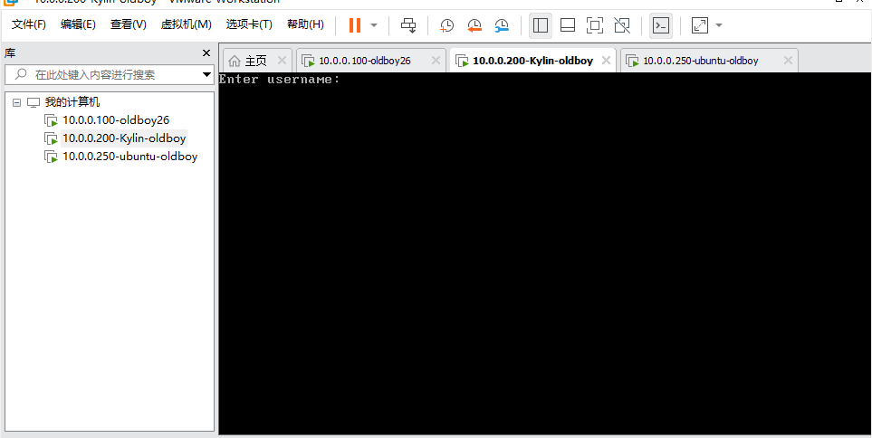
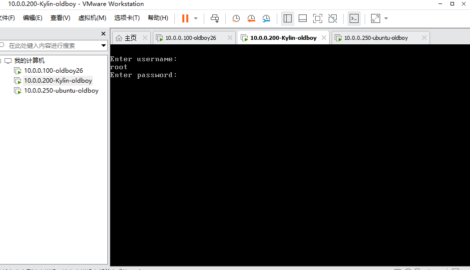
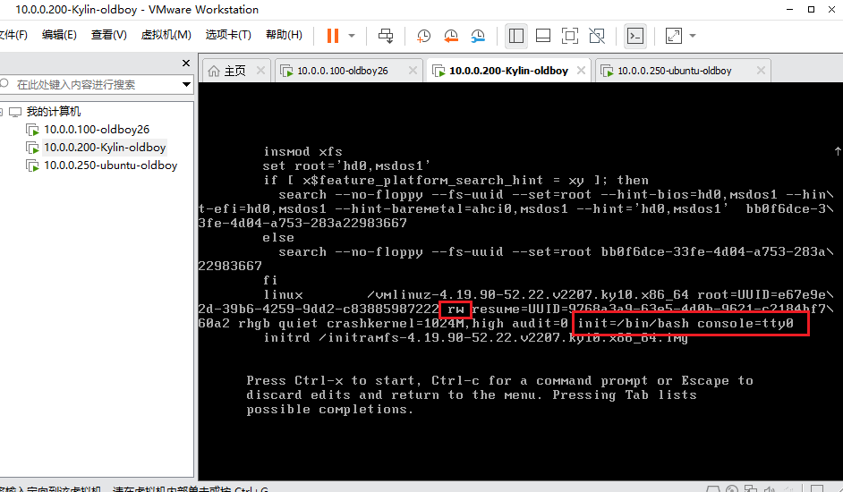
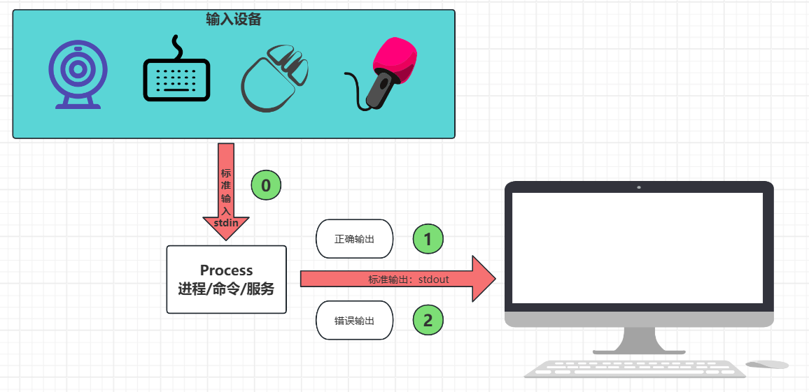
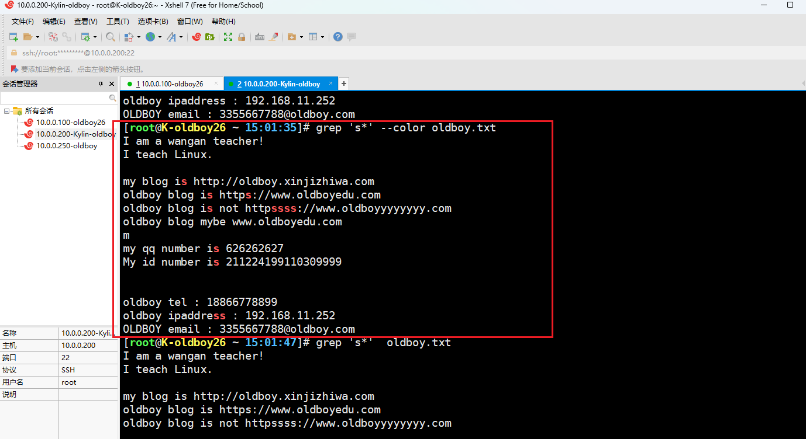

# 一、系统服务管理

```bash
#systemd

#1，查看服务的状态
[root@K-oldboy26 ~ 18:06-文件属性信息（1）:52]# systemctl status sshd
#2，启动服务
[root@K-oldboy26 ~ 18:06-文件属性信息（1）:52]# systemctl start sshd
#3，设置开机自启动
[root@K-oldboy26 ~ 18:06-文件属性信息（1）:52]# systemctl enable sshd
#4，关闭服务
[root@K-oldboy26 ~ 18:06-文件属性信息（1）:52]# systemctl stop sshd
#5，设置开机禁止启动
[root@K-oldboy26 ~ 18:06-文件属性信息（1）:52]# systemctl disable sshd
#6，重启服务
[root@K-oldboy26 ~ 18:06-文件属性信息（1）:52]# systemctl restart sshd
#7，重新加载配置文件（kill -1）
[root@K-oldboy26 ~ 18:06-文件属性信息（1）:52]# systemctl reload sshd
```

# 二、救援模式

## 1，kylin

```bash
#重启系统，快速按：e
```



```bash
root
Kylin123123
#k大写
```



```bash
#找到【linux】开头那一行：
	- 将ro改成rw
	- 在行尾添加：init=/bin/bash  console=tty0
#ctrl + x
```



```bash
#修改密码
	passwd root
#重启
	/usr/sbin/reboot -f
```

## 2，centos

```bash
#1,重启系统，快速按：e
#2,找到【linux16】开头那一行：
	- 在行尾添加：rd.break
#3,ctrl + x
#4，mount -o remount,rw /sysroot
#5,chroot /sysroot    
#5，系统语言改成英文
	LANG=en
#6，设置密码
	passwd root
#7，创建selinux标签
	touch /.autorelabel
	exit
#8,重启系统即可
	root
```

# 三、系统特殊符号和三剑客

## 1，系统特殊符号

### · 引号系列

| 引号         | 解释说明                                                     |
| ------------ | ------------------------------------------------------------ |
| 单引号【''】 | 所见即所得，单引号里面的内容，原封不动的输出；               |
| 双引号【""】 | 双引号里面的内容、变量、特殊符号，会被解析，【对于{}和通配符号，不解析】 |
| 反引号【``】 | 优先执行反引号中的命令，【支持{}和通配符】                   |
| 不加引号     | 【支持{}和通配符】                                           |

```bash
#单引号
[root@K-oldboy26 ~ 09-权限管理:04-Linux核心命令:50]# echo $PATH
/usr/local/sbin:/usr/local/bin:/usr/sbin:/usr/bin:/root/bin:/root/bin
[root@K-oldboy26 ~ 09-权限管理:05-系统重要的配置文件-etc:07-文件属性信息（2）]# echo '$PATH'
$PATH

#双引号
[root@K-oldboy26 ~ 09-权限管理:05-系统重要的配置文件-etc:24]# echo "$PATH"
/usr/local/sbin:/usr/local/bin:/usr/sbin:/usr/bin:/root/bin:/root/bin
[root@K-oldboy26 ~ 09-权限管理:06-文件属性信息（1）:07-文件属性信息（2）]# echo '$PATH'
$PATH
[root@K-oldboy26 ~ 09-权限管理:06-文件属性信息（1）:16]# echo {1..09-权限管理}
1 2 3 4 5 6 7 8 9 10
[root@K-oldboy26 ~ 09-权限管理:06-文件属性信息（1）:24]# echo "{1..09-权限管理}"
{1..09-权限管理}

#反引号
[root@K-oldboy26 ~ 09-权限管理:06-文件属性信息（1）:24]# echo "{1..09-权限管理}"
{1..09-权限管理}
[root@K-oldboy26 ~ 09-权限管理:06-文件属性信息（1）:29]# echo hostname
hostname
[root@K-oldboy26 ~ 09-权限管理:07-文件属性信息（2）:46]# echo "hostname"
hostname
[root@K-oldboy26 ~ 09-权限管理:07-文件属性信息（2）:52]# echo `hostname`
K-oldboy26
[root@K-oldboy26 ~ 09-权限管理:08-用户管理:02-linux目录结构与核心命令（）]# echo `{1..09-权限管理}`
-bash: 1：未找到命令

[root@K-oldboy26 ~ 09-权限管理:08-用户管理:24]# echo `echo {1..09-权限管理}`
1 2 3 4 5 6 7 8 9 10
```

### · 重定向系列



| 符号              | 含义                   | 解释说明                             |
| ----------------- | ---------------------- | ------------------------------------ |
| 【>】或者【1>】   | 标准正确输出覆盖重定向 | 先清空文件，再将正确的结果写入文件中 |
| 【2>】            | 标准错误输出覆盖重定向 | 先清空文件，再将错误的结果写入文件中 |
| 【>>】或者【1>>】 | 标准正确输出追加重定向 | 将正确的结果追加写入文件中           |
| 【2>>】           | 标准错误输出追加重定向 | 将错误的结果追加写入文件中           |
| 【<】或者【0<】   | 标准输入覆盖重定向     | 很少用，搭配xargs或者tr命令使用      |
| 【<<】或者【0<<】 | 标准输入追加重定向     | 与cat搭配使用，写入多行内容          |

```bash
#1，正确与错误都输出到文件中【操作日志】

- 方法一：
[root@K-oldboy26 ~ 09-权限管理:22:52]# echoo 123 1>> 3.txt 2>>3.txt
[root@K-oldboy26 ~ 09-权限管理:28:38]# cat 3.txt 
-bash: echoo：未找到命令
[root@K-oldboy26 ~ 09-权限管理:28:41]# echo 123 1>> 3.txt 2>>3.txt
[root@K-oldboy26 ~ 09-权限管理:28:47]# cat 3.txt 
-bash: echoo：未找到命令
123

- 方法二：【仅仅在centos和kylin当中可以用，Ubuntu不可以】
[root@K-oldboy26 ~ 09-权限管理:28:51]# echo 333 &>>3.txt
[root@K-oldboy26 ~ 09-权限管理:30:16]# cat 3.txt 
-bash: echoo：未找到命令
123
333
[root@K-oldboy26 ~ 09-权限管理:30:20]# echoooooo 333 &>>3.txt
[root@K-oldboy26 ~ 09-权限管理:30:28]# cat 3.txt 
-bash: echoo：未找到命令
123
333
-bash: echoooooo：未找到命令

- 方法三：
[root@K-oldboy26 ~ 09-权限管理:32:12-系统服务管理与三剑客（1）]# echoooooo 444444 1>>3.txt 2>&1
[root@K-oldboy26 ~ 09-权限管理:32:19]# echo 444444 1>>3.txt 2>&1
[root@K-oldboy26 ~ 09-权限管理:32:24]# cat 3.txt 
-bash: echoo：未找到命令
123
333
-bash: echoooooo：未找到命令
-bash: echoooooo：未找到命令
-bash: echoooooo：未找到命令
444444

#2，标准输入cat写法
[root@K-oldboy26 ~ 09-权限管理:32:27]# cat > 4.txt<<EOF
> 111
> 222
> 333
> EOF

[root@K-oldboy26 ~ 09-权限管理:34:06]# cat <<EOF >5.txt
> 111
> 222
> 333
> EOF

#3，标准输入案例
[root@K-oldboy26 ~ 09-权限管理:36:06]# seq 09-权限管理 > 6.txt
[root@K-oldboy26 ~ 09-权限管理:36:49]# cat 6.txt 
1
2
3
4
5
6
7
8
9
10


[root@K-oldboy26 ~ 09-权限管理:37:09-权限管理]# xargs -n 2 < 6.txt 
1 2
3 4
5 6
7 8
9 10
[root@K-oldboy26 ~ 09-权限管理:37:27]# cat 6.txt | xargs -n 2
1 2
3 4
5 6
7 8
9 09-权限管理.
```

### · 通配符

| 符号       | 解释说明                        |
| ---------- | ------------------------------- |
| *          | 表示【任意所有】：*.txt 、ens\* |
| [!]或者[^] | 取反                            |
| {}         | 输出序列                        |
| ？         | 匹配[一个]字符                  |

#### 1，{}花括号

```bash
[root@K-oldboy26 ~ 09-权限管理:37:46]# echo {1..09-权限管理}
1 2 3 4 5 6 7 8 9 10
[root@K-oldboy26 ~ 10-软件管理:11-进程与服务管理:01-vmware安装linux镜像+命令基础入门]# echo {a..z}
a b c d e f g h i j k l m n o p q r s t u v w x y z

[root@K-oldboy26 ~ 10-软件管理:11-进程与服务管理:23]# touch oldboy{1..09-权限管理}.txt
[root@K-oldboy26 ~ 10-软件管理:12-系统服务管理与三剑客（1）:06]# ll
总用量 0
-rw-r--r-- 1 root root 0  3月 17 10-软件管理:12-系统服务管理与三剑客（1） oldboy10.txt
-rw-r--r-- 1 root root 0  3月 17 10-软件管理:12-系统服务管理与三剑客（1） oldboy1.txt
-rw-r--r-- 1 root root 0  3月 17 10-软件管理:12-系统服务管理与三剑客（1） oldboy2.txt
-rw-r--r-- 1 root root 0  3月 17 10-软件管理:12-系统服务管理与三剑客（1） oldboy3.txt
-rw-r--r-- 1 root root 0  3月 17 10-软件管理:12-系统服务管理与三剑客（1） oldboy4.txt
-rw-r--r-- 1 root root 0  3月 17 10-软件管理:12-系统服务管理与三剑客（1） oldboy5.txt
-rw-r--r-- 1 root root 0  3月 17 10-软件管理:12-系统服务管理与三剑客（1） oldboy6.txt
-rw-r--r-- 1 root root 0  3月 17 10-软件管理:12-系统服务管理与三剑客（1） oldboy7.txt
-rw-r--r-- 1 root root 0  3月 17 10-软件管理:12-系统服务管理与三剑客（1） oldboy8.txt
-rw-r--r-- 1 root root 0  3月 17 10-软件管理:12-系统服务管理与三剑客（1） oldboy9.txt

[root@K-oldboy26 ~ 10-软件管理:12-系统服务管理与三剑客（1）:07-文件属性信息（2）]# echo a{b,c}
ab ac
[root@K-oldboy26 ~ 10-软件管理:12-系统服务管理与三剑客（1）:50]# echo a{b,c,d}
ab ac ad

#从1到100，每隔5个数打印一次；
[root@K-oldboy26 ~ 10-软件管理:13-系统服务管理与三剑客（2）:43]# echo {1..100..5}
1 6 11 16 21 26 31 36 41 46 51 56 61 66 71 76 81 86 91 96

#当前目录下，快速备份一个文件
[root@K-oldboy26 ~ 10-软件管理:17:40]# cp /etc/sysconfig/network-scripts/ifcfg-ens33{,.bak02}
==
[root@K-oldboy26 ~ 10-软件管理:17:40]# cp /etc/sysconfig/network-scripts/ifcfg-ens33   /etc/sysconfig/network-scripts/ifcfg-ens33.bak02

[root@K-oldboy26 ~ 10-软件管理:17:40]# cp /etc/sysconfig/network-scripts/ifcfg-ens33{,.bak02} 
[root@K-oldboy26 ~ 10-软件管理:20:42]# ll /etc/sysconfig/network-scripts/
总用量 12
-rw-r--r-- 1 root root 357  3月 11 15:49 ifcfg-ens33
-rw-r--r-- 1 root root 357  3月 17 10-软件管理:17 ifcfg-ens33.bak
-rw-r--r-- 1 root root 357  3月 17 10-软件管理:20 ifcfg-ens33.bak02
```

#### 2，？任意一个字符

```bash
[root@K-oldboy26 ~ 10-软件管理:22:35]# ll ./?.txt
-rw-r--r-- 1 root root 0  3月 17 10-软件管理:22 ./1.txt
-rw-r--r-- 1 root root 0  3月 17 10-软件管理:22 ./2.txt
-rw-r--r-- 1 root root 0  3月 17 10-软件管理:22 ./3.txt
-rw-r--r-- 1 root root 0  3月 17 10-软件管理:22 ./4.txt
-rw-r--r-- 1 root root 0  3月 17 10-软件管理:22 ./5.txt
-rw-r--r-- 1 root root 0  3月 17 10-软件管理:22 ./6.txt
-rw-r--r-- 1 root root 0  3月 17 10-软件管理:22 ./7.txt
-rw-r--r-- 1 root root 0  3月 17 10-软件管理:22 ./8.txt
-rw-r--r-- 1 root root 0  3月 17 10-软件管理:22 ./9.txt
```

## 2，grep与正则表达式（重点掌握）

```bash
#正则符号：过滤、处理文件当中的内容的符号；
#通配符号：过滤查找文件名称的符号；
```

| 基础正则 | 解释说明                                       |
| -------- | ---------------------------------------------- |
| ^        | 以...开头                                      |
| $        | 以...结尾                                      |
| .        | 匹配任意一个字符                               |
| *        | 匹配前面一个字符出现0次或者0次以上；           |
| [   ]    | 或者的意思；[abc] 代表，或者a、或者b、或者c    |
| [^]      | 取反的意思；\[^abc]代表，除了a、b、c之外的内容 |

| 扩展正则 | 解释说明                     |
| -------- | ---------------------------- |
| \|       | 或者                         |
| +        | 连续出现1次或者1次以上       |
| ()       | 表示一个整体                 |
| {}       | 控制前面字符出现的次数       |
| ?        | 前面一个字符出现0次或者1次； |

### · 准备环境

```bash
[root@K-oldboy26 ~ 10-软件管理:33:22]# vim oldboy.txt

I am a wangan teacher!
I teach Linux.

my blog is http://oldboy.xinjizhiwa.com
oldboy blog is https://www.oldboyedu.com
oldboy blog is not httpssss://www.oldboyyyyyyyy.com
oldboy blog mybe www.oldboyedu.com
m
my qq number is 626262627
My id number is 211224199110309999


oldboy tel : 18866778899
oldboy ipaddress : 192.168.10-软件管理.252
OLDBOY email : 3355667788@oldboy.com
```

### · 基础正则

#### 1，匹配开头和结尾

```bash
#1,过滤以I开头的行
[root@K-oldboy26 ~ 10-软件管理:38:59]# grep '^I' oldboy.txt 
I am a wangan teacher!
I teach Linux.

#2，过滤以m结尾的行
[root@K-oldboy26 ~ 10-软件管理:40:07-文件属性信息（2）]# grep 'm$' oldboy.txt 
my blog is http://oldboy.xinjizhiwa.com
oldboy blog is https://www.oldboyedu.com
oldboy blog is not httpssss://www.oldboyyyyyyyy.com
oldboy blog mybe www.oldboyedu.com
m
OLDBOY email : 3355667788@oldboy.com


#3，过滤空行
[root@K-oldboy26 ~ 10-软件管理:41:38]# grep '^$' oldboy.txt 


#4，过滤除了空行之外的行；【-v取反】
[root@K-oldboy26 ~ 10-软件管理:42:42]# grep -v '^$' oldboy.txt 
I am a wangan teacher!
I teach Linux.
my blog is http://oldboy.xinjizhiwa.com   
oldboy blog is https://www.oldboyedu.com   
oldboy blog is not httpssss://www.oldboyyyyyyyy.com   
oldboy blog mybe www.oldboyedu.com
m
my qq number is 626262627
My id number is 211224199110309999
oldboy tel : 18866778899
oldboy ipaddress : 192.168.10-软件管理.252
OLDBOY email : 3355667788@oldboy.com 

#案例：过滤sshd的配置文件；（过滤掉#号开头的，和空行）
[root@K-oldboy26 ~ 10-软件管理:45:23]# grep -v '^#' /etc/ssh/sshd_config | grep -v '^$' 
HostKey /etc/ssh/ssh_host_rsa_key
HostKey /etc/ssh/ssh_host_ecdsa_key
HostKey /etc/ssh/ssh_host_ed25519_key
SyslogFacility AUTH
PermitRootLogin yes
...

#案例：过滤selinux的配置文件；（过滤掉#号开头的，和空行）
[root@K-oldboy26 ~ 10-软件管理:46:17]# grep -v '^#' /etc/selinux/config | grep -v '^$' 
SELINUX=enforcing
SELINUXTYPE=targeted
SETLOCALDEFS=0
```

#### 2，匹配任意一个字符【.】

```bash
[root@K-oldboy26 ~ 10-软件管理:48:06-文件属性信息（1）]# grep '.' oldboy.txt 
I am a wangan teacher!
I teach Linux.
my blog is http://oldboy.xinjizhiwa.com   
oldboy blog is https://www.oldboyedu.com   
oldboy blog is not httpssss://www.oldboyyyyyyyy.com   
oldboy blog mybe www.oldboyedu.com
m
my qq number is 626262627
My id number is 211224199110309999
oldboy tel : 18866778899
oldboy ipaddress : 192.168.10-软件管理.252
OLDBOY email : 3355667788@oldboy.com    

#-n显示行号；
[root@K-oldboy26 ~ 10-软件管理:48:39]# grep -n '.' oldboy.txt 
1:I am a wangan teacher!
2:I teach Linux.
4:my blog is http://oldboy.xinjizhiwa.com   
5:oldboy blog is https://www.oldboyedu.com   
6:oldboy blog is not httpssss://www.oldboyyyyyyyy.com   
7:oldboy blog mybe www.oldboyedu.com
8:m
9:my qq number is 626262627
09-权限管理:My id number is 211224199110309999
12-系统服务管理与三剑客（1）:oldboy tel : 18866778899
13-系统服务管理与三剑客（2）:oldboy ipaddress : 192.168.10-软件管理.252
15:OLDBOY email : 3355667788@oldboy.com 

#花式玩法。两个【.】查询的时候，如果该行少于2个字符，不被过滤出来；
[root@K-oldboy26 ~ 10-软件管理:51:10-软件管理]# grep  '..' oldboy.txt 
I am a wangan teacher!
I teach Linux.
my blog is http://oldboy.xinjizhiwa.com   
oldboy blog is https://www.oldboyedu.com   
oldboy blog is not httpssss://www.oldboyyyyyyyy.com   
oldboy blog mybe www.oldboyedu.com
my qq number is 626262627
My id number is 211224199110309999
oldboy tel : 18866778899
oldboy ipaddress : 192.168.10-软件管理.252
OLDBOY email : 3355667788@oldboy.com 


#-o  显示匹配过程
[root@K-oldboy26 ~ 10-软件管理:51:16]# grep -o '..' oldboy.txt 
I 
am
 a
 w
an
ga
......
```

> 【\】撬棍

```bash
#匹配以.结尾的行

[root@K-oldboy26 ~ 10-软件管理:54:04-Linux核心命令]# grep '.$'  oldboy.txt 
I am a wangan teacher!
I teach Linux.
my blog is http://oldboy.xinjizhiwa.com   
oldboy blog is https://www.oldboyedu.com   
oldboy blog is not httpssss://www.oldboyyyyyyyy.com   
oldboy blog mybe www.oldboyedu.com
m
my qq number is 626262627
My id number is 211224199110309999
oldboy tel : 18866778899
oldboy ipaddress : 192.168.10-软件管理.252
OLDBOY email : 3355667788@oldboy.com  

#撬棍，还原本意；
[root@K-oldboy26 ~ 10-软件管理:54:19]# grep '\.$'  oldboy.txt 
I teach Linux.
```

#### 3，连续出现0次或者0次以上【*】

```bash
[root@K-oldboy26 ~ 15:01-vmware安装linux镜像+命令基础入门:47]# grep 's*'  oldboy.txt 
I am a wangan teacher!
I teach Linux.

my blog is http://oldboy.xinjizhiwa.com   
oldboy blog is https://www.oldboyedu.com   
oldboy blog is not httpssss://www.oldboyyyyyyyy.com   
oldboy blog mybe www.oldboyedu.com
m
my qq number is 626262627
My id number is 211224199110309999


oldboy tel : 18866778899
oldboy ipaddress : 192.168.10-软件管理.252
OLDBOY email : 3355667788@oldboy.com    
[root@K-oldboy26 ~ 15:02-linux目录结构与核心命令（）:16]# grep -o 's*'  oldboy.txt 
s
s
s
s
ssss
s
s
ss
```

> .*匹配所有




#### 4，[abc]匹配中括号中任意一个字符

```bash
#1，过滤匹配文件中带0或者Y或者L的行
[root@K-oldboy26 ~ 15:08-用户管理:54]# grep '[0YL]' oldboy.txt 
I teach Linux.
My id number is 211224199110309999
OLDBOY email : 3355667788@oldboy.com 

#2，匹配文件中包含数字的行
[root@K-oldboy26 ~ 15:10-软件管理:03-linux目录结构与核心命令（2）]# grep '[0-9]' oldboy.txt 
my qq number is 626262627
My id number is 211224199110309999
oldboy tel : 18866778899
oldboy ipaddress : 192.168.10-软件管理.252
OLDBOY email : 3355667788@oldboy.com

#3，匹配文件中包含字母的行
[root@K-oldboy26 ~ 15:11-进程与服务管理:32]# grep '[a-z]' oldboy.txt 
I am a wangan teacher!
I teach Linux.
my blog is http://oldboy.xinjizhiwa.com   
oldboy blog is https://www.oldboyedu.com   
oldboy blog is not httpssss://www.oldboyyyyyyyy.com   
oldboy blog mybe www.oldboyedu.com
m
my qq number is 626262627
My id number is 211224199110309999
oldboy tel : 18866778899
oldboy ipaddress : 192.168.10-软件管理.252
OLDBOY email : 3355667788@oldboy.com   

#4，匹配文件中包含大写字母的行
[root@K-oldboy26 ~ 15:12-系统服务管理与三剑客（1）:06]# grep '[A-Z]' oldboy.txt 
I am a wangan teacher!
I teach Linux.
My id number is 211224199110309999
OLDBOY email : 3355667788@oldboy.com 

#5，匹配文件中包含大写或者小写字母的行
[root@K-oldboy26 ~ 15:15:25]# grep  '[a-zA-Z]' oldboy.txt 
[root@K-oldboy26 ~ 15:15:44]# grep '[a-Z]' oldboy.txt 
I am a wangan teacher!
I teach Linux.
my blog is http://oldboy.xinjizhiwa.com   
oldboy blog is https://www.oldboyedu.com   
oldboy blog is not httpssss://www.oldboyyyyyyyy.com   
oldboy blog mybe www.oldboyedu.com
m
my qq number is 626262627
My id number is 211224199110309999
oldboy tel : 18866778899
oldboy ipaddress : 192.168.10-软件管理.252
OLDBOY email : 3355667788@oldboy.com

#6，-i不区分大小写
[root@K-oldboy26 ~ 15:16:47]# grep '[a-z]' oldboy.txt 
I am a wangan teacher!
I teach Linux.
my blog is http://oldboy.xinjizhiwa.com   
oldboy blog is https://www.oldboyedu.com   
oldboy blog is not httpssss://www.oldboyyyyyyyy.com   
oldboy blog mybe www.oldboyedu.com
m
my qq number is 626262627
My id number is 211224199110309999
oldboy tel : 18866778899
oldboy ipaddress : 192.168.10-软件管理.252
OLDBOY email : 3355667788@oldboy.com 

[root@K-oldboy26 ~ 15:16:58]# grep -i '[a-z]' oldboy.txt 
I am a wangan teacher!
I teach Linux.
my blog is http://oldboy.xinjizhiwa.com   
oldboy blog is https://www.oldboyedu.com   
oldboy blog is not httpssss://www.oldboyyyyyyyy.com   
oldboy blog mybe www.oldboyedu.com
m
my qq number is 626262627
My id number is 211224199110309999
oldboy tel : 18866778899
oldboy ipaddress : 192.168.10-软件管理.252
OLDBOY email : 3355667788@oldboy.com    
OOOOOO
```

#### 5，\[^abc]取反

```bash
[root@K-oldboy26 ~ 15:20:35]# grep  '[^a-z]' --color  oldboy.txt 
I am a wangan teacher!
I teach Linux.
my blog is http://oldboy.xinjizhiwa.com   
oldboy blog is https://www.oldboyedu.com   
oldboy blog is not httpssss://www.oldboyyyyyyyy.com   
oldboy blog mybe www.oldboyedu.com
my qq number is 626262627
My id number is 211224199110309999
oldboy tel : 18866778899
oldboy ipaddress : 192.168.10-软件管理.252
OLDBOY email : 3355667788@oldboy.com    
OOOOOO
5555555
```


> -v取反

```bash
[root@K-oldboy26 ~ 15:20:51]# grep -v '[a-z]' --color  oldboy.txt 


OOOOOO
5555555
```

> 以单词为代为匹配-w

```bash
[root@K-oldboy26 ~ 15:24:51]# cat o.txt 
oldboy1111
oldboy
old
[root@K-oldboy26 ~ 15:24:55]# grep 'old' o.txt 
oldboy1111
oldboy
old
[root@K-oldboy26 ~ 15:25:03-linux目录结构与核心命令（2）]# grep -w 'old' o.txt 
old

[root@K-oldboy26 ~ 15:40:23]# grep 'old' o.txt 
oldboy1111
oldboy
old

#\b\b边界符；
[root@K-oldboy26 ~ 15:40:27]# grep '\bold\b' o.txt 
old
```

### · grep总结

| 命令 | 参数            | 解释说明             |
| ---- | --------------- | -------------------- |
| grep |                 |                      |
|      | -v              | 取反                 |
|      | -o              | 显示匹配过程         |
|      | -i              | 不区分大小写         |
|      | -w              | 以单词为单位匹配     |
|      | -n              | 显示行号             |
|      | -r（了解即可）  | 查询目录下的文件内容 |
|      | -E或者【egrep】 | 支持扩展正则         |

```bash
#查询/root目录下，包含old单词的文件；
[root@K-oldboy26 / 15:29:13-系统服务管理与三剑客（2）]# grep -rw 'old'  /root/
/root/o.txt:old
```

### · 扩展正则

#### 1，连续出现1次或者1次以上【+】

```bash
[root@K-oldboy26 ~ 15:43:40]# grep -E 'O+' oldboy.txt 
OLDBOY email : 3355667788@oldboy.com    
OOOOOO
[root@K-oldboy26 ~ 15:44:02-linux目录结构与核心命令（）]# egrep  'O+' oldboy.txt 
OLDBOY email : 3355667788@oldboy.com    
OOOOOO

[root@K-oldboy26 ~ 15:44:09-权限管理]# egrep  '[0-9]+' oldboy.txt 
my qq number is 626262627
My id number is 211224199110309999
oldboy tel : 18866778899
oldboy ipaddress : 192.168.10-软件管理.252
OLDBOY email : 3355667788@oldboy.com    
5555555

#连续出现，1次或者1次以上（默认以单词为单位）
[root@K-oldboy26 ~ 15:45:36]# egrep  -o '[a-z]+' oldboy.txt 
am
a
wangan
teacher
teach
inux
......
```

#### 2，或者【|】

```bash
[root@K-oldboy26 ~ 15:48:42]# grep -E 'OLDBOY|My' oldboy.txt 
My id number is 211224199110309999
OLDBOY email : 3355667788@oldboy.com
```

#### 3，小括号（）表示一个整体

````bash
[root@K-oldboy26 ~ 15:50:13-系统服务管理与三剑客（2）]# grep -E '^m|^o' oldboy.txt 
	- 或者
[root@K-oldboy26 ~ 15:50:33]# grep -E '^(m|o)' oldboy.txt 
my blog is http://oldboy.xinjizhiwa.com   
oldboy blog is https://www.oldboyedu.com   
oldboy blog is not httpssss://www.oldboyyyyyyyy.com   
oldboy blog mybe www.oldboyedu.com
m
my qq number is 626262627
oldboy tel : 18866778899
oldboy ipaddress : 192.168.10-软件管理.252


#查看本地安装的软件包
[root@K-oldboy26 ~ 15:52:44]# rpm -qa | grep -E 'vim|sl|tree|expect'
slang-2.3.2-8.ky10.x86_64
vim-minimal-8.2-58.p01.ky10.x86_64
ostree-2020.4-2.ky10.x86_64
libpsl-0.21.1-1.ky10.x86_64
.....

[root@K-oldboy26 ~ 15:53:56]# rpm -qa | grep -E '^vim|^sl|^tree|^expect'
[root@K-oldboy26 ~ 15:53:06-文件属性信息（1）]# rpm -qa | grep -E '^(vim|sl|tree|expect)'
slang-2.3.2-8.ky10.x86_64
vim-minimal-8.2-58.p01.ky10.x86_64
tree-1.8.0-2.ky10.x86_64
expect-5.45.4-5.ky10.x86_64
vim-filesystem-8.2-58.p01.ky10.noarch
vim-enhanced-8.2-58.p01.ky10.x86_64
vim-common-8.2-58.p01.ky10.x86_64
sl-5.02-linux目录结构与核心命令（）-1.el7.x86_64
````

#### 4，{}前一个字符连续出现的次数

```bash
a*  表示a连续出现0次或者0次以上
a+  表示a连续出现1次或者1次以上
##################################
```

| 格式   | 解释说明                           |
| ------ | ---------------------------------- |
| a{n,m} | 表示：a连续出现最少n次，最多m次；  |
| a{n}   | 表示：a连续出现n次；               |
| a{n，} | 表示：a连续出现最少n次，最大不限制 |
| a{，m} | 表示：a连续出现最多m次，最少不限制 |

```bash
[root@K-oldboy26 ~ 16:02-linux目录结构与核心命令（）:51]# egrep  's{2}'  1.txt 
ss
sss
ssss
sssss
ssssss
sssssss
ssssssss

[root@K-oldboy26 ~ 16:03-linux目录结构与核心命令（2）:38]# egrep -o 's{2}'  1.txt 
ss
ss
ss
ss
ss
ss
ss
ss
ss
ss
ss
ss
ss
ss
ss
ss

[root@K-oldboy26 ~ 16:04-Linux核心命令:22]# egrep -o 's{5,8}'  1.txt 
sssss
ssssss
sssssss
ssssssss
[root@K-oldboy26 ~ 16:04-Linux核心命令:35]# egrep -o 's{,5}'  1.txt 
s
ss
sss
ssss
sssss
sssss
s
sssss
ss
sssss
sss
[root@K-oldboy26 ~ 16:04-Linux核心命令:53]# egrep 's{,5}'  1.txt 
s
ss
sss
ssss
sssss
ssssss
sssssss
ssssssss


#过滤出，文件中的ip地址
[root@K-oldboy26 ~ 16:06-文件属性信息（1）:47]# egrep '[0-9]{1,3}\.[0-9]{1,3}\.[0-9]{1,3}\.[0-9]{1,3}' oldboy.txt 
oldboy ipaddress : 192.168.10-软件管理.252


#过滤身份证号：
[root@K-oldboy26 ~ 16:07-文件属性信息（2）:32]# egrep '[11-进程与服务管理]{3}[24]{3}[0-9]{4}[0-9]{4}[0-9x]{4}' oldboy.txt 
My id number is 211224199110309999
```

#### 5，匹配前一个字符出现0次或者1次【？】

```bash
[root@K-oldboy26 ~ 16:12-系统服务管理与三剑客（1）:35]# egrep -w 'http|https' oldboy.txt 
my blog is http://oldboy.xinjizhiwa.com   
oldboy blog is https://www.oldboyedu.com 

[root@K-oldboy26 ~ 16:12-系统服务管理与三剑客（1）:48]# egrep -w 'https?' oldboy.txt 
my blog is http://oldboy.xinjizhiwa.com   
oldboy blog is https://www.oldboyedu.com  

[root@K-oldboy26 ~ 16:15:04-Linux核心命令]# egrep  '\bhttps?\b' oldboy.txt 
my blog is http://oldboy.xinjizhiwa.com   
oldboy blog is https://www.oldboyedu.com 
```

## 3，sed增删改查文件内容（了解掌握）

| 命令 | 参数   | 解释说明                |
| ---- | ------ | ----------------------- |
| sed  | -n     | 取消默认输出；          |
|      | -r     | 支持扩展正则；          |
|      | -i     | 修改文件内容；          |
|      | -i.bak | 修改文件内容,同时备份； |

### · sed过滤查找文件内容

#### 1，准备环境

```bash
[root@K-oldboy26 ~ 16:54:35]# cat -n 1.txt 
     1	111111
     2	222222
     3	333333
     4	444444
     5	555555
     6	666666
     7	777777
     8	888888
     9	999999
```

#### 2，筛选出第几行

```bash
[root@K-oldboy26 ~ 16:54:58]# sed '5p'  1.txt 
111111
222222
333333
444444
555555
555555
666666
777777
888888
999999
[root@K-oldboy26 ~ 16:55:36]# sed -n '5p'  1.txt 
555555
```

#### 3，筛选出n到m行

```bash
[root@K-oldboy26 ~ 16:58:10-软件管理]# sed -n '3,6p'  1.txt 
333333
444444
555555
666666
```

#### 4，sed过滤字符串

```bash
[root@K-oldboy26 ~ 16:58:32]# sed -n '/5/p'  1.txt 
555555

#筛选普通用户
[root@K-oldboy26 ~ 17:00:53]# sed -n '/bash$/p' passwd 
root:x:0:0:root:/root:/bin/bash
oldboy:x:1000:1000::/home/oldboy:/bin/bash
wangan26:x:1001:1001::/home/wangan26:/bin/bash
wangan26-01-vmware安装linux镜像+命令基础入门:x:2026:2026::/home/wangan26-01-vmware安装linux镜像+命令基础入门:/bin/bash
wangan26-06:x:2030:2030::/home/wangan26-06:/bin/bash
wa03:x:2033:2033::/home/wa03:/bin/bash
wa04:x:2034:2034::/home/wa04:/bin/bash
wa05:x:2035:2035::/home/wa05:/bin/bash
wa01:x:2036:2036::/home/wa01:/bin/bash
wuyonggang:x:200:3000::/home/wuyonggang:/bin/bash
[root@K-oldboy26 ~ 17:01-vmware安装linux镜像+命令基础入门:58]# sed -n '/bash$/p' passwd | wc -l
10

#过滤出以wa或者wangan开头的行【-r表示支持扩展正则】
[root@K-oldboy26 ~ 17:04-Linux核心命令:11-进程与服务管理]# sed -nr '/^(wa|wangan)/p'  passwd 
wangan26:x:1001:1001::/home/wangan26:/bin/bash
wangan26-01-vmware安装linux镜像+命令基础入门:x:2026:2026::/home/wangan26-01-vmware安装linux镜像+命令基础入门:/bin/bash
wangan26-03-linux目录结构与核心命令（2）:x:2027:2027::/home/wangan26-03-linux目录结构与核心命令（2）:/sbin/nologin
wangan26-04-Linux核心命令:x:2028:2028::/home/wangan26-04-Linux核心命令:/sbin/nologin
wangan26-05-系统重要的配置文件-etc:x:2029:2029::/home/wangan26-05-系统重要的配置文件-etc:/sbin/nologin
wangan26-06:x:2030:2030::/home/wangan26-06:/bin/bash
wa03:x:2033:2033::/home/wa03:/bin/bash
wa04:x:2034:2034::/home/wa04:/bin/bash
wa05:x:2035:2035::/home/wa05:/bin/bash
wa01:x:2036:2036::/home/wa01:/bin/bash
```

#### 5，过滤过滤字符串到字符串之间的行

```bash
[root@K-oldboy26 ~ 17:06:57]# sed -n '/3/,/6/p'  1.txt 
333333
444444
555555
666666

#过滤日志时间
[root@K-oldboy26 ~ 17:06:57]# sed -n '/16:57:30/,/17:03-linux目录结构与核心命令（2）:31/p' /var/log/messages
```

### · sed修改文件内容（重点）

> 【s】表示：sub替换的意思；
>
> 【g】表示：global全局的意思；

| 命令 | 参数    | 写法                |
| ---- | ------- | ------------------- |
| sed  | i/i.bak | s#将什么#改成什么#g |
|      |         | s/将什么/改成什么/g |
|      |         | s@将什么@改成什么@g |

```bash
[root@K-oldboy26 ~ 17:22:34]# cat 1.txt 
111111
222222
333333
444444
555555
666666
777777
888888
999999
[root@K-oldboy26 ~ 17:22:38]# sed 's#1#0#g' 1.txt 
000000
222222
333333
444444
555555
666666
777777
888888
999999
[root@K-oldboy26 ~ 17:26:26]# cat 1.txt 
111111
222222
333333
444444
555555
666666
777777
888888
999999
[root@K-oldboy26 ~ 17:26:32]# sed -i 's#1#0#g' 1.txt 
[root@K-oldboy26 ~ 17:27:27]# cat 1.txt 
000000
222222
333333
444444
555555
666666
777777
888888
999999
[root@K-oldboy26 ~ 17:27:31]# vim 1.txt 
[root@K-oldboy26 ~ 17:27:45]# sed 's#0#1#' 1.txt 
100000
222222
333333
444444
555555
666666
777777
888888
999999
100000
[root@K-oldboy26 ~ 17:28:06]# sed 's#0#1#g' 1.txt 
111111
222222
333333
444444
555555
666666
777777
888888
999999
111111
```

> 案例：sed永久关闭selinux

```bash
[root@K-oldboy26 ~ 17:31:36]# sed -i.bak 's#SELINUX=enforcing#SELINUX=disabled#g' /etc/selinux/config
[root@K-oldboy26 ~ 17:31:59]# cat /etc/selinux/config 
......
SELINUX=disabled
.......


[root@K-oldboy26 ~ 17:32:06]# ll /etc/selinux/config*
-rw-r--r-- 1 root root 703  3月 17 17:31 /etc/selinux/config
-rw-r--r-- 1 root root 704  3月 17 17:30 /etc/selinux/config.bak
```

> 花式玩法

```bash
#将passwd中的字母全部替换成空
[root@K-oldboy26 ~ 17:36:12-系统服务管理与三剑客（1）]# sed 's#[a-Z]##g' passwd 
::0:0::/://
::1:1::/://
::2:2::/://
::3:4:://://
::4:7::///://
::5:0::/://
::6:0::/://
::7:0::/://
::8:11-进程与服务管理::///://
```

> 查找并修改selinux配置文件

```bash
[root@K-oldboy26 ~ 17:45:34]# sed -i.bak '/^SELINUX=/s#disabled#enforcing#g' config 
[root@K-oldboy26 ~ 17:45:47]# cat config

# This file controls the state of SELinux on the system.
# SELINUX= can take one of these three values:
#     enforcing - SELinux security policy is enforced.
#     permissive - SELinux prints warnings instead of enforcing.
#     disabled - No SELinux policy is loaded.
#SELINUX=disabled
SELINUX=enforcing
# SELINUXTYPE= can take one of these three values:
#     targeted - Targeted processes are protected,
#     minimum - Modification of targeted policy. Only selected processes are protected. 
#     ukmls - Multi Level Security protection.
#     ukmcs -ukmcs variants of the SELinux policy.
#SELINUXTYPE=targeted
SELINUXTYPE=targeted

# SETLOCALDEFS= Check local definition changes
SETLOCALDEFS=0
```

### · sed删除文件内容

d表示删除

```bash
#1，删除第一行
[root@K-oldboy26 ~ 17:45:51]# cat 1.txt 
000000
222222
333333
444444
555555
666666
777777
888888
999999
000000
[root@K-oldboy26 ~ 17:48:37]# sed '1d' 1.txt 
222222
333333
444444
555555
666666
777777
888888
999999
000000
[root@K-oldboy26 ~ 17:49:06-文件属性信息（1）]# cat 1.txt 
000000
222222
333333
444444
555555
666666
777777
888888
999999
000000
[root@K-oldboy26 ~ 17:49:11-进程与服务管理]# sed -i '1d' 1.txt 
[root@K-oldboy26 ~ 17:49:20]# cat 1.txt 
222222
333333
444444
555555
666666
777777
888888
999999
000000

#修改config文件，删除掉空行和注释行
[root@K-oldboy26 ~ 17:51:21]# sed -ri  '/^$|^#/d' config
[root@K-oldboy26 ~ 17:51:47]# cat config
SELINUX=enforcing
SELINUXTYPE=targeted
SETLOCALDEFS=0
```

### · sed增加文件内容（了解一下）

| 参数 | 解释说明        |
| ---- | --------------- |
| c    | 替换            |
| i    | insert     插入 |
| a    | append  追加    |

```bash
#在第三行追加内容：oldboy
[root@K-oldboy26 ~ 17:54:56]# sed '3a oldboy' 1.txt 
222222
333333
444444
oldboy
555555
666666
777777
888888
999999
000000

#第2行插入younggirl
[root@K-oldboy26 ~ 17:55:39]# sed '2i younggirl' 1.txt 
222222
younggirl
333333
444444
555555
666666
777777
888888
999999
000000

#将第九行替换成空
[root@K-oldboy26 ~ 17:59:03-linux目录结构与核心命令（2）]# sed '9c \ ' 1.txt 
222222
333333
444444
555555
666666
777777
888888
999999
 
#将第五行替换成m
[root@K-oldboy26 ~ 17:59:23]# sed '5c m' 1.txt 
222222
333333
444444
555555
m
777777
888888
999999
000000
```

### · sed的反向引用（进阶了解）

> 一般用于对数据进行加工
>
> - 使用方法：
>   - 利用小括号，从左到右将数据进行分组；（12）（3456）（789）
>   - 使用前面分组的值的方式：\1  \2   \3 

```bash
[root@K-oldboy26 ~ 17:59:58]# 
[root@K-oldboy26 ~ 17:59:58]# echo 123456789
123456789


[root@K-oldboy26 ~ 18:04-Linux核心命令:47]# echo 123456789 | sed -r 's#([0-9]+)#<\1>#g'
<123456789>
[root@K-oldboy26 ~ 18:04-Linux核心命令:59]# echo 123456789 | sed -r 's#(...)(...)(...)#<\1>#g'
<123>
[root@K-oldboy26 ~ 18:06:04-Linux核心命令]# echo 123456789 | sed -r 's#(...)(...)(...)#\1\2\3#g'
123456789
[root@K-oldboy26 ~ 18:06:24]# echo 123456789 | sed -r 's#(...)(...)(...)#\1-\2-\3#g'
123-456-789
[root@K-oldboy26 ~ 18:06:31]# echo 20250318103255 | sed -r 's#(....)(..)(..)(..)(..)(..)#\1-\2-\3 \4:\5:\6#g'
2025-03-linux目录结构与核心命令（2）-18 09-权限管理:32:55
[root@K-oldboy26 ~ 18:06-文件属性信息（1）:43]# echo 20250318103255 | sed -r 's#(....)(..)(..)(..)(..)(..)#\1-\2-\3 \4:\5:\6#g'
2025-03-linux目录结构与核心命令（2）-18 09-权限管理:32:55
```

> 1，将passwd的第一列与最后一列调换位置（只允许使用sed一行完成）；

```bash
[root@K-oldboy26 ~ 18:23:37]# sed -r 's#(.*)(:x:.*:)(/.*$)#\3\2\1#g' passwd 
/bin/bash:x:0:0:root:/root:root
/sbin/nologin:x:1:1:bin:/bin:bin
/sbin/nologin:x:2:2:daemon:/sbin:daemon
/sbin/nologin:x:3:4:adm:/var/adm:adm
/sbin/nologin:x:4:7:lp:/var/spool/lpd:lp
/bin/sync:x:5:0:sync:/sbin:sync
```

> 2，取出ip a 命令中的ip地址（只允许使用sed一行完成）

```bash
[root@K-oldboy26 ~ 18:29:00]# ip a s ens33 | sed -n '3p' | sed -r 's#([a-z ]+)([0-9]{1,3}\.[0-9]{1,3}\.[0-9]{1,3}\.[0-9]{1,3})(/.*$)#\2#g' 

09-权限管理.0.0.200

[root@K-oldboy26 ~ 18:32:42]# ip a s ens33 | sed -n '3p' | sed -r 's#([a-z ]+)([0-9]{1,3}\.[0-9]{1,3}\.[0-9]{1,3}\.[0-9]{1,3})(/.*$)#\2#g' | xargs  ping
```

## 4，awk取行取列与计算（了解掌握）

| 命令 | 参数        | 选项                          | 解释说明              |
| ---- | ----------- | ----------------------------- | --------------------- |
| awk  | -F ‘分隔符’ |                               | 指定分隔符            |
|      |             | ‘{print   $数字，$数字，$NF}’ | 打印列$NF表示最后一列 |
|      | ‘NR==数字’  |                               | 取行，取第几行；      |

### · awk取列（awk核心功能）

> 语法：【awk  ‘{print  $列数，...}’】
>
> - $NF：打印最后一列

```bash
#查看/etc/下的内容，显示前十行，并取第五列
[root@K-oldboy26 ~ 18:42:02-linux目录结构与核心命令（）]# ll /etc/ | head
总用量 1312
drwxr-xr-x  3 root root      101  2月 28 09-权限管理:39 abrt
-rw-r--r--  1 root root       44  3月 17 07-文件属性信息（2）:49 adjtime
-rw-r--r--  1 root root     1529  6月 23  2020 aliases
drwxr-xr-x  2 root root     4096  2月 28 09-权限管理:41 alternatives
drwxr-xr-x  4 root root       58  2月 28 09-权限管理:39 anaconda
-rw-r--r--  1 root root      541  3月 22  2022 anacrontab
drwxr-xr-x  5 root root     4096  2月 28 09-权限管理:39 asciidoc
-rw-------  1 root root        0  2月 28 09-权限管理:56 at.allow
drwxr-x---  4 root root      100  2月 28 09-权限管理:39 audit

[root@K-oldboy26 ~ 18:42:06]# ll /etc/ | awk '{print $5}' | head

101
44
1529
4096
58
541
4096
0
100
```

> 案例：将passwd第一列、倒数第二列、最后一列打印
>
> -F   #指定分隔符

```bash
[root@K-oldboy26 ~ 18:46:03-linux目录结构与核心命令（2）]# awk -F':'  '{print $1,$(NF-1),$NF}' passwd 
root /root /bin/bash
bin /bin /sbin/nologin
daemon /sbin /sbin/nologin
adm /var/adm /sbin/nologin
lp /var/spool/lpd /sbin/nologin
sync /sbin /bin/sync

[root@K-oldboy26 ~ 18:46:25]# cat passwd 
root:x:0:0:root:/root:/bin/bash
bin:x:1:1:bin:/bin:/sbin/nologin
daemon:x:2:2:daemon:/sbin:/sbin/nologin
adm:x:3:4:adm:/var/adm:/sbin/nologin
lp:x:4:7:lp:/var/spool/lpd:/sbin/nologin
sync:x:5:0:sync:/sbin:/bin/sync
```

> 案例：利用awk取出ens33网卡的ip

```bash
[root@K-oldboy26 ~ 18:49:51]# ip a s ens33 | sed -n '3p' | awk -F'[ ]+|/' '{print $3}'
09-权限管理.0.0.200
```

### · awk取行

| NR比较符号 | 解释说明 |
| ---------- | -------- |
| ==         | 等于     |
| !=         | 不等于   |
| \>=        | 大于等于 |
| <=         | 小于等于 |
| >          | 大于     |
| <          | 小于     |

```bash
[root@K-oldboy26 ~ 18:50:05-系统重要的配置文件-etc]# cat passwd 
root:x:0:0:root:/root:/bin/bash
bin:x:1:1:bin:/bin:/sbin/nologin
daemon:x:2:2:daemon:/sbin:/sbin/nologin
adm:x:3:4:adm:/var/adm:/sbin/nologin
lp:x:4:7:lp:/var/spool/lpd:/sbin/nologin
sync:x:5:0:sync:/sbin:/bin/sync


[root@K-oldboy26 ~ 19:22:38]# awk 'NR==3' passwd 
daemon:x:2:2:daemon:/sbin:/sbin/nologin


[root@K-oldboy26 ~ 19:23:05-系统重要的配置文件-etc]# awk 'NR>=3' passwd 
daemon:x:2:2:daemon:/sbin:/sbin/nologin
adm:x:3:4:adm:/var/adm:/sbin/nologin
lp:x:4:7:lp:/var/spool/lpd:/sbin/nologin
sync:x:5:0:sync:/sbin:/bin/sync


[root@K-oldboy26 ~ 19:23:20]# awk 'NR>3' passwd 
adm:x:3:4:adm:/var/adm:/sbin/nologin
lp:x:4:7:lp:/var/spool/lpd:/sbin/nologin
sync:x:5:0:sync:/sbin:/bin/sync


[root@K-oldboy26 ~ 19:23:28]# awk 'NR>=3 && NR<=5' passwd 
daemon:x:2:2:daemon:/sbin:/sbin/nologin
adm:x:3:4:adm:/var/adm:/sbin/nologin
lp:x:4:7:lp:/var/spool/lpd:/sbin/nologin
```

> 根据列的比较值大小取行

```bash
#将第5列大于5000取出来
[root@K-oldboy26 ~ 19:26:20]# ll /etc/ | awk  '$5 > 5000'
-rw-r--r--  1 root root     5799  2月 21  2022 idmapd.conf
-rw-r--r--  1 root root     7925  2月 28 09-权限管理:39 kdump.conf
-rw-r--r--  1 root root    66594  3月 14 16:48 ld.so.cache
-rw-r--r--  1 root root     5122  3月 30  2022 makedumpfile.conf.sample
-rw-r--r--  1 root root     5176  2月 21  2022 man_db.conf
-rw-r--r--  1 root root    67454  4月 22  2020 mime.types
-rw-r--r--  1 root root     6568  6月 23  2020 protocols
-rw-r--r--  1 root root   692252  6月 23  2020 services
-rw-r-----  1 root tss      7046  3月 22  2022 tcsd.conf

#取出磁盘使用率大于3%的行
[root@K-oldboy26 ~ 19:29:39]# df -h | awk -F'[ %]+' '$(NF-1)>3'
文件系统        容量  已用  可用 已用% 挂载点
/dev/sda3        98G  3.9G   94G    4% /
/dev/sda1       195M  122M   74M   63% /boot
```

> 根据字符串取行

```bash
[root@K-oldboy26 ~ 19:30:15]# cat passwd 
root:x:0:0:root:/root:/bin/bash
bin:x:1:1:bin:/bin:/sbin/nologin
daemon:x:2:2:daemon:/sbin:/sbin/nologin
adm:x:3:4:adm:/var/adm:/sbin/nologin
lp:x:4:7:lp:/var/spool/lpd:/sbin/nologin
sync:x:5:0:sync:/sbin:/bin/sync

[root@K-oldboy26 ~ 19:31:19]# awk '/^bin/' passwd 
bin:x:1:1:bin:/bin:/sbin/nologin

[root@K-oldboy26 ~ 19:31:49]# awk '/^bin/,/^adm/' passwd 
bin:x:1:1:bin:/bin:/sbin/nologin
daemon:x:2:2:daemon:/sbin:/sbin/nologin
adm:x:3:4:adm:/var/adm:/sbin/nologin
```

> 过滤某一列，包含某个字符串的行

```bash
#匹配第三列以0或者1开头的行【~】；
[root@K-oldboy26 ~ 19:32:13-系统服务管理与三剑客（2）]# cat passwd 
root:x:0:0:root:/root:/bin/bash
bin:x:1:1:bin:/bin:/sbin/nologin
daemon:x:2:2:daemon:/sbin:/sbin/nologin
adm:x:3:4:adm:/var/adm:/sbin/nologin
lp:x:4:7:lp:/var/spool/lpd:/sbin/nologin
sync:x:5:0:sync:/sbin:/bin/sync


[root@K-oldboy26 ~ 19:35:50]# awk -F':' '$3 ~ /^[01-vmware安装linux镜像+命令基础入门]/' passwd 
root:x:0:0:root:/root:/bin/bash
bin:x:1:1:bin:/bin:/sbin/nologin

#1，匹配访问日志第五列，中包含login的行
[root@K-oldboy26 ~ 19:41:06]# awk '$5 ~ /login/' messages 

#访问日志中第三列，09或者15开头的行
[root@K-oldboy26 ~ 19:43:43]# awk '$3 ~ /^(08-用户管理|15)/' messages 
```

### · awk取行取列结合

| 命令 | 语法                             | 含义                     |
| ---- | -------------------------------- | ------------------------ |
| awk  | awk   -F‘:’   ‘NR==3{print $NF}’ | 将第三行的最后一列取出来 |

```bash
#ip a 取ip地址
[root@K-oldboy26 ~ 19:47:59]# ip a s ens33| awk -F'[ /]+' 'NR==3{print $3}'
09-权限管理.0.0.200

#查看交换分区，使用了多少
[root@K-oldboy26 ~ 19:50:22]# free  | awk 'NR==3{print $3}'
0
```

### · awk统计和计算

| awk统计  | 语法                                             | 含义                                                         |
| -------- | ------------------------------------------------ | ------------------------------------------------------------ |
| 统计行数 | awk   ‘/^$/{++i} END{print i}’     /etc/services | 取出文件所有空行，统计数量；<br>设置一个变量i，每一行编号：i=i+1,最后输出一个结果 |

```bash
[root@K-oldboy26 ~ 19:55:49]# awk '/^$/{++i} END{print i}' /etc/services
16

[root@K-oldboy26 ~ 19:56:03-linux目录结构与核心命令（2）]# grep '^$' /etc/services | wc -l
16

[root@K-oldboy26 ~ 19:59:45]# awk   '/^$/{print ++i}'     /etc/services
1
2
3
4
5
6
7
8
9
10
11
12
13
14
15
16

#统计/etc目录下，文件大小的总和
[root@K-oldboy26 ~ 20:02-linux目录结构与核心命令（）:32]# du -sh /etc
25M	/etc

[root@K-oldboy26 ~ 20:05-系统重要的配置文件-etc:40]# ll /etc | awk '/^-/{i=i+$5}END{print i}'  
972395

#算数运算
[root@K-oldboy26 ~ 20:06-文件属性信息（1）:40]# awk 'BEGIN{print 972395/1024}'
949.604

[root@K-oldboy26 ~ 20:06:01-vmware安装linux镜像+命令基础入门]# awk 'BEGIN{print 972395/1024/1024}'
0.927348
[root@K-oldboy26 ~ 20:06-文件属性信息（1）:40]# awk 'BEGIN{print 972395/1024}'
949.604
[root@K-oldboy26 ~ 20:06-文件属性信息（1）:54]# awk 'BEGIN{print 2^2}'
4
[root@K-oldboy26 ~ 20:07-文件属性信息（2）:56]# awk 'BEGIN{print 2^09-权限管理}'
1024
[root@K-oldboy26 ~ 20:08-用户管理:04-Linux核心命令]# awk 'BEGIN{print 2*100}'
200
[root@K-oldboy26 ~ 20:08-用户管理:13-系统服务管理与三剑客（2）]# awk 'BEGIN{print 2-100}'
-98
```

> END{}    #输出最终的结果

# 四、定时任务

## 1，概念

> 概念：系统的闹钟；
>
> - 在linux系统当中，可以通过设置定时任务，来执行重复性的工作；
> - 让重复性的工作，铜鼓哦定时任务，自动的完成；

```bash
#1，查看系统定时任务服务的进程
[root@K-oldboy26 ~ 23:52:33]# ps -ef | grep -v grep | grep crond
root         768       1  0 12-系统服务管理与三剑客（1）:42 ?        00:00:00 /usr/sbin/crond -n


#2，软件的名称：cronie
[root@K-oldboy26 ~ 23:52:52]# rpm -qa cronie
cronie-1.5.5-3.ky10.x86_64

#3，查看安装目录
[root@K-oldboy26 ~ 23:54:02-linux目录结构与核心命令（）]# rpm -ql cronie
/etc/anacrontab
/etc/cron.d
/etc/cron.d/0hourly
/etc/cron.d/dailyjobs
/etc/cron.deny
/etc/cron.hourly/0anacron
/etc/pam.d/crond
/etc/sysconfig/crond
/lib/systemd/system/crond.service
/usr/bin/cronnext
/usr/bin/crontab
/usr/sbin/anacron
/usr/sbin/crond
/usr/share/doc/cronie
/usr/share/doc/cronie/AUTHORS
/usr/share/doc/cronie/COPYING
/usr/share/doc/cronie/ChangeLog
/usr/share/doc/cronie/README
/var/spool/anacron
/var/spool/anacron/cron.daily
/var/spool/anacron/cron.monthly
/var/spool/anacron/cron.weekly
/var/spool/cron

#4，系统定时任务的配置文件
[root@K-oldboy26 ~ 23:54:53]# ll /etc/cron*

#5，定时任务的执行日志
	- centos与kylin
[root@K-oldboy26 ~ 23:56:07-文件属性信息（2）]# ll /var/log/cron 
-rw------- 1 root root 94125  3月 17 23:01-vmware安装linux镜像+命令基础入门 /var/log/cron
	- ubuntu
[root@K-oldboy26 ~ 23:56:07-文件属性信息（2）]# ll /var/log/syslog
-rw------- 1 root root 94125  3月 17 23:01-vmware安装linux镜像+命令基础入门 /var/log/syslog

#6，查看定时任务是否启动
[root@K-oldboy26 ~ 23:57:34]# systemctl status crond.service
```

## 2，定时任务的使用

```bash
#1，查看当前用户下的定时任务
[root@K-oldboy26 ~ 23:58:48]# crontab -l
no crontab for root

#2，设置（局部，当前用户）定时任务
[root@K-oldboy26 ~ 23:58:48]# crontab -e
	- 或者
[root@K-oldboy26 ~ 23:58:48]# vim  /var/spool/cron/root

no crontab for root - using an empty one

#root^s crontab
#* * * * *  要执行的命令
#分时日月周 要执行的命令
```

| *          | *           | *        | *        | *              |
| ---------- | ----------- | -------- | -------- | -------------- |
| 分钟：1-60 | 小时：01-00 | 日：1-31 | 月：1-12 | 周：0-6或者1-7 |

````bash
#1，每天造成8:30，备份messages文件
[root@K-oldboy26 ~ 23:51:00]# vim /var/spool/cron/root 
#root^s crontab
30 07-文件属性信息（2） * * * cp /var/log/messages /backup/message_`date +\%F-\%T`.log

#2，每五分钟，自动同步一次时间
#root^s timesync
*/5 * * * * /usr/sbin/ntpdate ntp1.aliyun.com 1> /dev/null 2>&1

#3，每1分钟创建一个目录（以当前时间命名）
#每1分钟创建一个事件名称的目录，在家目录下
*/1 * * * *       /usr/bin/mkdir /root/`date +\%T`


#4，每天00点打包家目录下的所有，到/backup目录
#打包家目录下
00 00 * * *     /usr/bin/tar zcf `date +\%F`.tar.gz  /root/*

#5，每2个小时，清空一次/tmp
#每2小时清空tmp
00 */2 * * *  /usr/bin/rm -rf /tmp/*

#6,每天9：00和9:30清空/opt/
#每天9:00和9:30清空opt目录
00,30 08-用户管理 * * *  /usr/bin/rm -rf /opt/*


#7,每天的9：00到9:30每分钟清空一次opt
#每天9:00到9:30每分钟清空一次opt目录
00-30 08-用户管理 * * *  /usr/bin/rm -rf /opt/*


#8，每天的10:00到23:00，每3个小时清空一次opt目录
#每天的10:00到23:00，每3个小时清空一次opt目录
00 09-权限管理-23/3 * * *  /usr/bin/rm -rf /opt/*
````

```bash
#每天00点的一个小时当中，每分钟都执行一次命令
* 00 * * *     /usr/bin/tar zcf `date +\%F`.tar.gz  /root/*
```

> 全局设置定时任务

```bash
[root@K-oldboy26 ~ 15:51:16]# vim /etc/crontab 

SHELL=/bin/bash
PATH=/sbin:/bin:/usr/sbin:/usr/bin
MAILTO=root

# For details see man 4 crontabs

# Example of job definition:
# .---------------- minute (0 - 59)
# |  .------------- hour (0 - 23)
# |  |  .---------- day of month (1 - 31)
# |  |  |  .------- month (1 - 11-进程与服务管理) OR jan,feb,mar,apr ...
# |  |  |  |  .---- day of week (0 - 6) (Sunday=0 or 7) OR sun,mon,tue,wed,thu,fri,sat
# |  |  |  |  |
# *  *  *  *  * user-name  command to be executed
#* * * * *      root  命令
```


